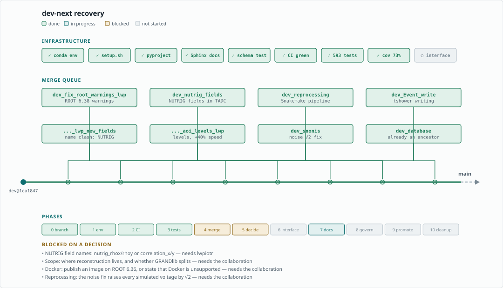

# GRANDlib recovery plan

Working document for the `dev-next` overhaul. The rendered version, with the
full audit and the reasoning behind each phase, is kept as a Claude artifact;
this file is the copy that lives with the code and is updated in the same
commits as the work.



Regenerate the diagram after any change of state:

```bash
python docs/dev/make_recovery_diagram.py
```

## Why this exists

`master` is the GitHub default and sits 1163 commits behind `dev`, which is
the real trunk. A second abandoned trunk, `main`, was created in 2023 and left
355 behind. CI has not completed a run in a long time — the last 36 workflow
runs were all cancelled, and `tests.yml` has never produced a single run — so
no merge in recent memory has been validated by anything. Thirty-six branches
and ten open pull requests have accumulated behind that.

`dev-next` is cut from `dev@1ca1847d`. All work lands there, and it is promoted
to `main` in Phase 9. **Nothing is deleted before Phase 10**: keeping `dev`,
`master` and every branch intact through the transition is what makes rollback
trivial — if `dev-next` goes wrong, unfreeze `dev` and carry on.

## Status

Measured in the built environment on 2026-08-30:

| | |
|---|---|
| Merge queue | 5 of 9 merged |
| Test suite | 124 failed, 215 passed, 14 skipped — the rise is `dev_aoi_unittest` exposing a NumPy 2 bug, not a regression |
| Regression against `dev` | none — identical failure set |
| Environment | builds; `env/setup.sh` completes; `pip install -e .` works |
| Documentation | 7 pages build, examples execute against real GRANDlib |
| Tag | `v0.1.0-dev.1` |

## Phases

Phases 0–2 build the place to work and the means to verify it. Phase 6 is the
one that makes the library usable. Phase 9 is the one that stops this becoming
a third abandoned trunk.

### Before you start
- [x] Name an owner per phase — Mauricio Bustamante, all phases
- [ ] Draft and send the freeze announcement for `dev`
- [ ] Decide the reprocessing policy for the √2 noise change
- [ ] Write the rollback sentence somewhere visible
- [ ] Fix a first version number and target date

### Phase 0 — integration branch
- [x] Cut `dev-next` from `dev@1ca1847d`
- [ ] Push `dev-next` to origin *(deliberately held: publishing announces the plan)*
- [ ] Announce the freeze date for `dev`
- [ ] Tag `master` as `archive/master-2025-03`

### Phase 1 — one environment
- [x] Write `env/conda/grand-dev.yml`, consolidating four dependency lists
- [x] Build it — 4.1 GB, ROOT 6.36.04, Python 3.12.14, `--solver=libmamba`
- [x] Run `env/setup.sh` — TURTLE and GULL compile, `_core.abi3.so` builds
- [x] Add `pyproject.toml` — `pip install -e .` works
- [ ] Verify the four-command install on a *clean* machine

### Phase 2 — restore CI
- [x] Read the logs of a cancelled run and confirm the cause — see `FINDINGS_CI.md`
- [ ] Move the container into the repo, publish to GHCR under `grand-mother`
- [ ] Add `pull_request` to the triggers — fork PRs have had no CI at all
- [ ] Move the `paths:` filter off the triggers into the workflow
- [ ] Add the ROOT 6.36 / 6.38 matrix
- [ ] Turn on branch protection for `dev-next`

### Phase 3 — tests before features
- [x] Merge `dev_aoi_unittest`, stripped of its summary docs and stray artifacts
- [ ] End-to-end numerical regression against Fig. 6 of the paper
- [x] Parseval invariant for galactic noise — `tests/sim/test_galactic_noise_normalisation.py`
- [x] Tree schema snapshot — `tests/dataio/test_schema_snapshot.py`
- [ ] Tree schema round-trip
- [ ] Backward-compatibility ROOT fixture
- [ ] Upgrade `test_rf_chain.py` to passivity, reciprocity, cascade identity

### Phase 4 — merge the queue
- [x] `dev_fix_root_warnings_lwp` — ROOT 6.38 warnings
- [x] `dev_nutrig_fields` — NUTRIG fields in TADC
- [x] `dev_reprocessing` — Snakemake pipeline
- [x] `dev_Event_write` — tshower writing
- [ ] `dev_fix_root_warnings_lwp_new_fields` — **blocked, see below**
- [ ] `dev_fix_root_warnings_aoi_levels_lwp` — blocked behind it
- [ ] `dev_snonis` — conflict on `galaxy.py`, plus the physics decision
- [ ] `dev_database` — conflict on `granddb/datamanager.py`

### Phase 5 — the three decisions
- [ ] Galactic noise: fix or rewrite
- [ ] Where reconstruction lives
- [ ] Whether GRANDlib splits (`grandio_light`)

### Phase 6 — delineate input, processing, output
- [ ] Extract the pure kernel — arrays in, arrays out, no filesystem
- [ ] Introduce configuration objects
- [ ] Move ROOT to I/O adapters at the edges
- [ ] Reimplement `Efield2Voltage` over the three, with a deprecation shim
- [ ] Remove the import-time `ROOT.gROOT.GetVersionInt()` check

### Phase 7 — documentation
- [x] Single Sphinx tree at `docs/source/`
- [x] `conf.py` with autodoc, numpydoc, jupyter-sphinx
- [x] Narrative pages; Appendix A ported into `coordinates.rst`
- [x] Clean local build with executed examples
- [x] Five exemplar docstrings to the numpydoc + jupyter-execute standard
- [ ] Reduce build warnings to zero, so `-W` can gate
- [ ] Apply the standard to the remaining functions
- [ ] Ruff `D`-rule ratchet
- [ ] Delete `docs/apidoc-only/`, retire Doxygen
- [ ] Notebook: coordinate systems, showing the frames and conversions end to end
      (`notebooks/02_coordinates.ipynb`) — the long form of `coordinates.rst`,
      with figures: a DU layout in GRANDCS, the same in geodetic, a shower
      axis in both, and a terrain profile along it
- [ ] Publish to GitHub Pages from CI

### Phase 8 — governance and weight
- [ ] CONTRIBUTING.md, CODEOWNERS, templates, CITATION.cff
- [ ] pre-commit with black, ruff, nbstripout
- [ ] Move large ROOT fixtures to a fetched bundle
- [ ] Delete `createAIP.jar` and the stray `GP300` file

### Phase 9 — promote to `main`
- [ ] Confirm exit criteria
- [ ] Archive the 2023 `main`, free the name
- [ ] Rename `dev-next`, set default, move protection
- [ ] Announce with the install commands

### Phase 10 — bulk cleanup
- [ ] Re-run `git cherry` against the finished trunk
- [ ] Salvage the seven branches carrying unique work
- [ ] Archive-tag everything before deleting
- [ ] Close PRs 9, 49, 52
- [ ] Retire `master` and `dev` to their tags

## Blocked on a decision

**NUTRIG field names.** `dev_nutrig_fields` adds `nutrig_rhox`/`nutrig_rhoy` to
`TADC`; `dev_fix_root_warnings_lwp_new_fields` adds `correlation_x`/`correlation_y`
for the same quantity. Same author, same type, same meaning. Field names enter
the ROOT schema and the data contract, so this needs lwpiotr. Until it is
settled, `_aoi_levels_lwp` is blocked behind it.

**Galactic noise.** `dev_snonis` changes the normalisation by a factor of about
1.41; `refact_galaxy` rewrites the model in new modules alongside the old one.
Both cannot land. Section 8.2 of the paper describes phase-only randomisation
while the code also randomises the modulus, so the published description does
not match either implementation exactly.

Measured 2026-08-30 (`tests/sim/test_galactic_noise_normalisation.py`): against
the tabulated model at LST 18 h the simulated RMS is **0.33** of the Parseval
value with the current `size_out/2`, and would be **0.47** with
`size_out/sqrt(2)`. Neither is 1, so the √2 change is not by itself sufficient
and a factor of roughly 2 is unexplained. **The question that settles it:** is
`Vocmax_..._uVperMHz` an RMS voltage spectral density or a maximum? That is for
the table's authors (PengFei / Xidian, or Stavros).

## Branches carrying unique work

Verified with `git cherry`, so distance behind `dev` is not the criterion.
Salvage before Phase 10 deletes anything:

| Branch | Unmerged | Content |
|---|---|---|
| `masterkastner` | 3 | docstrings for five modules |
| `beta_dc1` | 3 | `scripts/ADanalysis.py`, `TDAnalysis.py` |
| `dev_leisos` | 2 | recursive `coreas_pipeline` |
| `dc2_debug_xmax` | 2 | DC2 polarisation-voltage debugging |
| `snonis_sim2root_test_merge` | 2 | galaxy test notebook |
| `tian-conda-arm` | 1 | ARM install notes |
| `147-add-option-…` | 1 | non-parallel CoREAS support |

## Tools

- `quality/premerge_check.py` — reports what a branch adds; flags tree fields
  whose docstrings duplicate an existing field's meaning, and new modules that
  shadow existing ones.
- `docs/dev/make_recovery_diagram.py` — regenerates the status diagram.
- `tests/dataio/test_schema_snapshot.py` — pins the ROOT tree schema.
