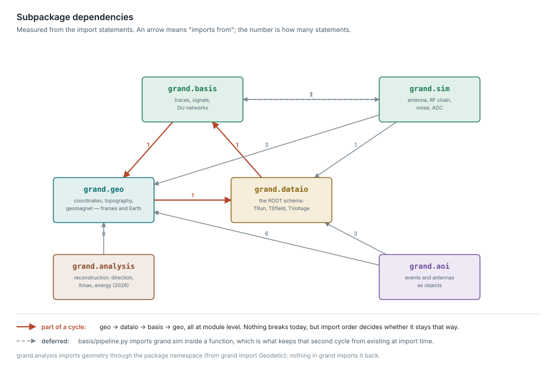

Code architecture
=================

This page describes how the source is organised.  See :doc:`coordinates` and
:doc:`datamodel` for what the pieces mean physically.

What GRANDlib is
----------------

GRANDlib simulates comparatively little physics itself.  Air showers and their
radio emission come from ZHAireS or CoREAS, tau propagation from DANTON,
terrain from TURTLE, the geomagnetic field from GULL, and sky brightness from
LFMap.  What GRANDlib owns is three things:

1. **A schema** — what a GRAND event *is*, and the format the collaboration
   stores it in (:mod:`grand.dataio`).
2. **A frame-reconciliation engine** — where things are, in which frame, over
   what terrain, in what magnetic field (:mod:`grand.geo`).
3. **An instrument-response model** — effective length, Galactic noise, RF
   chain, ADC (:mod:`grand.sim`).

Composition
-----------

Measured on the ``dev`` branch, by lines of Python:

======================================  =====  =====
Subpackage                              Lines  Share
======================================  =====  =====
``grand.sim`` — instrument response     4510   31.9%
``grand.dataio`` — data model           3696   26.1%
``grand.geo`` — geometry and geodesy    2375   16.8%
``grand.aoi`` — user-facing API         1602   11.3%
``grand.basis`` — traces and array viz  1512   10.7%
``grand.recon`` — reconstruction        28     0.2%
======================================  =====  =====

The last row is the thing to notice.  The pipeline runs forward only:
shower to field to voltage to ADC.  Reconstruction — recovering direction,
core position, energy and depth of shower maximum from recorded voltages —
is where the experiment's real questions live, and it is not yet here.

Layering
--------

The intended layering is that :mod:`grand.geo` and :mod:`grand.dataio` sit at
the bottom and know nothing above them, :mod:`grand.sim` composes both, and
:mod:`grand.aoi` and :mod:`grand.basis` sit on top providing the objects a user
handles and the plots they look at.

That is not what the imports say.

         import statements, showing a three-edge cycle between geo, dataio and
         basis
   :width: 100%

*Click the figure to open it full size.*

The edges are measured rather than asserted;
``python docs/dev/make_modules_diagram.py --measure`` re-derives them by
walking every import statement under ``grand/``, and the diagram is generated
from the result.  Re-run it after moving code between subpackages.

.. warning::

   **There is a module-level import cycle**, and it is not visible from any one
   file:

   .. code-block:: text

       grand.geo.topography     imports  grand.dataio.protocol
       grand.dataio.root_files  imports  grand.basis.traces_event
       grand.basis.type_trace   imports  grand.geo.coordinates

   Three modules, three subpackages, back to the start.  Nothing breaks today —
   Python tolerates a cycle whose members do not need each other's names at
   import time — but whether it keeps working depends on import order, which no
   one is choosing deliberately.

   The first edge is also why importing anything from ``grand`` requires ROOT:
   it pulls the ROOT-dependent data layer into what should be a self-contained
   geometry module.  See :ref:`issue-import-requires-root`.

A fourth edge would close a second cycle and does not, because it is deferred:
``grand/basis/pipeline.py`` imports :class:`~grand.sim.efield2voltage.Efield2Voltage`
*inside a function* rather than at module level.  That is the pattern to follow
if a genuine back-edge is unavoidable — but breaking the ``geo`` edge properly
is worth more than adding another deferred import.

:mod:`grand.recon` has no edges in either direction: nothing imports it, and it
imports nothing.  It is a placeholder with two constructors and no algorithm.
