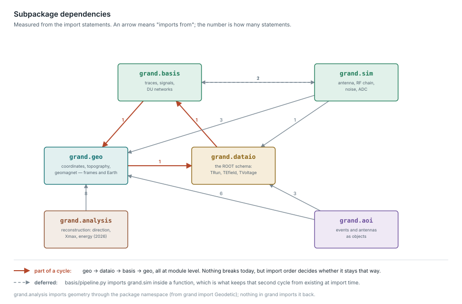

Code architecture
=================

This page describes how the source is organized.  See :doc:`coordinates` and
:doc:`datamodel` for what the pieces mean physically.

What GRANDlib is
----------------

GRANDlib computes little of the physics itself.  Air showers and their
radio emission come from :term:`ZHAireS` or CoREAS, tau propagation from DANTON,
terrain from :term:`TURTLE`, the geomagnetic field from :term:`GULL`, and sky brightness from
:term:`LFMap`.  What GRANDlib owns is three things:

1. **A schema** — what a GRAND event *is*, and the format the collaboration
   stores it in (:mod:`grand.dataio`).
2. **A frame-reconciliation engine** — where things are, in which frame, over
   what terrain, in what magnetic field (:mod:`grand.geo`).
3. **An instrument-response model** — :term:`effective length`, Galactic noise, RF
   chain, :term:`ADC` (:mod:`grand.sim`).

Composition
-----------

Lines of Python per subpackage, on 24 September 2026:

======================================  =====  =====
Subpackage                              Lines  Share
======================================  =====  =====
``grand.sim`` — instrument response     5856   29.1%
``grand.dataio`` — data model           5086   25.3%
``grand.geo`` — geometry and geodesy    3857   19.2%
``grand.aoi`` — user-facing API         2171   10.8%
``grand.basis`` — traces and array viz  1908   9.5%
``grand.analysis`` — reconstruction     1261   6.3%
======================================  =====  =====

The simulation runs forward, from shower to field to voltage to ADC counts.
:mod:`grand.analysis` (Marion Guelfand) runs back: it reconstructs the
arrival direction, the distance to the shower maximum and an
electromagnetic-energy estimate from recorded times and amplitudes, with
plane-wave, spherical-wave and ADF fits.  Its tests show that the fits recover
what their own forward models generate; comparison with full simulations and
measured showers is still to come.

Layering
--------

The intended layering is that :mod:`grand.geo` and :mod:`grand.dataio` sit at
the bottom and know nothing above them, :mod:`grand.sim` composes both, and
:mod:`grand.aoi` and :mod:`grand.basis` sit on top providing the objects a user
handles and the plots they look at.

The imports do not quite follow it:

         import statements, showing a three-edge cycle between geo, dataio and
         basis
   :width: 100%

*Click the figure to open it full size.*

The diagram is generated from the import statements under ``grand/`` by
``python docs/dev/make_modules_diagram.py --measure``.  Re-run it after moving
code between subpackages.

.. warning::

   **There is a module-level import cycle**, and it is not visible from any one
   file:

   .. code-block:: text

       grand.geo.topography     imports  grand.dataio.protocol
       grand.dataio.root_files  imports  grand.basis.traces_event
       grand.basis.type_trace   imports  grand.geo.coordinates

   Python tolerates the cycle, because none of these modules needs the others'
   names at import time, but it makes the package sensitive to import order.
   The first edge is also why topography needs ROOT
   (:ref:`issue-import-requires-root`).

``grand/basis/pipeline.py`` imports
:class:`~grand.sim.efield2voltage.Efield2Voltage` inside a function rather than
at module level, which avoids a second cycle.  Follow that pattern where an
upward import cannot be avoided.

:mod:`grand.analysis` sits on top: it imports geometry (through the package
namespace, ``from grand import Geodetic``) and nothing in ``grand`` imports it
back.

Lazy imports
------------

``import grand`` loads nothing heavy: its public names (``Geodetic``,
``Efield2Voltage``, ``RFChain``, ...) are imported on first use (PEP 562).
``import grand`` and :mod:`grand.geo.coordinates` therefore work without ROOT
or the compiled libraries.  The documentation build uses a typed stand-in for
ROOT where it is absent.
