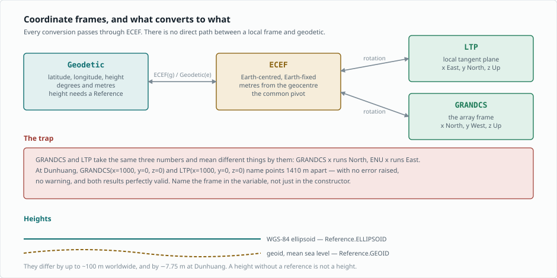

Coordinate systems
==================

.. contents::
   :local:
   :depth: 2

Getting a simulated electric field onto a real antenna is, more than anything
else, a coordinate problem.  Air showers are computed in shower coordinates;
antennas sit at geodetic positions on curved, uneven terrain; the radio
emission is driven by the local geomagnetic field.  Reconciling those is what
:mod:`grand.geo.coordinates` is for, and it is the single largest source of
user error in the library.

The frames
----------

============  ==========================================================
Frame         What it is
============  ==========================================================
``Geodetic``  Latitude, longitude, height. Degrees and metres.
``ECEF``      Earth-Centred Earth-Fixed Cartesian; the common pivot.
``LTP``       Local tangent plane at a given origin and orientation.
``GRANDCS``   The array frame: an ``LTP`` with GRAND's conventions.
============  ==========================================================

Every conversion between a local frame and geodetic passes through ``ECEF``.
There is no direct path, and that is deliberate: one pivot means one place
for the ellipsoid constants to live.

Converting between them
-----------------------

A frame is constructed *from* another frame by passing it to the
constructor.  Starting from the GRANDProto300 site at Dunhuang:

.. jupyter-execute::

    import numpy as np
    from grand import Geodetic, ECEF, GRANDCS, LTP

    site = Geodetic(latitude=40.98, longitude=93.95, height=1200.0)

    ecef = ECEF(site)
    print("ECEF (m):", np.round(np.asarray(ecef).ravel(), 1))

The round trip returns what went in, which is the property every test in
``tests/geo`` leans on:

.. jupyter-execute::

    back = Geodetic(ecef)
    print("back to geodetic:", np.round(np.asarray(back).ravel(), 6))

A local frame needs an origin, supplied as ``location``:

.. jupyter-execute::

    point = GRANDCS(x=1000.0, y=0.0, z=0.0, location=site)
    print("1 km along GRANDCS x:", np.round(np.asarray(Geodetic(point)).ravel(), 6))

Compare that with the site itself — latitude 40.98, longitude 93.95.  Moving
1 km along ``x`` changed the **latitude**, so **GRANDCS x points North**.

.. _coordinates-the-trap:

The trap: x is not x
--------------------

.. warning::

   ``GRANDCS`` and ``LTP`` accept the same three numbers and mean different
   things by them.

``LTP`` with ``orientation='ENU'`` is the usual east-north-up convention, so
its ``x`` runs **East**.  ``GRANDCS`` follows GRAND's array convention, and
its ``x`` runs **North**.  The same triple therefore names two different
places:

.. jupyter-execute::

    grandcs = ECEF(GRANDCS(x=1000.0, y=0.0, z=0.0, location=site))
    enu     = ECEF(LTP(x=1000.0, y=0.0, z=0.0, location=site,
                       orientation='ENU', magnetic=False))

    separation = np.linalg.norm(np.asarray(grandcs).ravel()
                                - np.asarray(enu).ravel())
    print("same numbers, different frame: %.1f m apart" % separation)

No exception, no warning, and both answers are perfectly valid — they simply
answer different questions.  A detector position mixed up this way lands
outside the array footprint, and a shower axis mixed up this way points at
the wrong patch of sky.

The habit that prevents it is to name the frame in the variable rather than
relying on the constructor alone: ``du_grandcs``, ``axis_enu``.

Orientation strings
-------------------

``LTP`` takes its axes as a three-character string, one per axis, drawn from
``E``/``W``, ``N``/``S`` and ``U``/``D``.  ``'ENU'`` is east-north-up;
``'NWU'`` is the GRAND convention that ``GRANDCS`` applies for you.

.. jupyter-execute::

    enu = Geodetic(LTP(x=0.0, y=1000.0, z=0.0, location=site,
                       orientation='ENU', magnetic=False))
    nwu = Geodetic(LTP(x=0.0, y=1000.0, z=0.0, location=site,
                       orientation='NWU', magnetic=False))
    print("1 km along y, ENU:", np.round(np.asarray(enu).ravel()[:2], 5))
    print("1 km along y, NWU:", np.round(np.asarray(nwu).ravel()[:2], 5))

``magnetic=True`` measures the horizontal axes from **magnetic** north rather
than geographic north, using the geomagnetic model at that place and date.
The declination at Dunhuang is a few degrees, which over a 10 km array is
hundreds of metres — so it is a choice to make deliberately, not a default to
inherit.

Heights need a reference
------------------------

A height is meaningless without saying what it is measured from.  The
ellipsoid is a smooth mathematical figure; the geoid is mean sea level, and
the two differ by up to about 100 m worldwide.

.. jupyter-execute::

    from grand.geo.coordinates import geoid_undulation

    undulation = geoid_undulation(latitude=40.98, longitude=93.95)
    print("geoid - ellipsoid at Dunhuang: %.2f m" % undulation)

At Dunhuang the geoid sits 7.75 m *below* the ellipsoid, so a point 1200 m
above the ellipsoid is about 1207.75 m above sea level.  Use
:class:`~grand.geo.coordinates.Reference` to say which you mean.

Angles are in degrees
---------------------

Every angle in this module — polar, azimuth, latitude, longitude, elevation —
is in **degrees**, not radians.  The representation helpers convert among
Cartesian, spherical and horizontal descriptions of the same vector:

.. jupyter-execute::

    from grand.geo.coordinates import (_cartesian_to_spherical,
                                       _spherical_to_horizontal)

    theta, phi, r = _cartesian_to_spherical(0.0, 0.0, 1.0)
    print("straight up, spherical  : theta=%.1f deg, phi=%.1f, r=%.1f"
          % (theta, phi, r))

    az, el, norm = _spherical_to_horizontal(theta, phi, r)
    print("straight up, horizontal : azimuth=%.1f deg, elevation=%.1f deg"
          % (az, el))

Note what changed: the spherical polar angle is measured **down from the
zenith**, while horizontal elevation is measured **up from the horizon**, and
azimuth is measured from **north**, not from the :math:`+x` axis.  The
horizontal frame is fixed to geographic north, so converting into it assumes
an ENU basis and a shared origin — components expressed in another Cartesian
basis give a silently wrong azimuth.

Common mistakes
---------------

.. list-table::
   :header-rows: 1
   :widths: 34 66

   * - Symptom
     - Cause
   * - A detector lands outside the array
     - ``GRANDCS`` and ``LTP`` axes confused; see :ref:`coordinates-the-trap`
   * - Positions off by a few hundred metres
     - ``magnetic=True`` where geographic north was meant, or the reverse
   * - Heights off by a few metres
     - Ellipsoid and geoid references mixed
   * - Angles wrong by a factor of about 57
     - Radians passed where degrees are expected
   * - Azimuth mirrored
     - Spherical :math:`\phi` used as an azimuth; they run in opposite senses
   * - A local frame refuses to convert
     - No ``location`` given, so the frame has no origin

.. note::

   A worked notebook is planned for this page — the frames and conversions
   end to end, with a detector layout drawn in ``GRANDCS`` and again in
   geodetic coordinates, a shower axis in both, and a terrain profile along
   it. Tracked in ``docs/dev/RECOVERY_PLAN.md``.

Reference
---------

Appendix A of `arXiv:2408.10926 <https://arxiv.org/abs/2408.10926>`_ gives
the transformation matrix and the WGS-84 constants.  The API reference for
this module is in :doc:`api`.
