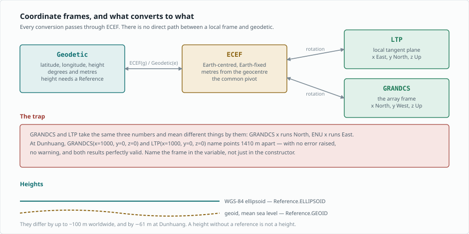

Coordinates and conventions
===========================

.. contents::
   :local:
   :depth: 2

Air showers are computed in shower coordinates, antennas sit at geodetic
positions on curved terrain, and the radio emission depends on the local
geomagnetic field.  :mod:`grand.geo.coordinates` converts between the frames
these quantities are expressed in.  Mixing up frames is the most common source
of wrong results in GRANDlib, and rarely raises an error, so this page states
each convention and shows it executing.  Units are listed in the
:ref:`Quick start guide <quickstart-units>`.

The frames
----------

============  ==========================================================
Frame         What it is
============  ==========================================================
``Geodetic``  Latitude, longitude, height. Degrees and meters.
``ECEF``      Earth-centered, Earth-fixed Cartesian; the common pivot.
``LTP``       Local tangent plane at a given origin and orientation.
``GRANDCS``   The array frame: an ``LTP`` with GRAND's conventions.
============  ==========================================================

Every conversion between a local frame and geodetic passes through ``ECEF``.
There is no direct path, so the ellipsoid constants are defined in one
place.

Converting between them
-----------------------

A frame is constructed *from* another frame by passing it to the
constructor.  Starting from the :term:`GRANDProto300 <GP300>` site at Dunhuang:

.. jupyter-execute::

    import numpy as np
    from grand import Geodetic, ECEF, GRANDCS, LTP

    site = Geodetic(latitude=40.98, longitude=93.95, height=1200.0)

    ecef = ECEF(site)
    print("ECEF (m):", np.round(np.asarray(ecef).ravel(), 1))

The round trip returns the input:

.. jupyter-execute::

    back = Geodetic(ecef)
    print("back to geodetic:", np.round(np.asarray(back).ravel(), 6))

A local frame needs an origin, supplied as ``location``:

.. jupyter-execute::

    point = GRANDCS(x=1000.0, y=0.0, z=0.0, location=site)
    print("1 km along GRANDCS x:", np.round(np.asarray(Geodetic(point)).ravel(), 6))

The site is at latitude 40.98, longitude 93.95.  Moving 1 km along ``x``
changed the **latitude**: **GRANDCS x points north**.

To go the other way, pass the geodetic position as the first argument:

.. jupyter-execute::

    north = Geodetic(latitude=40.99, longitude=93.95, height=1200.0)
    local = GRANDCS(north, location=site)
    print("0.01 deg north, in GRANDCS (m):", np.round(np.asarray(local).ravel(), 1))

The point is due north, yet ``y`` is not zero: ``GRANDCS`` measures ``x``
from **magnetic** north, 0.3° from geographic north at Dunhuang, and ``z`` is
slightly negative because the Earth curves away below the tangent plane.

Every frame stores its components as ``(3, n)`` arrays, so a single point
comes back with shape ``(3, 1)``; ``np.asarray(x).ravel()`` flattens it to
three numbers.

Frames are NumPy arrays
~~~~~~~~~~~~~~~~~~~~~~~

Every frame subclasses :class:`numpy.ndarray`, so arithmetic and broadcasting
work as for any array.  Two consequences:

* :func:`copy.copy` loses the origin, the basis and the height reference,
  which NumPy does not carry through a copy.  Use
  :func:`grand.geo.coordinates.copy`.
* A component is an array, not a number.  ``float(position.x)`` works only
  for a single point; use ``np.ravel(position.x)[0]`` where a number is
  needed.

.. _coordinates-the-trap:

GRANDCS and LTP axes differ
---------------------------

.. warning::

   ``GRANDCS`` and ``LTP`` accept the same three numbers and mean different
   things by them.

``LTP`` with ``orientation='ENU'`` is the usual east-north-up convention, so
its ``x`` runs **East**.  ``GRANDCS`` follows GRAND's array convention, and
its ``x`` runs **North**.  The same triple therefore names two different
places:

.. jupyter-execute::

    grandcs = ECEF(GRANDCS(x=1000.0, y=0.0, z=0.0, location=site))
    enu     = ECEF(LTP(x=1000.0, y=0.0, z=0.0, location=site,
                       orientation='ENU', magnetic=False))

    separation = np.linalg.norm(np.asarray(grandcs).ravel()
                                - np.asarray(enu).ravel())
    print("same numbers, different frame: %.1f m apart" % separation)

Neither raises an error or a warning.  A detector position mixed up this way
lands outside the array, and a shower axis points at the wrong part of the
sky.  Naming the frame in the variable (``du_grandcs``, ``axis_enu``) makes
the mistake visible.

Orientation strings
-------------------

``LTP`` takes its axes as a three-character string, one per axis, drawn from
``E``/``W``, ``N``/``S`` and ``U``/``D``.  ``'ENU'`` is east-north-up;
``'NWU'`` is the GRAND convention that ``GRANDCS`` applies for you.

.. jupyter-execute::

    enu = Geodetic(LTP(x=0.0, y=1000.0, z=0.0, location=site,
                       orientation='ENU', magnetic=False))
    nwu = Geodetic(LTP(x=0.0, y=1000.0, z=0.0, location=site,
                       orientation='NWU', magnetic=False))
    print("1 km along y, ENU:", np.round(np.asarray(enu).ravel()[:2], 5))
    print("1 km along y, NWU:", np.round(np.asarray(nwu).ravel()[:2], 5))

``magnetic=True`` measures the horizontal axes from **magnetic** north rather
than geographic north, using the geomagnetic model at that place and date.
The declination at Dunhuang is small, about 0.3° in 2020 by the IGRF-13
model, or roughly 50 m at the edge of a 10 km array.  Elsewhere it reaches
several degrees.

Heights need a reference
------------------------

A height is meaningless without saying what it is measured from.  The
ellipsoid is a smooth mathematical figure; the geoid is mean sea level, and
the two differ by up to about 100 m worldwide.

.. jupyter-execute::

    from grand.geo.coordinates import geoid_undulation

    undulation = geoid_undulation(latitude=40.98, longitude=93.95)
    print("geoid - ellipsoid at Dunhuang: %.2f m" % undulation)

At Dunhuang the geoid sits 61 m *below* the ellipsoid, so a point 1200 m
above the ellipsoid is about 1261 m above sea level.  Use
:class:`~grand.geo.coordinates.Reference` to say which you mean.

Angles are in degrees
---------------------

Every angle in this module (polar, azimuth, latitude, longitude, elevation)
is in **degrees**, not radians.  The representation helpers convert among
Cartesian, spherical and horizontal descriptions of the same vector:

.. jupyter-execute::

    from grand.geo.coordinates import (_cartesian_to_spherical,
                                       _spherical_to_horizontal)

    theta, phi, r = _cartesian_to_spherical(0.0, 0.0, 1.0)
    print("straight up, spherical  : theta=%.1f deg, phi=%.1f, r=%.1f"
          % (theta, phi, r))

    az, el, norm = _spherical_to_horizontal(theta, phi, r)
    print("straight up, horizontal : azimuth=%.1f deg, elevation=%.1f deg"
          % (az, el))

The spherical polar angle is measured **down from the zenith**; elevation is
measured **up from the horizon**.  Azimuth is measured from **north**; the
spherical :math:`\phi` from the :math:`+x` axis.  The horizontal frame is
fixed to geographic north, so converting into it assumes an ENU basis and a
shared origin.  Components in another Cartesian basis give a wrong azimuth
without any warning.

A shower's angles say where it comes from
-----------------------------------------

A shower's ``zenith`` and ``azimuth`` name the direction it **arrives from**,
not the direction it travels.  A vertical shower has zenith 0°, and the shower
maximum lies upstream, at those angles as seen from the core.  The files
GRANDlib reads, the converters that write them and Appendix A of the GRANDlib
paper all follow this convention.  ``_cartesian_to_spherical`` applied to the
position of :term:`Xmax` relative to the core returns the stored zenith and azimuth;
``tests/geo/test_angle_convention.py`` checks this against the :term:`ZHAireS`
summaries of the committed example events.

Where the direction of travel is needed, negate the arrival vector.

Common mistakes
---------------

.. list-table::
   :header-rows: 1
   :widths: 34 66

   * - Symptom
     - Cause
   * - A detector lands outside the array
     - ``GRANDCS`` and ``LTP`` axes confused; see :ref:`coordinates-the-trap`
   * - Positions off by tens of meters (more at sites with a larger declination)
     - ``magnetic=True`` where geographic north was meant, or the reverse
   * - Heights off by a few meters
     - Ellipsoid and geoid references mixed
   * - Angles wrong by a factor of about 57
     - Radians passed where degrees are expected
   * - Azimuth mirrored
     - Spherical :math:`\phi` used as an azimuth; they run in opposite senses
   * - A local frame refuses to convert
     - No ``location`` given, so the frame has no origin

.. note::

   Notebook 01, *Coordinate systems* (:doc:`notebooks`), works through this
   page with figures: a detector layout drawn in ``GRANDCS`` and in geodetic
   coordinates, and a shower axis in both.

Reference
---------

Appendix A of :cite:`GRAND:2024atu` gives the transformation matrix and the
WGS-84 constants.  :doc:`api` documents :mod:`grand.geo.coordinates`.
