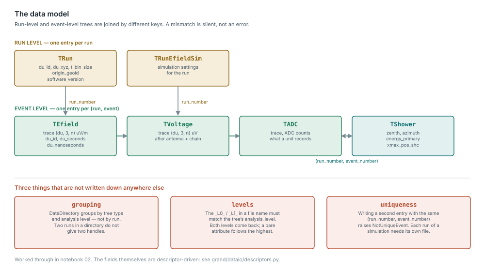

The data model
==============

Simulated and recorded GRAND data are stored in ROOT ``TTree`` objects.
:mod:`grand.dataio` reads and writes them, so that you work with Python
numbers, lists and arrays rather than with ROOT classes.

An **event** is usually a candidate air shower, generated by a cosmic ray,
gamma ray or neutrino.  A **run** is a collection of events detected within a
given time span.

         three grouping rules that are not documented elsewhere
   :width: 100%

*Click the figure to open it full size.*

The naming convention
---------------------

The class names follow four rules:

``TRun*``
   Information that stays constant for the duration of a run.  One entry per
   run.

``T*`` (without ``Run``)
   One entry per event.

``T*Sim``
   Content produced exclusively by simulators.

``T*`` without ``Sim``
   Content originating from hardware.  It may also be filled by simulation,
   in which case fields that hardware would have supplied are left empty.

The classes
-----------

=================  =========================================================
Class              Contents
=================  =========================================================
``TRun``           Run information common to all events
``TRunVoltage``    Voltage information common to all events of a run
``TADC``           Traces in ADC units, before conversion to voltage
``TRawVoltage``    Traces after conversion to voltage
``TVoltage``       Voltage traces at the antenna feed point
``TEfield``        Electric-field traces of an event
``TShower``        Characteristics of a shower
``TShowerSim``     Additional information about a *simulated* shower
``TRunNoise``      Noise information common to all events of a run
=================  =========================================================

.. _datamodel-read-one-event:

Read one event
--------------

The shower parameters -- zenith, azimuth, energy, Xmax -- are in ``TShower``,
in the ``shower_*.root`` file.  ``TShowerSim`` (``showersim_*.root``) holds
only what a simulator adds on top, so ``tshowersim.zenith`` does not exist.
Both forms below print the first event of the sample that ships with the
repository; run them from the repository root.

With :mod:`grand.dataio`, one tree per file:

.. code-block:: python

    from grand.dataio import TShower, TEfield

    DIR = "sim2root/Common/sim_Xiaodushan_20221026_000000_RUN1_CD_ZHAireS_0000/"

    with TShower(DIR + "shower_1618-13790_L0_0000.root") as shower:
        shower.get_entry(0)
        run, event = shower.run_number, shower.event_number
        print("run %d, event %d" % (run, event))
        print("zenith %.2f deg, azimuth %.2f deg" % (shower.zenith, shower.azimuth))
        print("energy %.3g GeV, Xmax %.1f g/cm2" % (shower.energy_primary, shower.xmax_grams))

    with TEfield(DIR + "efield_1618-13790_L0_0000.root") as efield:
        efield.get_event(event, run)
        print("antennas %d" % len(efield.du_id))

With :mod:`grand.aoi`, which joins the trees into one event object:

.. code-block:: python

    from grand.aoi.event_list import EventList

    DIR = "sim2root/Common/sim_Xiaodushan_20221026_000000_RUN1_CD_ZHAireS_0000"

    event = next(iter(EventList(DIR)))
    shower = event.simshower            # the simulated shower, from the L0 shower file
    print("run %d, event %d" % (event.run_number, event.event_number))
    print("zenith %.2f deg, azimuth %.2f deg" % (shower.zenith, shower.azimuth))
    print("energy %.3g GeV, Xmax %.1f g/cm2" % (shower.energy_primary, shower.Xmax))
    print("antennas %d" % len(event.antennas))

The two APIs name the same quantity differently, and ``simshower`` means
different things in each: in :mod:`grand.aoi` it is the *simulated* shower
read from ``TShower`` at level 0 (``event.shower`` is the level-1 one, absent
from a simulation), not ``TShowerSim``.

======================  ===================  =====================  =======
Quantity                ``grand.dataio``     ``grand.aoi``          Unit
======================  ===================  =====================  =======
Zenith ("comes from")   ``TShower.zenith``   ``simshower.zenith``   degrees
Azimuth ("comes from")  ``TShower.azimuth``  ``simshower.azimuth``  degrees
Primary energy          ``energy_primary``   ``energy_primary``     GeV
Electromagnetic energy  ``energy_em``        ``energy_em``          GeV
Xmax depth              ``xmax_grams``       ``Xmax``               g/cm²
Xmax position           ``xmax_pos``         ``Xmaxpos``            m
Core position           ``shower_core_pos``  ``core_ground_pos``    m
Primary particle (PDG)  ``primary_type``     ``primary_type``       --
Antennas in the event   ``TEfield.du_id``    ``event.antennas``     --
======================  ===================  =====================  =======

Notebook 09, *Reading events* (:doc:`notebooks`), goes further with
:mod:`grand.aoi`: traces, times and the pitfalls of looping over events.

Provenance
----------

``TRun`` carries ``data_generator_version``, ``event_version``,
``analysis_level``, ``site`` and ``site_layout``; every tree records the
software that last wrote it (``modification_software``,
``modification_software_version``), and ``TVoltage`` the GRANDlib version
that computed its voltages (``grandlib_version``).  A change to the
Galactic-noise normalization, for example, alters every voltage without
changing the file's layout; the version stamp is what tells two such files
apart.

``site`` and ``site_layout`` are free-form strings: they name a site and a
layout but do not point to a versioned description of either.

.. _datamodel-releasing-trees:

Reading many files: release each tree
-------------------------------------

A tree is released, with the ROOT file it opened, when its last reference
goes, unless another live tree reads the same file.  Releasing it explicitly
is clearer and takes effect at once rather than at the next garbage
collection.  The simplest way is the ``with`` form, which releases the tree
even if the loop body raises:

.. code-block:: python

    from pathlib import Path
    from grand.dataio.event_trees import TADC, TRawVoltage

    for path in Path("data").rglob("*.root"):
        with TADC(str(path)) as tadc, TRawVoltage(str(path)) as tvoltage:
            for event, run in tadc.get_list_of_events():
                tadc.get_event(event, run)
                ...

Without ``with``, call ``stop_using()`` at the end of each iteration:

.. code-block:: python

    tadc = TADC(path)
    ...
    tadc.stop_using()

``stop_using()`` removes the tree from ``grand_tree_list`` and closes the ROOT
file the tree opened from a file name, once no other live tree reads from that
file.  A ``ROOT.TFile`` you passed in yourself, or the one a ``DataFile``
holds, is left open for you to close.  Do not use a tree after releasing it: if
its file was closed, the TTree is gone.  Write a tree you filled with
``write()`` *before* releasing it.

Releasing does not bring memory growth to zero: ROOT 6.36 itself keeps about
0.08 MB for every file opened, read and closed, even from compiled C++.

How the tree classes work
-------------------------

A field of a tree class is a descriptor, not an ordinary attribute.
``TTreeScalarDesc``, ``StdVectorListDesc`` and their siblings translate
between Python values and the C++ type of a ``TTree`` branch, so declaring

.. code-block:: python

    nutrig_rhox: StdVectorListDesc = field(default=StdVectorListDesc("unsigned short"))

adds a branch to the file format.  Adding or renaming a field therefore
changes what every reader of the format sees;
``tests/dataio/test_schema_snapshot.py`` fails until the stored snapshot of
the layout is updated, so the change shows up in review.

A descriptor can also carry a unit and a valid range.  Writing a value
outside the range warns, and the unit appears in the field's documentation.

Reference
---------

Appendix B of :cite:`GRAND:2024atu`, and :doc:`api` for every class and
field.
