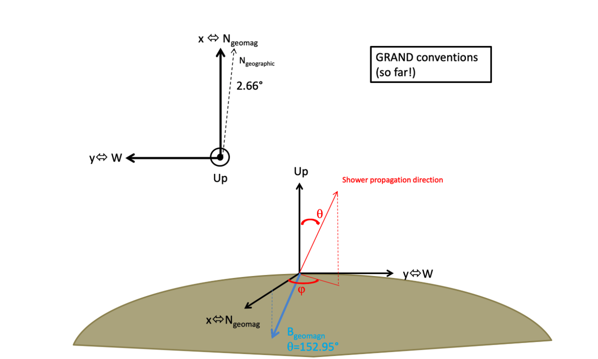
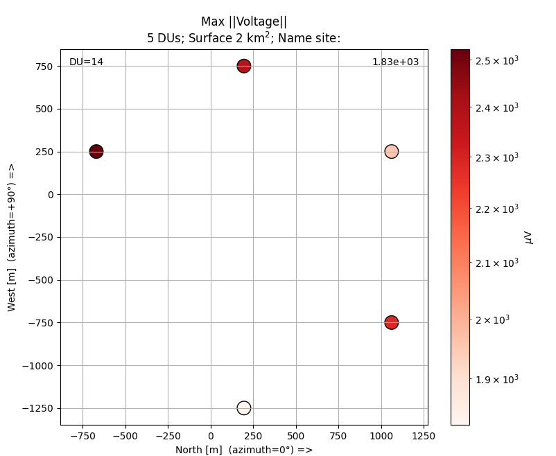
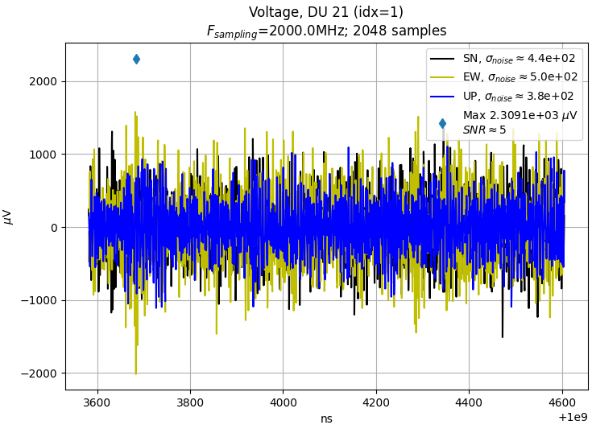
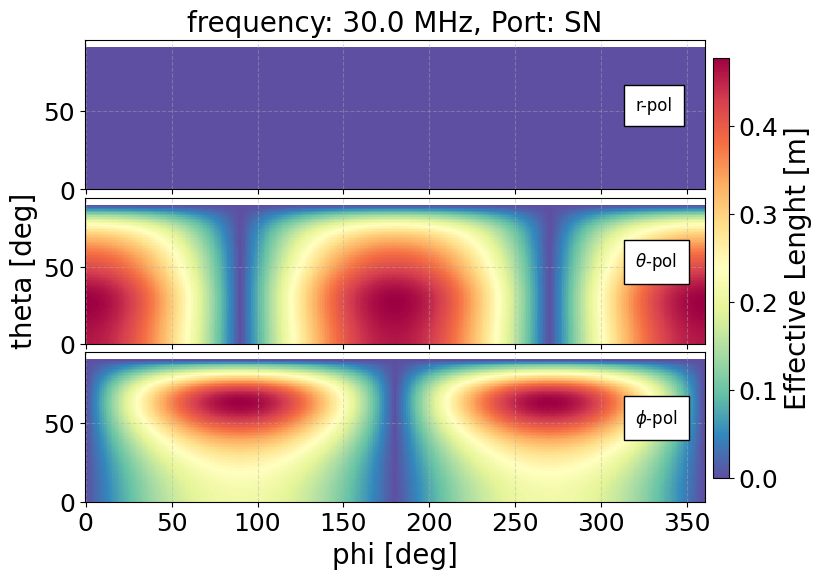
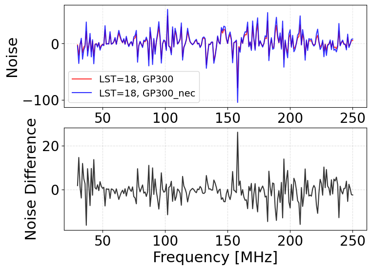
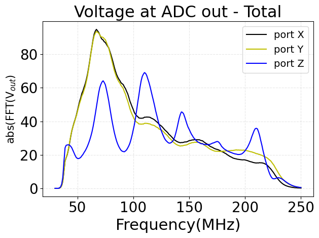
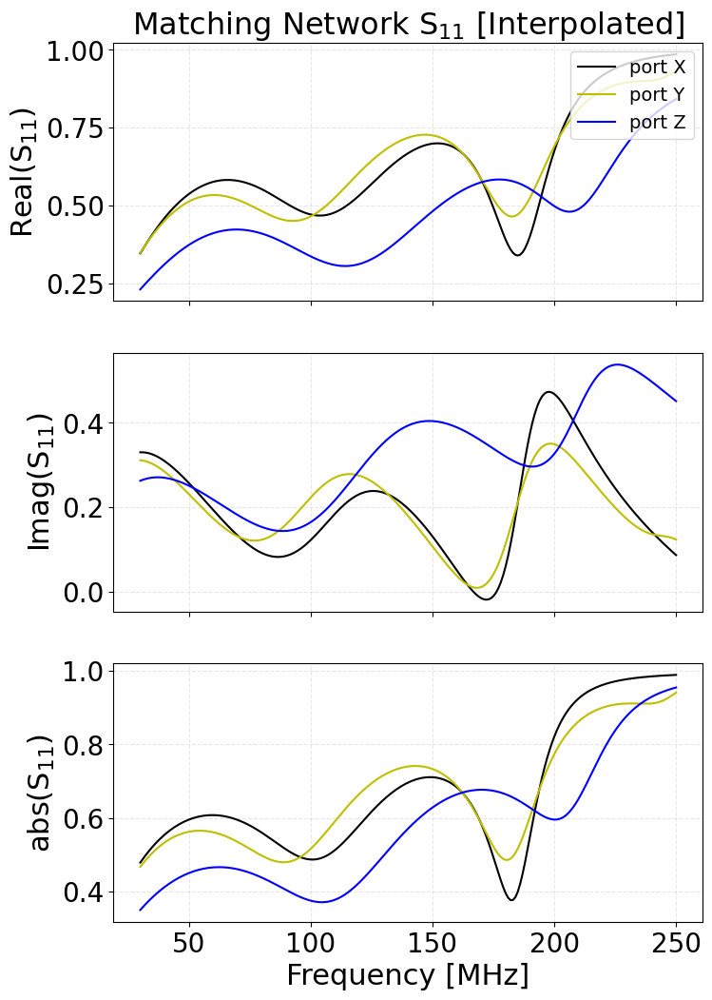

.. This page is generated from resources/GRANDlib_Handbook.zip
   by docs/dev/build_handbook.py.  Do not edit it by hand.

Directory Structure
===================

.. warning::

   This section contains statements the code contradicts.  See :doc:`index` for the errata.


The GRANDlib repository is organized into modular directories to facilitate simulation, data access, and detector modeling. Below is an overview of the top-level folders and their purpose.

+---------------+------------------------------------------------------+
| **Directory** | **Description**                                      |
+===============+======================================================+
| ``data/``     | Scripts for downloading essential models (antenna    |
|               | responses, galactic noise maps, electronics chain,   |
|               | geomagnetic files). Required before most             |
|               | simulations.                                         |
+---------------+------------------------------------------------------+
| ``docs/``     | Documentation PDFs for internal conventions,         |
|               | coordinate systems, and analysis tutorials. Includes |
|               | ``GRANDreferential.pdf``, ``GRANDscripts.pdf``, and  |
|               | ``grandlib_classes_v2.pdf``.                         |
+---------------+------------------------------------------------------+
| ``env/``      | Environment setup scripts and conda environment YAML |
|               | files. Contains ``setup.sh`` used to initialize      |
|               | paths and compile dependencies like GULL and TURTLE. |
+---------------+------------------------------------------------------+
| ``examples/`` | Example Python and Jupyter notebooks for common      |
|               | workflows, such as plotting traces, computing        |
|               | antenna response, or applying filtering methods.     |
+---------------+------------------------------------------------------+
| ``grand/``    | Core Python package. Implements file I/O             |
|               | (``grand.io``), analysis tools (``grand.aoi``),      |
|               | topography support, and antenna chain modeling.      |
+---------------+------------------------------------------------------+
| ``granddb/``  | Tools for interacting with the GRAND SQL database,   |
|               | currently under development. Includes schema         |
|               | wrappers and utilities.                              |
+---------------+------------------------------------------------------+
| ``quality/``  | Code quality and test scripts. Includes formatting,  |
|               | static checks, and test suite configuration.         |
+---------------+------------------------------------------------------+
| ``scripts/``  | Executable scripts for E-field to voltage            |
|               | conversion, antenna filtering, and plotting.         |
|               | Standalone tools for CLI usage.                      |
+---------------+------------------------------------------------------+
| ``sim2root/`` | Contains tools and bindings to convert outputs from  |
|               | external simulation software (e.g. AIRES, ZHAireS)   |
|               | into ROOT files readable by GRANDlib.                |
+---------------+------------------------------------------------------+

Each of these directories contains submodules or utilities covered in later chapters. For first-time users, it is recommended to explore the ``data/``, ``grand/``, and ``examples/`` directories after installation.

Data
====

The ``data`` directory contains mainly scripts that allow the user to download various models, such as the antenna model, electronic effects, and the galactic signal.

download_data_grand.py
----------------------

This script checks and downloads the GRAND detector data model.

First, remove or rename the directory ``grand/data/model/detector`` if it already exists on your system. Then, navigate to the ``grand/data`` directory and run:

.. code:: bash

   python download_data_grand.py

Possible outputs include:

.. code:: bash

   ==============================
   Detector directory does not exist. Triggering data model download.

   ==============================
   Skip download: data model is up to date.

   ==============================
   Updating data model. Removing old directories...
   ==============================
   Downloading new data model ({repo_version}), please wait...
   ==============================
   Extracting tar file...

   Data model updated successfully!

download_LFmap_grand.py
~~~~~~~~~~~~~~~~~~~~~~~

This script downloads the ``LFMap.tar.gz`` file required for galactic noise simulations. Navigate to the ``grand/data`` directory and run:

.. code:: bash

   python download_LFmap_grand.py

Possible outputs:

.. code:: bash

   ==============================
   Skip download LFmap files for Galactic noise simulations

   ==============================
   Download LFmap model (~ 6.4 MB) for GRAND, please wait ...
   ==============================
   Extracting tar file...

   LFmap model available in grand/data/noise directory !

download_grand_antenna_models.py
~~~~~~~~~~~~~~~~~~~~~~~~~~~~~~~~

This script downloads the ``grand_model_20241218.tar.gz`` file containing the antenna model files. Run the following in the ``grand/data`` directory:

.. code:: bash

   python download_grand_antenna_models.py

Expected outputs:

.. code:: bash

   ==============================
   Skip download Grand antenna models

   ==============================
   Download antenna models, RFchain, Galactic noise (~ 1GB) for GRAND, please wait ...

   Successfully downloaded

   ==============================
   Extracting tar file...

   Antenna models available in grand/data/detector directory !

download_new_RFchain.py
~~~~~~~~~~~~~~~~~~~~~~~

This script downloads the ``RF_chain_20241218.tar.gz`` file containing the detector and electronic models. In the ``grand/data`` directory, run:

.. code:: bash

   python download_new_RFchain.py

Possible outputs:

.. code:: bash

   ==============================
   Skip download data model

   ==============================
   Download new RFchain model (~ 450 KB) for GRAND, please wait ...

   Successfully downloaded

   ==============================
   Extracting tar file...

   data model available in grand/data/detector directory !

Geomagnet
~~~~~~~~~

This folder includes geomagnetic model files:

- ``IGRF13.COF``

- ``WMM2020.COF``

These files are required for scripts in ``examples/geo/`` that simulate Earth’s magnetic field at different altitudes and locations.

Detector
~~~~~~~~

| This folder includes the antenna Effective Length simulated models from three different programs HFSS, NEC, Matlab. It also includes the RFchain_v2 folder that contains the new s parameter files for the RFchain components as well as the new Transfer Function (TF) files.
| The antenna models are seperated into 3 categories. The Light_GP300Antenna\_*arm_leff.npz contains the HFSS model, the Light_GP300Antenna_mat\_*arm_leff.npz contains the Matlab model and the Light_GP300Antenna_nec\_*arm_leff.npz the nec model.

- ``Light_GP300Antenna_EWarm_leff.npz``

- ``Light_GP300Antenna_SNarm_leff.npz``

- ``Light_GP300Antenna_Zarm_leff.npz``

- ``Light_GP300Antenna_mat_Xarm_leff.npz``

- ``Light_GP300Antenna_mat_Yarm_leff.npz``

- ``Light_GP300Antenna_mat_Zarm_leff.npz``

- ``Light_GP300Antenna_nec_Xarm_leff.npz``

- ``Light_GP300Antenna_nec_Yarm_leff.npz``

- ``Light_GP300Antenna_nec_Zarm_leff.npz``

File Format
^^^^^^^^^^^

| 
| The files are stored as a NumPy ``.npz`` archive, which is a compressed container of multiple arrays. It provides the effective length response of the GP300 antenna model (East–West arm, denoted as EW or X arm , South–North denoted as SN or Y arm and Vertical denotes as Zarm) as a function of frequency and arrival direction.

Contents
^^^^^^^^

| 
| The archive contains the following datasets:

+----------------+----------------+------------+-----------------------------+
| **Key**        | **Shape**      | **Dtype**  | **Description**             |
+================+================+============+=============================+
| ``version``    | (1,)           | string     | File format version (e.g.,  |
|                |                |            | ``"v01"``).                 |
+----------------+----------------+------------+-----------------------------+
| ``freq_mhz``   | (221,)         | float64    | Frequency axis in MHz,      |
|                |                |            | covering the simulated      |
|                |                |            | frequency range.            |
+----------------+----------------+------------+-----------------------------+
| ``leff_theta`` | (361, 91, 221) | complex128 | Effective antenna length    |
|                |                |            | (:math:`\theta`-component), |
|                |                |            | complex values. Indexed as  |
|                |                |            | [azimuth, zenith,           |
|                |                |            | frequency].                 |
+----------------+----------------+------------+-----------------------------+
| ``leff_phi``   | (361, 91, 221) | complex128 | Effective antenna length    |
|                |                |            | (:math:`\phi`-component),   |
|                |                |            | complex values. Indexed as  |
|                |                |            | [azimuth, zenith,           |
|                |                |            | frequency].                 |
+----------------+----------------+------------+-----------------------------+

Coordinate System and Indexing
^^^^^^^^^^^^^^^^^^^^^^^^^^^^^^

- **Azimuth (:math:`\phi`):** :math:`0^\circ`–:math:`360^\circ`, sampled in :math:`1^\circ` steps (array length = 361).

- **Zenith (:math:`\theta`):** :math:`0^\circ`–:math:`90^\circ`, sampled in :math:`1^\circ` steps (array length = 91).

- **Frequency:** 221 bins, exact values provided in ``freq_mhz`` from 30-250MHz.

Thus, for each frequency bin, the file stores the complex effective length vector of the antenna in spherical coordinates :math:`(\theta, \phi)`.

Example Usage
^^^^^^^^^^^^^

.. code:: python


   import numpy as np
   import matplotlib.pyplot as plt

   # ## Load Data
   file_path = "file/path/to/Light_GP300Antenna_EWarm_leff.npz"
   data = np.load(file_path)

   freq = data["freq_mhz"]        # (221,)
   leff_theta = data["leff_theta"]  # (361, 91, 221) [az, zen, freq]
   leff_phi   = data["leff_phi"]    # (361, 91, 221)

   print("Available keys:", list(data.keys()))
   print("freq shape:", freq.shape, "range:", freq.min(), "-", freq.max())
   print("leff_theta shape:", leff_theta.shape)
   print("leff_phi shape:", leff_phi.shape)

   # ## 1. Plot |leff_theta| vs frequency at selected angles
   az_samples = [0, 90, 180, 270]   # degrees
   zen_samples = [30, 60]           # degrees

   plt.figure(figsize=(8,5))
   for az in az_samples:
       for zen in zen_samples:
           y = np.abs(leff_theta[az, zen, :])
           plt.plot(freq, y, label=f"az={az}^\circ$, zen={zen}^\circ$")
   plt.xlabel("Frequency [MHz]")
   plt.ylabel(r"$|l_{\mathrm{eff},\theta}|$ [m]")
   plt.title("|leff_theta| vs Frequency")
   plt.grid(True)
   plt.legend()
   plt.show()


   # ## 2. Plot |leff_phi| vs frequency at selected angles
   plt.figure(figsize=(8,5))
   for az in az_samples:
       for zen in zen_samples:
           y = np.abs(leff_phi[az, zen, :])
           plt.plot(freq, y, label=f"az={az}^\circ$, zen={zen}^\circ$")
   plt.xlabel("Frequency [MHz]")
   plt.ylabel(r"$|l_{\mathrm{eff},\phi}|$ [m]")
   plt.title("|leff_phi| vs Frequency")
   plt.grid(True)
   plt.legend()
   plt.show()

   # ## 3. Heatmaps at a chosen frequency
   f_target = 50.0
   f_idx = np.argmin(np.abs(freq - f_target))
   f_val = freq[f_idx]

   theta_map = np.abs(leff_theta[:, :, f_idx]).T  # shape (zen, az)
   phi_map   = np.abs(leff_phi[:, :, f_idx]).T

   # Heatmap of leff_theta
   plt.figure(figsize=(8,5))
   im = plt.imshow(theta_map, origin="lower", aspect="auto",
                   extent=[0, 360, 0, 90])
   plt.colorbar(im, label=r"$|l_{\mathrm{eff},\theta}|$ [m]")
   plt.xlabel("Azimuth [deg]")
   plt.ylabel("Zenith [deg]")
   plt.title(f"|leff_theta| at {f_val:.1f} MHz")
   plt.show()

   # Heatmap of leff_phi
   plt.figure(figsize=(8,5))
   im = plt.imshow(phi_map, origin="lower", aspect="auto",
                   extent=[0, 360, 0, 90])
   plt.colorbar(im, label=r"$|l_{\mathrm{eff},\phi}|$ [m]")
   plt.xlabel("Azimuth [deg]")
   plt.ylabel("Zenith [deg]")
   plt.title(f"|leff_phi| at {f_val:.1f} MHz")
   plt.show()

RFchain_v2: RF Chain Data and Formats
~~~~~~~~~~~~~~~~~~~~~~~~~~~~~~~~~~~~~

The ``RFchain_v2`` directory contains Touchstone S-parameter files for individual RF components (antenna+LNA frontends, standalone LNAs, baluns, matching networks, filters, cable/connector sections), measured or simulated transfer functions, and helper scripts/notes used to build the station-level RF transfer function.

Folder Contents (overview)
^^^^^^^^^^^^^^^^^^^^^^^^^^

| 
| Key files and groups observed in this release:

.. container:: nolist

   | **Component S-parameters** (``.s1p``/``.s2p``):
   | ``antenna_LNA_X_frontend0db.s2p``, ``antenna_LNA_Y_frontend0db.s2p``, ``antenna_LNA_Z_frontend0db.s2p``, ``LNA-X.s2p``, ``LNA-Y.s2p``, ``LNA-Z.s2p``, ``balun_before_ad.s2p``, ``balun_in_nut.s2p``, ``MatchingNetworkX.s2p``, ``MatchingNetworkY.s2p``, ``MatchingNetworkZ.s2p``, ``cable+Connector.s2p``, ``feb+amfitler+biast.s2p``, ``filter+vga0db+filter.s2p``, ``filter+vga20db+filter.s2p``, ``High_freq_pass_PAnalogfilter.s2p``

   | **Precomputed transfer functions** (complex arrays or text):
   | ``TF_full_rf_chain2.npy``, ``TF_Vlna_out_rf_chain2.npy``, ``TF2_20241218_EW``, ``TF2_20241218_NS``, ``TF3_20dB_EW``, ``TF3_20dB_NS``, ``TF3_20dB_Z``

   **Notes & scripts**: ``rf_chain_new_setup.py``, ``Note.txt``, plus a folder ``Antenna S1p including matching network measured results/`` with additional measurements.

Touchstone Format Recap
^^^^^^^^^^^^^^^^^^^^^^^

| 
| Touchstone files are plain-text tables with a header line:

  .. math:: \verb|# <FreqUnit> <ParamType> <Format> R <Z_0>|

  Common options in this folder:

- **Frequency unit:** ``Hz``

- **Parameter type:** ``S`` (S-parameters)

- **Data format:** ``DB`` (magnitude dB, phase deg) or ``RI`` (real, imaginary)

- **Reference impedance:** typically :math:`50\,\Omega`

Data lines for ``.s2p`` contain 9 columns: frequency, then the four complex entries :math:`S_{11}`, :math:`S_{21}`, :math:`S_{12}`, :math:`S_{22}` (each as a pair depending on the chosen format). For ``.s1p``, 3 columns: frequency and :math:`S_{11}` (complex).

Component Files (details)
^^^^^^^^^^^^^^^^^^^^^^^^^

| 

.. container:: longtable

   | \|T5.5cm\|L2.1cm\|L8.0cm\|
     **Filename** & **Type** & **Notes / Header format**
   | & 2-port & Header observed: ``# Hz S DB R 0``. dB/deg S-params across band. Used as combined antenna+LNA frontend model (X).
   | & 2-port & As above for Y.
   | & 2-port & As above for Z.
   | , , & 2-port & Stand-alone LNAs; S-param format as specified in file headers (typ. ``DB`` or ``RI``, :math:`R\!=\!50\,\Omega`).
   | , & 2-port & Balun blocks for differential/single-ended conversion & matching; include return loss/isolation.
   | , , & 2-port & Per-axis matching networks.
   | & 2-port & Insertion loss & mismatch for interconnect; used for overall gain/phase shaping.
   | & 2-port & Front-end board section with analog filter and bias-T.
   | & 2-port & Filter–VGA(0 dB)–filter cascade as a single ``.s2p``.
   | & 2-port & Filter–VGA(20 dB)–filter cascade as a single ``.s2p``.
   | & 2-port & Header observed: ``# Hz S RI R 50``. Real/imag S-params. High-pass (or HF-pass) analog filter response.
   | & mixed &
     Contains additional ``.s1p`` antenna+matching measurements; same Touchstone conventions.

Precomputed Transfer Functions
^^^^^^^^^^^^^^^^^^^^^^^^^^^^^^

| 

- ``TF_full_rf_chain2.npy``: complex transfer function :math:`H(f)` of the *full* cascaded chain on a frequency grid (NumPy ``.npy``, complex dtype).

- ``TF_Vlna_out_rf_chain2.npy``: complex transfer function evaluated at the LNA output (NumPy ``.npy``, complex dtype).

- ``TF2_20241218_EW``, ``TF2_20241218_NS``, ``TF3_20dB_EW``, ``TF3_20dB_NS``, ``TF3_20dB_Z``: text files with one complex value per line (format like ``(a+bj)``), representing :math:`H(f)` samples for given hardware states (date-stamped runs and VGA settings).

Helper Script
^^^^^^^^^^^^^

| 
| ``rf_chain_new_setup.py`` loads individual ``.s1p``/``.s2p`` blocks, aligns/interpolates them onto a common frequency grid, performs the cascade, and can export :math:`H(f)` as ``.npy`` or text. It is the reference for reproducing ``TF_*`` arrays in this folder.

Notes
^^^^^

| 
| ``Note.txt`` contains measurement context (e.g. “measured by 50 Ohm VNA”), reaffirming the :math:`50\,\Omega` reference used during VNA measurements.

Noise
~~~~~

The ``noise/`` directory provides simulated and measured background noise models used in GRAND simulations. These files describe the expected galactic and instrumental noise in different formats, ready for direct use in Python.

Contents Overview
^^^^^^^^^^^^^^^^^

| 

- **Voltage-domain noise models**: ``Vocmax_*``, ``Voutmax_*`` arrays (units: :math:`\mu`\ V/MHz).

- **Power-domain noise models**: ``Pocmax_*`` arrays (units: Watt/MHz or dBm/MHz).

- **Galactic sky maps**: LFmap-based noise simulations stored as ``LFmap/*.npy``.

- **MATLAB format file**: ``PG_ALL_jifen.mat`` (original measurement set).

File Types
^^^^^^^^^^

| 

.. container:: longtable

   | \|T6.0cm\|L2.5cm\|L7.5cm\|
     **Filename pattern** & **Type** & **Description**
   | & NumPy array & Open-circuit voltage noise spectrum across 30–250 MHz, in :math:`\mu`\ V/MHz, generated with NEC, HFSS, or MATLAB models.
   | & NumPy array & Output voltage noise spectrum across 30–250 MHz after RF chain, in :math:`\mu`\ V/MHz.
   | & NumPy array & Open-circuit power noise spectrum in Watt/MHz.
   | & NumPy array & Same as above but in dBm/MHz.
   | & MATLAB file & Legacy dataset used for cross-checking MATLAB noise simulations.
   | & NumPy array & Galactic noise maps at frequency :math:`XXX` MHz, derived from LFmap sky model. Each array encodes sky brightness temperature for that frequency.

Usage in Simulations
^^^^^^^^^^^^^^^^^^^^

| 
| Noise models are used to add realistic background to simulated traces:

- Open-circuit noise (:math:`Voc`) is scaled by the antenna effective length and impedance.

- Output noise (:math:`Vout`) is after RF chain filtering and amplification.

- LFmap sky maps provide directional dependence of galactic noise.

Topography
~~~~~~~~~~

The ``topography/`` directory contains Shuttle Radar Topography Mission (SRTM) digital elevation tiles in ``.hgt`` format. These are used by GRANDlib’s ``grand.topography`` module to provide realistic ground profiles for antenna placement, shower footprint projection, and propagation studies.

.. _file-format-1:

File Format
^^^^^^^^^^^

| 

- Each ``.hgt`` file corresponds to a 1°×1° tile of Earth’s surface.

- Filename convention: ``NxxEyyy.hgt`` (or S/W for south/west), where ``xx`` = latitude and ``yyy`` = longitude of the southwest corner.

- Data type: signed 16-bit integers (big-endian).

- Resolution: typically 3 arc-seconds (:math:`\approx`\ 90 m) or 1 arc-second (:math:`\approx`\ 30 m), depending on dataset version.

- Elevation unit: meters above sea level.

Files in this folder
^^^^^^^^^^^^^^^^^^^^

| 

.. container:: longtable

   | \|T4.5cm\|L3cm\|L8.0cm\|
     **Filename** & **Tile region** & **Description**
   | & 41–42°N, 96–97°E & Elevation tile covering part of central Asia (used for GRAND prototype sites).
   | & 40–41°N, 94–95°E & Elevation tile adjacent to above, used for extended simulation regions.

Usage
^^^^^

| 
| The ``grand.topography`` module reads ``.hgt`` files and interpolates elevations into local tangent plane (LTP) coordinates. These are then used for:

- Generating realistic antenna positions on terrain.

- Calculating line-of-sight and horizon limits for signal propagation.

- Projecting air shower footprints onto irregular ground surfaces.

Docs
----

The ``docs/`` directory contains documentation files that describe the GRAND coordinate conventions, class structures, and interactive tutorials. These files are particularly useful for understanding the data formats and signal analysis workflow used in GRANDlib.

GRANDreferential.pdf
~~~~~~~~~~~~~~~~~~~~

This document defines the GRAND coordinate system conventions.

.. container:: center

   |image|

GRANDscripts.pdf
~~~~~~~~~~~~~~~~

This is a hands-on tutorial PDF designed for newcomers. It includes:

- Step-by-step instructions for computing antenna response to transient EM signals

- Exploration of time traces and amplitude patterns

- Exercises using real or simulated events

It is split into two parts:

#. Computing the antenna response to a transient signal

#. Analyzing the signal at the output of the RF chain

grandlib_classes_v2.pdf
~~~~~~~~~~~~~~~~~~~~~~~

This file documents the internal Python classes and conventions used by GRANDlib, including:

- Antenna model format and frequency response structures

- 3D time trace structures (E-field and V-field)

- Detector and hardware model naming conventions

This document is especially useful for developers extending or modifying GRANDlib’s internal components.

Package/
~~~~~~~~

The ``docs/package/`` directory contains reStructuredText (.rst) source files used to generate developer documentation for GRANDlib via the Sphinx toolchain. These files document the structure and interfaces of key GRANDlib modules.

**Included files:**

- ``grand.rst`` — Top-level namespace overview

- ``grand.io.rst`` — ROOT file input/output documentation

- ``grand.topography.rst`` — Coordinate and elevation functions

- ``grand.coordinates.rst`` — Details on coordinate systems used

- ``grand.simulation.rst`` — Shower simulation bindings

- ``grand.store.rst`` — Metadata and storage format helpers

- ``grand.geomagnet.rst`` — Geomagnetic field modeling tools

These files are meant to be compiled using the ``sphinx-build`` command or included in an auto-generated API index. They rely on docstrings and module introspection to produce clean, browsable HTML or PDF documentation for developers.

Env
---

The ``env/`` directory contains configuration scripts and helper tools for initializing GRANDlib in either Docker or Conda environments. These scripts ensure all environment variables are correctly set, dependencies are compiled, and optional tools (e.g., VS Code setup) are ready.

setup.sh
~~~~~~~~

Main initialization script. It:

- Sets ``GRAND_ROOT``

- Adds ``grand/``, ``scripts/``, and ``quality/`` to ``PYTHONPATH`` and ``PATH``

- Compiles TURTLE and GULL (C/C++ dependencies)

- Optionally downloads the detector model

**Execute with:**

.. code:: bash

   source env/setup.sh

**Expected output:**

.. code:: bash

   Set var GRAND_ROOT=/home/user/grand
   ==============================
   add grand/quality to PATH
   add scripts to PATH 
   add grand to PYTHONPATH
   Install external lib gull and turtle
   make: Nothing to be done for 'all'.
   ==============================
   Download data model (~452MB) for GRAND, please wait ...

\_setup_env.sh
~~~~~~~~~~~~~~

This internal script is sourced by ``setup.sh``. It handles the actual setting of paths and environment variables:

- Exports library paths (e.g., GULL, TURTLE)

- Updates ``LD_LIBRARY_PATH``, ``PYTHONPATH``, and ``PATH``

- Ensures all submodules are accessible

\_setup_lib.sh
~~~~~~~~~~~~~~

This helper script builds TURTLE and GULL using ``make``. It:

- Detects architecture and compiler settings

- Ensures a clean build if needed

- Verifies that required static libraries are created

**If compilation fails:**

.. code:: bash

   cd src
   make clean
   cd ..
   source env/setup.sh

\_setup_vs_code.py
~~~~~~~~~~~~~~~~~~

Optional helper script to configure VS Code development environment. It:

- Generates VS Code settings files

- Adds the correct interpreter path

- Enables linting and auto-completion for GRANDlib modules

readme.md (env/)
~~~~~~~~~~~~~~~~

A short README explaining the differences between Docker (recommended on macOS) and Conda (preferred on Linux). It links to the `GRANDlib wiki <https://github.com/grand-mother/grand/wiki#development-environment>`__ and provides local Conda environment instructions.

Conda Files
~~~~~~~~~~~

The ``env/conda/`` folder contains ready-to-use files and setup instructions to manage Conda environments compatible with GRANDlib.

grandlib_amd64.yml
^^^^^^^^^^^^^^^^^^

The recommended YAML file for setting up GRANDlib on ``amd64`` (x86_64) systems.

**To use:**

.. code:: bash

   conda config --set channel_priority disabled
   conda env create -n grandlib --file env/conda/grandlib_amd64.yml
   conda activate grandlib

It includes:

- ROOT (6.30.4), GCC/GFortran

- ``matplotlib``, ``scipy``, ``awkward``, ``h5py``

- ``astropy``, ``uproot``, ``lmfit``, ``paramiko``, ``plotly``

Also includes a list of Python packages under ``pip`` for signal processing and testing.

requirements.txt
^^^^^^^^^^^^^^^^

Minimal set of Python dependencies for editable installation:

.. code:: bash

   pip install -r env/conda/requirements.txt

Includes:

- ``matplotlib``, ``lmfit``, ``pytest``, ``astropy``, ``uproot``

- Others are commented for manual tuning (e.g., ``scipy``, ``numba``)

readme.md (conda/)
^^^^^^^^^^^^^^^^^^

Describes:

- Conda/pip installation

- Manual environment setup (e.g., TURTLE, GULL variables)

- How to export custom Conda envs into YAML

**Example:**

.. code:: bash

   conda create -c conda-forge --name grandlib_root_6.30 root=6.30.4
   conda activate grandlib_root_6.30
   conda env export > grandlib_root_6.30.yml
   # Edit and expand YAML
   conda env create -n grandlib_root_6.30_complete --file grandlib_root_6.30.yml

Docker ARM64
~~~~~~~~~~~~

The ``env/docker/`` directory includes Dockerfiles and build scripts for Apple Silicon (M1/M2) and other ARM64 platforms.

Dockerfiles
^^^^^^^^^^^

- ``base.dockerfile`` — Fedora base

- ``dev.dockerfile`` — Full development image

- ``release.dockerfile`` — Lightweight runtime image

- ``ci.dockerfile`` — Headless CI image

- ``dev_eclipse.dockerfile`` — Dev image with Eclipse

Build Scripts
^^^^^^^^^^^^^

- ``build_base.sh``

- ``build_dev.sh``

- ``build_release.sh``

- ``build_ci.sh``

- ``build_dev_eclipse.sh``

Example Build (ARM64)
^^^^^^^^^^^^^^^^^^^^^

.. code:: bash

   git clone https://github.com/grand-mother/grand.git
   cd grand/env/docker
   bash build_dev.sh
   docker run -it --rm -v $PWD:/home grandlib/dev:2.0

Tagging Custom Images
^^^^^^^^^^^^^^^^^^^^^

.. code:: bash

   docker commit grand-arm64
   docker tag <container-id> grandlib/dev:custom
   docker save -o grandlib-dev-custom.tar grandlib/dev:custom

Docker AMD64 (Intel/AMD)
~~~~~~~~~~~~~~~~~~~~~~~~

Instructions for running GRANDlib on x86_64 systems via Docker.

.. _dockerfiles-1:

Dockerfiles
^^^^^^^^^^^

Same as ARM64: ``base.dockerfile``, ``dev.dockerfile``, etc.

Build and Run
^^^^^^^^^^^^^

.. code:: bash

   cd env/docker
   bash build_dev.sh

   docker run -it --rm -v $PWD:/home grandlib/dev:1.2

GUI Support (Linux)
^^^^^^^^^^^^^^^^^^^

Option 1:

.. code:: bash

   docker run --net=host \
     --env="DISPLAY" \
     --volume="$HOME/.Xauthority:/root/.Xauthority:rw" \
     --name grand_dev_gui grandlib/dev:1.2

Option 2:

.. code:: bash

   xhost +
   docker run -it --rm \
     -e DISPLAY=$DISPLAY \
     -v /tmp/.X11-unix:/tmp/.X11-unix \
     grandlib/dev:1.2
   xhost -

Eclipse Image
^^^^^^^^^^^^^

Includes Eclipse IDE 4.22 with:

- EGit, PyDev

- YAML, Bash editors

See ``note_install_eclipse.md`` for more.

DockerHub Publishing
^^^^^^^^^^^^^^^^^^^^

.. code:: bash

   docker login -u grandlib
   docker tag grandlib/dev:custom grandlib/dev:1.0
   docker push grandlib/dev:1.0
   docker save -o grandlib-dev.tar grandlib/dev:1.0

Python Dependencies (Docker)
~~~~~~~~~~~~~~~~~~~~~~~~~~~~

- ``requirements.txt``

- ``requirements_vers.txt`` – pinned versions

**Sample:**

.. code:: bash

   numpy==1.22.1
   scipy==1.7.3
   matplotlib==3.5.1
   uproot==4.3.7
   psycopg2==2.9.5
   SQLAlchemy==1.4.44

**Install with:**

.. code:: bash

   pip install -r requirements_vers.txt

Examples
--------

The ``examples/`` directory provides a collection of Jupyter Notebooks and Python scripts that demonstrate how to use the GRANDlib modules in real-world workflows. These examples are structured by functionality and are ideal for both learning and testing specific components of the GRAND software.

The directory is organized into the following subfolders:

- **aoi/** — Analysis-Oriented-Interface examples.

- **basis/** — Basic examples of signal visualization and trace handling.

- **dataio/** — Reading and manipulating GRANDROOT files directly.

- **datalib/** — Accessing simulation metadata, antenna configurations, and noise models.

- **geo/** — Coordinate systems, topography interpolation, and antenna positioning.

- **sim/** — Simulating events and writing output to GRANDROOT format.

Each subdirectory contains Python scripts or Jupyter Notebooks designed for a specific use case, from basic data browsing to full detector simulation pipelines. The examples are independent and can be run individually once the environment is properly configured using Docker or Conda. Outputs typically include printed event summaries, graphical displays of traces or antenna positions, and written ROOT files when needed.

AOI: Analysis Oriented Interface
~~~~~~~~~~~~~~~~~~~~~~~~~~~~~~~~

The **Analysis Oriented Interface (AOI)** provides tools for single-event-based analysis workflows, such as reconstruction of :math:`X_{\text{max}}`, energy, and arrival direction.
It is ideal for scenarios where computational time is dominated by analysis rather than I/O.

Generating Dummy Events
^^^^^^^^^^^^^^^^^^^^^^^

| 
| This script creates a ROOT file containing randomly generated dummy events with shower parameters, antenna layout, and voltage traces.

.. code:: bash

   python event_generation.py <file_name> 

**Example output:**

::

   Writing events to file dummy_example_events.root
   Event  0
   No valid tshower TTree in the file dummy_example_events.root. Creating a new one.
   No valid tefield TTree in the file dummy_example_events.root. Creating a new one.
   No valid tvoltage TTree in the file dummy_example_events.root. Creating a new one.
   No valid trun TTree in the file dummy_example_events.root. Creating a new one.
   Wrote event 0
   Event  1
   Wrote event 1
   ...

Reading and Inspecting Events
^^^^^^^^^^^^^^^^^^^^^^^^^^^^^

| 
| You can inspect the stored events with ``data_play.py`` or the Jupyter notebook ``data_play.ipynb``.

.. code:: bash

   python data_play.py dummy_example_events.root

**Example output:**

::

   Run information loaded.
   Voltage information loaded.
   Efield information loaded.
   Shower information loaded.
   Simulated shower information loaded.
   /home/grand/aoi/event.py:878: VisibleDeprecationWarning: Creating an ndarray from ragged nested sequences (which is a list-or-tuple of lists-or-tuples-or ndarrays with different lengths or shapes) is deprecated. If you meant to do this, you must specify 'dtype=object' when creating the ndarray.
     t_vectors = np.array(t_vectors)
   _file                          Name: dummy_example_events.root Title: 
   _directory                                               None
   event_number                                                0
   run_number                                                  0
   _entry_number                                            None
   L                                                           0
   t_vector                       [0.000e+00 1.000e+00 2.000e+00 ... 1.878e+03 1.879e+03 1.880e+03]
   is_reconstructed                                        False
   is_wave                                                 False
   origin_planewave                                   [0. 0. 0.]
   chi2_planewave                                     [0. 0. 0.]
   origin_sphere                                      [0. 0. 0.]
   chi2_sphere                                        [0. 0. 0.]
   is_eas                                                  False
   run_mode                                                    0
   data_source                                             other
   data_generator                                       GRANDlib
   data_generator_version                                  0.1.0
   site                                               dummy site
   _origin_geoid                              [[0.]
    [0.]
    [0.]]
   _t_bin_size                                               2.0
   is_starshape                                            False
   auto_file_close                                          True
   Shower:
           Energy EM:                                                0.0
           Xmax [g/cm2]:                              289.29998779296875
           Xmax position:                                     [0. 0. 0.]
           Origin geoid:                                      [0. 0. 0.]
           Core ground pos:               [ 26.31477737 484.98400879 233.21377563]
   Antennas:
           No of antennas:                                             0
           Position:                                                  []
           Tilt:                                                      []
           Acceleration:                                              []
   Voltages:
           Triggered status:              [True, True, True, True, True, True]
           Traces lengths:                [927, 941, 934, 930, 911, 924]
           Traces first values:           [0.20999999344348907, 0.38999998569488525, 0.17000000178813934, 1.850000023841858, 0.5099999904632568, -1.7599999904632568]
   Efields:
           Traces lengths:                [927, 941, 934, 930, 911, 924]
           Traces first values:           [0.24570000171661377, 0.4562999904155731, 0.1988999992609024, 2.1644999980926514, 0.5967000126838684, -2.0592000484466553]
   other
   0 [ 0.20999999 -1.74000001 -1.08000004]
   1 [ 0.38999999  1.51999998 -0.12      ]
   2 [ 0.17       -0.92000002 -1.20000005]
   3 [1.85000002 1.13999999 0.63999999]
   4 [ 0.50999999 -0.44999999 -0.68000001]
   5 [-1.75999999 -1.25999999  0.36000001]
   0 [ 0.2457     -2.03579998 -1.26359999]
   1 [ 0.45629999  1.77839994 -0.14040001]
   2 [ 0.1989     -1.07640004 -1.40400004]
   3 [2.1645     1.33379996 0.74879998]
   4 [ 0.59670001 -0.52649999 -0.7956    ]
   5 [-2.05920005 -1.47420001  0.42120001]

Browsing Real Events (GP300)
^^^^^^^^^^^^^^^^^^^^^^^^^^^^

| 
| This script allows browsing through GP300 real events stored in ROOT format.

.. code:: bash

   python browse_gp13_events_example.py /path/to/gp13_rootfiles/

**Example output:**

::

   Reading file GRAND.TEST-RAW.20230307174423.001.root
   Event 0, du_id 30017, time 2023-03-07 17:44:23.128764
   enter "c" or "q" to continue, "x" to quit, "b" to break the loop: c
   Event 1, du_id 30042, time 2023-03-07 17:44:23.129016
   enter "c" or "q" to continue, "x" to quit, "b" to break the loop: c
   Event 2, du_id 30005, time 2023-03-07 17:44:23.129241
   enter "c" or "q" to continue, "x" to quit, "b" to break the loop: c
   ...

Browsing Simulated Events
^^^^^^^^^^^^^^^^^^^^^^^^^

| 
| Similar to browsing real data, but for events converted via ``sim2root``.

.. code:: bash

   python browse_sim2root_events_example.py /path/to/sim2root_output/

**Example output:**

::

   Reading directory /data/sim2root/evt_run_000123
   Event 0, du_id 41007, time 2023-03-07 18:12:00.003981
   enter "c" or "q" to continue, "x" to quit, "b" to break the loop: c
   Event 1, du_id 41032, time 2023-03-07 18:12:00.004217
   enter "c" or "q" to continue, "x" to quit, "b" to break the loop: c
   Event 2, du_id 41019, time 2023-03-07 18:12:00.004429
   enter "c" or "q" to continue, "x" to quit, "b" to break the loop: c
   ...

Basis: Minimal Analysis Pipeline
~~~~~~~~~~~~~~~~~~~~~~~~~~~~~~~~

The **basis** folder contains a minimal analysis pipeline built on top of the GRANDlib infrastructure. It is ideal for new users seeking a clean and reproducible entry point into GRANDlib-based analysis.

**The script ``run_pipeline.py`` is currently non-functional. For E-field to Voltage conversion, refer to ``scripts/convert_efield2voltage.py``.**

``class_Handling3dTraces.ipynb:``\ (at dev_sim2root_merge_merge_with_dev)
^^^^^^^^^^^^^^^^^^^^^^^^^^^^^^^^^^^^^^^^^^^^^^^^^^^^^^^^^^^^^^^^^^^^^^^^^

This Jupyter Notebook demonstrates how to read and visualize 3D traces from GRANDROOT files using the ``grand.io`` module.
It is intended as a learning tool for handling Detector Unit (DU) time–domain data and applying simple processing steps.

**Key features:**

- Loading ROOT files and listing available TTrees.

- Selecting events, DUs, and channels for inspection.

- Plotting voltage traces in the time domain.

- Basic filtering and normalization.

**Note:** This notebook is designed for minimal preprocessing; for E-field to voltage conversion or full simulation pipelines, see ``scripts/convert_efield2voltage.py`` or the ``sim/`` examples.

Dataio: Reading and Writing ROOT Files
~~~~~~~~~~~~~~~~~~~~~~~~~~~~~~~~~~~~~~

The **dataio** folder provides examples for storing and reading simulation data using GRANDlib’s I/O framework.
It interfaces with ROOT ``TTrees`` and abstracts low-level ROOT handling into simple Python scripts.

Storing Data to ROOT
^^^^^^^^^^^^^^^^^^^^

This script generates a small dataset of simulated events and stores them into ROOT TTrees.

.. code:: bash

   python data_storing.py  </path/to/file>

**Example output:**

::

   4 traces for event 0
   3 traces for event 1
   5 traces for event 2
   3 traces for event 3
   4 traces for event 4
   6 traces for event 5
   3 traces for event 6
   3 traces for event 7
   6 traces for event 8
   6 traces for event 9
   Wrote trun
   Wrote tadccounts
   Wrote trawvoltage
   Wrote tvoltage
   Wrote tefield
   Wrote tshower
   Finished writing file stored_data.root

Reading Data from ROOT
^^^^^^^^^^^^^^^^^^^^^^

This script reads a ROOT file and reports basic metadata and field values.

.. code:: bash

   python data_reading.py  </path/to/file>

**Example output:**

::

   List of events in the tree:
   event_number run_number
   0 0
   1 0
   2 0
   ...
   ADCCounts first event readout: tadccounts.event_number, tadccounts.time_seconds, tadccounts.trace_ch0[0]
   0 1754922694 [[ 18 -19  -3 ...  -1   2  16]
    [  8 -11 -19 ...   2   8   5]
    [ 14  -3 -17 ... -12 -16  12]
    [-11   7   8 ... -15 -14  19]]
   [ 18 -19  -3 ...   16]
   Iterate through ADCCounts
   Entry #, Event #, Run #
   0 0 0
   1 1 0
   ...

   Efield readout: tefield.event_number, tefield.det_time[0], tefield.trace[0][0], tadccounts.evt_id
   The event_number of tadccounts changed to 4 when tefield event with event_number 4 was requested
   8 1754922695 [-0.0025708  -0.00012854  0.00051416  0.0019281  -0.00038562  0.00154248
    ...]

Using the ROOT Interface Directly
^^^^^^^^^^^^^^^^^^^^^^^^^^^^^^^^^

This script shows how to use GRANDlib’s ROOT interface for direct file operations.

.. code:: bash

   python datafile_use.py stored_data.root

**Example output:**

::

   This DataFile refers to the following file:
   ['stored_data.root']
   File size:                                   812784
   Tree classes found in the file: ['TRun', 'TADC', 'TRawVoltage', 'TVoltage', 'TEfield', 'TShower']
   Trees of type TRun                                    : ['trun']                                
   Trees of type TADC                                    : ['tadc']                                
   Trees of type TRawVoltage                             : ['trawvoltage']                         
   Trees of type TVoltage                                : ['tvoltage']                            
   Trees of type TEfield                                 : ['tefield']                             
   Trees of type TShower                                 : ['tshower']                             
   trun
     evt_cnt             : 1
     name                : trun
     type                : TRun
     comment             : Generated by data_storing.py
     creation_datetime   : 2025-08-11 14:31:34
     modification_history: 
     modification_software: 
     modification_software_version: 
     analysis_level      : 0
     source_datetime     : 0
     mem_size            : 16007
     disk_size           : 4855
   tadc
     evt_cnt             : 10
     name                : tadc
     type                : TADC
     comment             : Generated data_storing.py
     creation_datetime   : 2025-08-11 14:31:34
     modification_history: 
     modification_software: 
     modification_software_version: 
     analysis_level      : 0
     source_datetime     : 0
     dus                 : [0, 1, 2, 3, 4, 5]
     mem_size            : 416245
     disk_size           : 190024
   trawvoltage
     evt_cnt             : 10
     name                : trawvoltage
     type                : TRawVoltage
     comment             : Generated data_storing.py
     creation_datetime   : 2025-08-11 14:31:34
     modification_history: 
     modification_software: 
     modification_software_version: 
     analysis_level      : 0
     source_datetime     : 0
     dus                 : [0, 1, 2, 3, 4, 5]
     mem_size            : 681227
     disk_size           : 227889
   tvoltage
     evt_cnt             : 10
     name                : tvoltage
     type                : TVoltage
     comment             : Generated data_storing.py
     creation_datetime   : 2025-08-11 14:31:35
     modification_history: 
     modification_software: 
     modification_software_version: 
     analysis_level      : 0
     source_datetime     : 0
     dus                 : [0, 1, 2, 3, 4, 5]
     mem_size            : 503283
     disk_size           : 169492
   tefield
     evt_cnt             : 5
     name                : tefield
     type                : TEfield
     comment             : Generated data_storing.py
     creation_datetime   : 2025-08-11 14:31:35
     modification_history: 
     modification_software: 
     modification_software_version: 
     analysis_level      : 0
     source_datetime     : 0
     dus                 : [0, 1, 2, 3, 4, 5]
     mem_size            : 761648
     disk_size           : 204789
   tshower
     evt_cnt             : 5
     name                : tshower
     type                : TShower
     comment             : Generated data_storing.py
     creation_datetime   : 2025-08-11 14:31:35
     modification_history: 
     modification_software: 
     modification_software_version: 
     analysis_level      : 0
     source_datetime     : 0
     mem_size            : 12661
     disk_size           : 4253

   Read run number 0, event number 0 of tvoltage
   Trace X for du 0 for tvoltage:
   [ 0.00186768 -0.00219727 -0.00043945  0.00142822  0.0020874   0.0012085
   ... ]

Accessing 3D Traces
^^^^^^^^^^^^^^^^^^^

This script loads 3D electric field traces (X, Y, Z components) from a ROOT file.

.. code:: bash

   python ioroot_3dtraces.py /path/to/file.root

   options:
     -h, --help            show this help message and exit
     -f, --footprint       interactive plot (double click) of footprint, max value for each DU
     --time_val            interactive plot, value of each DU at time t defined by a slider
     -t TRACE, --trace TRACE
                           plot trace x,y,z and power spectrum of detector unit (DU)
     --idx_evt IDX_EVT     Select event with index <idx_evt>, given by -i option, idx_evt is always > 0 or = 0
     --trace_image         interactive image plot (double click) of norm of traces
     --list_du             list of identifier of DU
     --list_ttree          list of TTree present in file
     --dump DUMP           dump trace of DU
     -i, --info            some information about the contents of the file

**Example output:**

::

   INFO: Example script to deal with 3D traces.
   Nb events     : 12
   Idx    run_nb  event_nb
   0      174423  1
   1      174423  2
   ...
   Select event index: 0
   ===================
   Nb DU         : 64
   Size trace    : 2048
   Identifier DU : {30001: 0, 30002: 1, 30003: 2, ...}
   # (matplotlib windows open for requested plots)

**Plot examples with option ``--footprint``**
^^^^^^^^^^^^^^^^^^^^^^^^^^^^^^^^^^^^^^^^^^^^^

**Footprint plot with maximum by detector.**
^^^^^^^^^^^^^^^^^^^^^^^^^^^^^^^^^^^^^^^^^^^^

#. Interactive plot, you can click on DU station to open the trace on each axis and also the density power spectrum associated

#. Surface of network

#. Number of detector unit

#. Axis North, West indicated

#. Maximum value for each DU

#. Name file ROOT, event number and run number value

**For simulated event:**

#. Distance to core position

#. Azimuth and zenith angle

#. Primary energy

.. container:: center

   |image1|

**Trace of detector**

#. DU identifier and index value

#. Frequency sampling

#. Number of samples

#. Unit and relative time in event

#. Estimated noise by antenna

#. Maximum value by Hilbert estimator with 3 antennas

#. Estimated SNR

#. Name file ROOT, event number and run number

.. container:: center

   |image2|

Datalib: Data Management and Configuration
~~~~~~~~~~~~~~~~~~~~~~~~~~~~~~~~~~~~~~~~~~

The **datalib** folder provides configuration and a minimal example for structured access to simulation datasets via the ``granddb`` data manager. It resolves local files first, then falls back to configured remote repositories (HTTPS or SSH).

Files
^^^^^

- ``config.ini`` — Declares local directories, remote repositories, and (optionally) credentials.

- ``datamanager_example.py`` — Minimal example showing how to request a file and let the manager fetch it if missing.

Requirements
^^^^^^^^^^^^

- Python 3.9+ and the repo root on ``PYTHONPATH`` (or installed):

  .. code:: bash

     export PYTHONPATH=$PWD:$PYTHONPATH

- Python packages:

  .. code:: bash

     python3 -m pip install requests paramiko sshtunnel "SQLAlchemy>=1.4,<2.0" psycopg2-binary

Sample: ``config.ini``
^^^^^^^^^^^^^^^^^^^^^^

 *Notes:* (i) ``localdir`` must be an **absolute** path and must already exist; (ii) for SSH, use an agent-loaded key or fill the credentials section.

::

   [general]
   provider = "Fleg"

   [directories]

   Absolute "incoming" directory where fetched files are stored
   localdir = ["/home/examples/datalib/incoming"]
   [repositories]

   SSH repository (path list can include multiple roots)
   CC = ["ssh", "cca.in2p3.fr", 22, ["/sps/trend/..."]]
   HTTPS repository (e.g., GitHub raw or release storage)
   WEB = ["https","github.com", 443, ["/grand-mother/data_challenge1/..."]]
   [credentials]

   Empty password means: use SSH agent or key-based auth
   CC = ["legrand",""]

Setup and Run
^^^^^^^^^^^^^

 Create the incoming folder and run the example from the directory containing both files:

.. code:: bash

   mkdir -p /home/examples/datalib/incoming
   python3 datamanager_example.py --config config.ini

What the Example Does
^^^^^^^^^^^^^^^^^^^^^

- Checks ``localdir`` for the requested file; if missing, tries the repositories in order.

- For ``WEB`` (HTTPS) it uses ``requests``; for ``CC`` (SSH) it uses ``paramiko``/``sshtunnel``.

- On success, prints the local path to the fetched file (stored under ``localdir``).

Geo: Geospatial and Topographic Utilities
~~~~~~~~~~~~~~~~~~~~~~~~~~~~~~~~~~~~~~~~~

The ``geo`` folder includes tools and tutorials for handling geospatial data, coordinate transformations, geomagnetic fields, and topographic modeling for GRAND site layouts. These tools are essential for simulation configuration, antenna placement, and physical modeling over real terrain.

Key Functionalities:
^^^^^^^^^^^^^^^^^^^^

- Coordinate conversions (geodetic :math:`\leftrightarrow` local cartesian)

- Terrain extraction and interpolation from elevation maps

- Magnetic field vector computation using IGRF

- Layout generation (hexagonal, rectangular)

Coordinate Transformation
^^^^^^^^^^^^^^^^^^^^^^^^^

| 
| **coordinates_tutorial.ipynb** — Demonstrates GRAND’s custom coordinate system implemented in Python.
  This system does not depend on ``astropy`` and supports seamless conversion between multiple systems.

The following coordinate systems are defined:

- **ECEF** — Earth-Centered Earth-Fixed coordinates.

- **Geodetic** — Latitude, longitude, altitude reference.

- **LTP** — Local Tangent Plane coordinates.

- **GRANDCS** — GRAND-specific system (subclass of LTP).

Defining a coordinate in a required system is done by instantiating the respective CS object.

Magnetic Field Calculation
^^^^^^^^^^^^^^^^^^^^^^^^^^

| 
| The **geomagnet_tutorial.ipynb** calculates the geomagnetic field at a given location and obstime. ’IGRF13’ geomagnetic model is used as default.

Using the ’geomagnetic’ module, the magnetic field can be defined in two different ways depending on the input location. The default geomagnetic model (’IGRF13’) and default obstime (’2020-01-01’) are used if not given.

Topography Mapping
^^^^^^^^^^^^^^^^^^

Using **GP100_topography.py** and **topography_tutorial.ipynb**, you can download DEM tiles and create elevation maps for a given region:

.. code:: python

   from grand.topography import Topography

   topo = Topography("GP100")
   topo.plot()
   alt = topo.get_altitude(lon=91.98, lat=38.89)

.. code:: python

   python GP100_topography.py

**Example output:**

::

   topography: N 40 E 94 N40E094.SRTMGL1.hgt
   Caching data for /home/data/topography/N40E094.hgt
   Nb of units: 96
   A<index> <x_m> <y_m> <latitude_deg> <longitude_deg> <z_m>
    A0 -2120.0 -4488.0 40.883041 94.107676 1401.9
    A1 -706.7 -4488.0 40.895765 94.107760 1371.5
    A2 706.7 -4488.0 40.908489 94.107844 1344.2
    A3 2120.0 -4488.0 40.921213 94.107928 1322.5
    A4 -2826.7 -4080.0 40.876697 94.102795 1419.8
    A5 -1413.4 -4080.0 40.889421 94.102878 1383.4
    A6 -0.0 -4080.0 40.902145 94.102961 1356.1
    A7 1413.4 -4080.0 40.914870 94.103044 1329.5
    A8 2826.7 -4080.0 40.927594 94.103128 1311.3
    ...

Custom Grid Layouts
^^^^^^^^^^^^^^^^^^^

| 
| For synthetic deployments, layout builders are provided:

- ``grids.py`` — Generates rectangular and polar grids for arrays.

- ``hexy.py`` — Computes hexagonal arrays with adjustable spacing and origin.

These are useful for creating synthetic array layouts for simulation inputs or for deployment planning.

Layout File: GP300 Test Site
^^^^^^^^^^^^^^^^^^^^^^^^^^^^

The file trial_GP300_layout_2021.txt contains the lat/lon/alt layout of antennas used in the GP300 test configuration. These layouts can be loaded and visualized with ‘grand.detector‘ or ‘grand.topography‘.

Sim: Simulation Examples 
~~~~~~~~~~~~~~~~~~~~~~~~

The ``grand/examples/sim`` directory contains notebooks and scripts that demonstrate key steps of the GRANDlib simulation pipeline: loading antenna models, reading E-field simulations (CoREAS/ZHAireS), converting E-field to voltages through the RF chain, exploring Galactic noise, and plotting voltages at device outputs.

Antenna Model Exploration (``antenna.ipynb``)
^^^^^^^^^^^^^^^^^^^^^^^^^^^^^^^^^^^^^^^^^^^^^

| 
| Interactive notebook to visualize gain/effective length patterns and inspect antenna responses over frequency and direction.

**Example output:**

.. container:: center

   |image3|

CoREAS E-field Analysis (``coreas.ipynb``)
^^^^^^^^^^^^^^^^^^^^^^^^^^^^^^^^^^^^^^^^^^

| 
| *This is outdated and does not work.
  Keep this ipynb as a placeholder for coreas_to_root.py
  Update this after coreas_to_root.py is complete.*

ZHAireS E-field Analysis (``zhaires.ipynb``)
^^^^^^^^^^^^^^^^^^^^^^^^^^^^^^^^^^^^^^^^^^^^

| 
| *This is outdated and may not work.
  Keep this ipynb as a placeholder for zhaires_to_root.py
  Update this after zhaires_to_root.py is complete.*

Galactic Noise Study (``galactic_noise.ipynb``)
^^^^^^^^^^^^^^^^^^^^^^^^^^^^^^^^^^^^^^^^^^^^^^^

| 
| Simulates LFMap-based Galactic noise voltage vs frequency and LST.

**Example output (notebook cells):**

.. container:: center

   |image4|

Plot Voltages at Device (``plot_VoltageAtDevice.ipynb``)
^^^^^^^^^^^^^^^^^^^^^^^^^^^^^^^^^^^^^^^^^^^^^^^^^^^^^^^^

| 
| Loads simulated data of the RFchain elements and plots them. (e.g., Voc vs Vout).

**Example output (notebook cells):**

.. container:: center

   |image5|

RF Chain Exploration (Notebook) (``rf_chain_example.ipynb``)
^^^^^^^^^^^^^^^^^^^^^^^^^^^^^^^^^^^^^^^^^^^^^^^^^^^^^^^^^^^^

| 
| Interactive inspection of the RFchain elements S-parameters, transfer functions, and gain settings.

**Example output (notebook cells):**

.. container:: center

   |image6|

End-to-end Shower Demo (Notebook) (``shower_event.ipynb``)
^^^^^^^^^^^^^^^^^^^^^^^^^^^^^^^^^^^^^^^^^^^^^^^^^^^^^^^^^^

| 
| In this example, we will compute the voltage at the antenna output for a given simulated shower. This basically consists in a scalar product between the Efield vector and the antennas effective length, the complex vectorial information encoding the antenna response

End-to-end Shower Demo (Script) (``shower_event.py``)
^^^^^^^^^^^^^^^^^^^^^^^^^^^^^^^^^^^^^^^^^^^^^^^^^^^^^

| 
| CLI version for batch or headless environments.

.. code:: bash

   python shower_event.py

**Example output:**

::

   Shower Frame:
   {'location': ECEF([[-546142.87234436],
         [4771222.9364452 ],
         [4186334.74943439]]), 'basis': array([[ 0.08399931, -0.65427316,  0.75157883],
          [ 0.99279305,  0.11964829, -0.0068007 ],
          [-0.08547561,  0.7467335 ,  0.65960822]]), 'orientation': 'NWU', 'magnetic': True, 'declination': -0.5184295978295808, 'magmodel': 'IGRF13', 'obstime': '2020-01-01', 'rotation': None}
   origin_geoid: [41.27 96.53  0.  ] # lat, lon, alt
   Core=[   0.    0. 2025.]
   obstime: 2020-01-01
   Zenith: 92.0999984741211
   Azimuth: 110.0
   Xmax (shc): [[  98786.24]
    [-271412.97]
    [  12588.98]]
   ---------------------------------

Manual E-field :math:`\rightarrow` Voltage (``efield2voltage_manually.py``)
^^^^^^^^^^^^^^^^^^^^^^^^^^^^^^^^^^^^^^^^^^^^^^^^^^^^^^^^^^^^^^^^^^^^^^^^^^^

| 
| Applies antenna effective length and RF chain step-by-step for validation.

*This script is not working at the moment. To check on how to convert Efield to Voltage, please check scripts/convert_efield2voltage.py*

RF Chain Exploration (``rf_chain_example.py``)
^^^^^^^^^^^^^^^^^^^^^^^^^^^^^^^^^^^^^^^^^^^^^^

| 
| Batch compute transfer functions and save figures.

.. code:: text

   python rf_chain_example.py [-h] [--lst LST] [--savefig] plot_option

   Parser to select which noise quantity to plot. To Run: ./rf_chain_example.py <plot_option>. <plot_option>: galactic, lna balun_after_lna cable vga
   balun_before_adc rf_chain. Add --lst <int> for galactic noise. i.e ./plot_noise.py galactic --lst 18.

   positional arguments:
     plot_option  Option to select which noise quantity to plot.

   options:
     -h, --help   show this help message and exit
     --lst LST    lst for Local Sideral Time, galactic noise is variable with LST and maximal for 18h.
     --savefig    don't add galactic noise.

read_modify_RF_chain_elements.ipynb
~~~~~~~~~~~~~~~~~~~~~~~~~~~~~~~~~~~

This notebook demonstrates loading and analyzing RF chain element responses using ``grand. sim.detector.rf_chain``.
It computes S-matrix, ABCD-matrix, and impedances from Touchstone files (``.s2p`` / ``.s1p``) and provides plotting utilities.

Main functions:
^^^^^^^^^^^^^^^

- ``Compute_S_ABCD_matrix_*`` — Load ``.s2p`` files and return S/ABCD matrices (dB, radians, or complex formats).

- ``Load_impedance`` / ``Ant_impedance`` — Compute load and antenna impedances.

- ``from_S_to_ABCD`` / ``from_ABCD_to_S`` — Convert between S and ABCD.

- ``from_*_to_TF`` — Compute voltage transfer functions.

.. _notes-1:

Notes:
^^^^^^

- Place RF chain files in ``data/detector/RFchain_v2/``.

- Use ``_db`` for dB input, ``_rad`` if phase is in radians.

Grand
-----

The ``grand`` directory is the core of GRANDlib. It provides modular building blocks for reading/writing GRAND root files, geospatial utilities, analysis-oriented event access, and simulation helpers. Its main subpackages are:Unlike the ``grand/scripts/`` folder, which contains executable entry points, the modules here are mostly **class and function definitions** meant to be imported and reused. They are the foundation upon which higher-level workflows, pipelines, and scripts are built.

The directory is organized into the following subfolders:

- **aoi/** — Analysis-Oriented-Interface examples.

- **basis/** — Basic examples of signal visualization and trace handling.

- **dataio/** — Reading and manipulating GRANDROOT files directly.

- **geo/** — Coordinate systems, topography interpolation, and antenna positioning

- **recon/** — Reconstruction Algorithms

- **sim/** —Interfaces around E-field/voltage simulation steps.

Each subdirectory contains Python scripts or Jupyter Notebooks designed for a specific use case, from basic data browsing to full detector simulation pipelines. The examples are independent and can be run individually once the environment is properly configured using Docker or Conda. Outputs typically include printed event summaries, graphical displays of traces or antenna positions, and written ROOT files when needed.

.. _aoi-analysis-oriented-interface-1:

AOI: Analysis-Oriented Interface
~~~~~~~~~~~~~~~~~~~~~~~~~~~~~~~~

The ``grand/aoi`` package provides high-level data structures and convenience
classes for accessing, manipulating, and analyzing GRAND events.
Unlike the low-level simulation modules, AOI is designed for streamlined analysis:
loading detector events, navigating between showers, DUs, and traces, and applying
physics utilities without needing to manage ROOT trees directly.

``antenna.py``
   Defines the ``Antenna`` class, representing a single GRAND antenna (Detection Unit, DU).
   Key attributes:

   - DU ID and metadata.

   - Position and orientation (local Cartesian or geodetic coordinates).

   - Antenna tilt and hardware configuration.

   This class serves as the entry point for per-antenna data such as traces or geometry.

``event.py``
   Provides the ``Event`` class, the central AOI object.
   It aggregates:

   - Event ID, run number, and metadata.

   - Associated ``Shower`` (physics properties).

   - Collections of antennas and traces involved in the event.

   - Convenience methods for filtering, iteration, and reconstruction.

``event_list.py``
   Provides the ``EventList`` class, which manages collections of events.
   Allows iteration, selection, slicing, and batch processing.

``shower.py``
   Defines the ``Shower`` class, encapsulating the physics of the extensive air shower.
   Attributes:

   - Primary particle type (via PDG code).

   - Energy, zenith, and azimuth angles.

   - Core position.

   Integrated with ``event.py`` so each event directly references its shower.

``timetrace.py``
   Defines the ``TimeTrace`` class, representing digitized voltage traces from antennas.
   Core methods:

   - Access samples as NumPy arrays.

   - Compute power spectral density (FFT-based).

   - Extract features such as max amplitude, RMS, or pulse timing.

Basis: Signal Basis
~~~~~~~~~~~~~~~~~~~

The **basis** module defines primitives for handling GRAND signals and traces, including DU networks and pipelines.

``signal.py``
   Minimal signal container(s) for time- and frequency-domain data with metadata.
   Typical features:

   - Sampling info (rate, dt, start time), units, and channel labels.

   - Convenience transforms (FFT/IFSFT), windowing, slicing, normalization.

   - Helpers to align, resample, and stack multi-channel traces.

``type_trace.py``
   Trace typing and schema helpers to standardize how traces are tagged and validated.
   Common usage:

   - Enforce conventions (e.g., ``RAW``, ``FILTERED``, ``SIM``, ``NOISE_ONLY``).

   - Validate shape/dtype/units before passing traces to downstream code.

   - Attach provenance (processing history) for reproducibility.

``traces_event.py``
   Lightweight loader and iterator for per-event, per-DU traces.
   Typical features:

   - Map {event, DU, channel} :math:`\rightarrow` trace objects from ROOT/NPZ/HDF5.

   - Batch iteration for quick scans and QA plots.

   - Simple filters (by DU set, channel mask, amplitude thresholds).

``du_network.py``
   Utilities for Detector Unit (DU) layouts and neighborhood queries.
   Typical features:

   - Build a graph from DU positions (kNN, radius graphs, hex grids).

   - Query nearest neighbors / rings / sectors for footprint analyses.

   - Export/import layout subsets for fast prototyping.

``pipeline.py``
   Tiny processing-pipeline framework to chain operations on traces/signals.
   Typical features:

   - Compose steps (filtering, whitening, windowing, feature extraction).

   - Pure-Python hooks (callables) + simple config dicts.

   - Consistent input/output contracts for easy swapping of steps.

Dataio: Data Input/Output
~~~~~~~~~~~~~~~~~~~~~~~~~

The ``grand/dataio`` package is the core I/O interface of GRANDlib.
It provides a ROOT-independent API for reading and writing GRANDROOT TTrees, so that end-users do not need direct ROOT knowledge.
The implementation hides internal schema details from both data generators and analysis users, ensuring compatibility even if file formats evolve in the collaboration:contentReference[oaicite:0]index=0.

``data_handling.py``
   High-level API for opening, reading, and writing GRANDROOT files.
   Features:

   - Context manager to open ROOT files safely.

   - Wrappers to write NumPy arrays and Python structures into ROOT TTrees.

   - Unified interface for both event and run data.

``data_tree.py``
   Abstractions for TTrees (generic tree manipulation).
   Provides:

   - Class definitions mapping ROOT branches to Python attributes.

   - Generic “tree descriptor” base classes.

   - Iteration and slicing over entries.

``descriptors.py``
   Schema descriptors that define the structure of GRANDROOT files.
   Contains Python classes/enums for branches, field types, and layouts, ensuring consistent typing across modules.

``event_trees.py``
   Implements TTrees specific to per-event data.
   Manages:

   - Event metadata (IDs, run numbers, seeds).

   - Per-DU traces and associated properties.

   - Cross-links to shower info when present.

``run_trees.py``
   Implements TTrees for run-level metadata.
   Contains information on:

   - Run configuration (layout, detector configuration).

   - Time stamps, logging, acquisition status.

   - Cross-references to multiple event TTrees.

``root_files.py``
   Root file manager class.
   Handles:

   - File creation and closing.

   - Mapping of Python containers to ROOT TTrees.

   - Transparent caching of objects for efficiency.

``protocol.py``
   Defines internal protocol conventions between GRANDlib modules and data I/O.
   Provides abstract interfaces for “reader” and “writer” objects to ensure
   compatibility across modules.
   Example: specifying how a “Trace” object should be serialized/deserialized.

Geo: Geospatial Tools 
~~~~~~~~~~~~~~~~~~~~~

The **geo** module provides transformations between geodetic, ECEF, and local frames, as well as access to topographic and geomagnetic models.

``coordinates.py``
   Implements GRAND-specific coordinate systems and transformations.
   Features:

   - Conversion between geodetic (lat, lon, height), Earth-centered Earth-fixed (ECEF), and local tangent-plane (LTP) coordinates.

   - Support for orientation definitions: ENU (East-North-Up), site-centered Cartesian, and detector-aligned frames.

   - Vector operations and rotation matrices for shower direction handling.

``coordinates_test.ipynb``
   Jupyter notebook with worked examples and tests of coordinate conversions.
   Demonstrates step-by-step transformations (e.g. geodetic :math:`\rightarrow` ECEF :math:`\rightarrow` LTP).

``geomagnet.py``
   Provides access to Earth’s geomagnetic field using IGRF models.
   Features:

   - Compute magnetic field vector :math:`\vec{B}` at site (lat, lon, height, date).

   - Returns :math:`B_x, B_y, B_z` in a chosen coordinate frame.

   - Used for particle trajectory estimates and polarization studies.

``topography.py``
   Provides terrain and elevation handling for GRAND sites.
   Features:

   - Download and cache DEM (Digital Elevation Model) tiles for a given radius around a site.

   - Interpolate elevation for arbitrary (x, y) positions in local frames.

   - Generate terrain grids for simulation layouts.

``turtle.py``
   Utility for environment setup, file downloads, and caching of external data
   (DEM files, geomagnetic coefficients, etc.).
   Ensures reproducibility and offline availability.

``gull.py``
   Companion to ``turtle.py``, providing higher-level download management
   and wrappers around data resources (maps, models).
   Abstracts away details of file sources and storage.

Recon: Reconstruction 
~~~~~~~~~~~~~~~~~~~~~

The **recon** module (currently under development) will host algorithms for air-shower reconstruction, including:

- Shower direction fitting

- Core position reconstruction

- Energy estimation

Example workflows will be added in future releases.

Sim: Simulation Modules 
~~~~~~~~~~~~~~~~~~~~~~~

The ``grand/grand/sim`` directory contains the main simulation primitives of GRANDlib.
It implements the detector response chain, stochastic noise models, shower handling,
and the high-level ``efield2voltage.py`` driver that ties everything together.

.. _detector-1:

detector/
^^^^^^^^^

| 
| The ``detector`` folder implements the hardware response of a GRAND detection unit
  in modular stages: antenna, analog RF chain, and ADC digitizer.

``antenna_model.py``
   Computes antenna-domain responses: vector effective length (VEL),
   impedance vs. frequency, and conversion from incident :math:`\vec{E}(t)` to open-circuit voltage :math:`V_\mathrm{oc}(t)`.

``rf_chain.py``
   Propagates the antenna signal through the analog electronics
   (matching networks, LNAs, filters, baluns, cables, connectors). Uses transfer functions
   and S-parameters specified in ``rf_chain_config.xml``.

``rf_chain_config.xml``
   XML configuration file describing the detector’s RF chain,
   with paths to stage response files and per-stage enable/disable flags. Axis-specific placeholders
   (``{axis}``) allow loading different files for X/Y/Z antenna arms.

``adc.py``
   Models the analog-to-digital converter:
   sampling rate, quantization, bit depth, and full-scale voltage. Converts analog voltages
   to digital counts for trigger and analysis studies.

``process_ant.py``
   Utility routines to preprocess antenna responses
   (interpolation, smoothing, regridding) and prepare lookup tables for the chain.

.. _noise-1:

noise/
^^^^^^

| 
| The ``noise`` folder provides galactic and instrumental noise models.
  These are essential for realistic background modelling and trigger studies.

``Compute_Galactic_Noise.ipynb``
   Jupyter tutorial that walks through
   generating galactic noise spectra from sky-temperature maps and saving them to NumPy arrays.

``Compute_Plot_Galactic_Noise.py``
   Command-line script that computes
   and plots galactic noise PSDs for a given site and frequency range.

``galaxy.py``
   Core noise generator module. Provides functions to compute
   or load galactic noise PSDs (:math:`N(f)`) and convert them to time-domain traces.

``galactic_Efield2_per_Hz_gp13_GP300.npy``
   Example precomputed dataset
   with galactic noise PSD per Hz for site GP13, usable directly in simulations.

shower/
^^^^^^^

| 
| The ``shower`` folder contains helpers for interfacing extensive air-shower simulations
  with GRANDlib detector simulation.

``gen_shower.py``
   Generates shower structures and metadata (energy,
   direction, core position, primary type) compatible with GRANDROOT. Can be used as both
   a module and a CLI tool.

``pdg.py``
   Provides PDG particle code lookups: names, masses, and basic properties.
   Used to label primary cosmic rays (proton, iron, gamma, neutrino).

efield2voltage.py
^^^^^^^^^^^^^^^^^

| 
| The high-level driver that converts simulated electric-field traces into digitized voltages.
  It orchestrates all components from antenna to ADC.

#. Input: E-field traces from a shower simulation.

#. Antenna model: conversion to open-circuit voltage.

#. RF chain: propagation through analog electronics via transfer functions.

#. ADC: sampling and quantization to digital counts.

#. Optional: noise injection (galactic or instrumental).

#. Output: GRANDROOT files with voltage traces per DU and metadata.

Granddb
-------

The ``granddb/`` folder contains modules, helper classes, and command-line scripts to manage the GRAND database. It covers file staging and registration, monitoring extraction, materialized views, and Docker-based deployment of a local PostgreSQL instance synchronized with the master DB.

Structure
~~~~~~~~~

| 
| Top-level utilities:

- ``Doxyfile`` — Doxygen configuration for generating developer documentation.

- ``__init__.py`` — Empty marker file defining ``granddb`` as a Python package.

- ``readme.md`` — Developer notes and examples.

- ``config.ini.example`` — Template configuration for the Data Manager.

- ``datamanager.py`` — Core class for repositories, file fetching, staging, and DB access.

- ``granddblib.py`` — Database functions and SQL/ORM access.

- ``rootdblib.py`` — Helpers for handling ROOT file metadata in the DB.

- ``ReadRootForDb.py`` — Example driver to fetch and register ROOT files.

- ``register_file_in_db.py`` — Register individual files.

- ``register_dir_in_db.py`` — Register all files in a directory.

- ``register_dataset_in_db.py`` — Register dataset-level directories.

- ``register_in_db.py`` — Generalized registration script (files, dirs, datasets).

- ``refresh_mat_views.py`` — Refresh database materialized views.

- ``monitoring.py`` — Extract monitoring information (ADC/Efield/Voltage traces).

Subfolder ``docker/``:

- ``granddb.dockerfile`` — Build a PostgreSQL 15.1 image with ``pgsync`` and ``pgweb``.

- ``db.conf.sample`` — Template configuration file for container credentials.

- ``create-db.bash`` — Initialize or restore schema, set sequences, run ``pgsync``.

- ``startdbgrand.bash`` — Launch container with environment variables and port mapping.

- ``start-web.bash`` — Start the ``pgweb`` web interface.

- ``pgsync.yml`` — Synchronization configuration (tables and filters).

- ``README.rst`` — Deployment and synchronization notes.

**DataManager**

Datamanager object is the main object to access data. It first gets its
configuration from an ``ini`` file (``config.ini`` by default).
To run in docker, you need to use the ``grandlib/dev:1.2`` version
to have all the requested libraries.

**Inifile**

Inifile is organized in sections.
The 6 sections are ``[general]``, ``[directories]``,
``[repositories]``, ``[credentials]``, ``[database]``,
``[registerer]``.

.. code:: bash

   [general]
   provider = "Your name"
   socket_timeout = 5

   [directories]
   localdir = ["/path/to/incoming/dir", "/another/local/directory"]

   [repositories]
   ; Name = [protocol,server, port, [paths]]
   CC = ["ssh","cca.in2p3.fr",22,["/path/to/datas/","/another/path/"]]
   WEB = [ "https", "github.com" , 443, ["/grand-mother/data_challenge1/raw/main/coarse_subei_traces_root/"]]

   [credentials]
   ; Name =  [user, keyfile]
   CC = ["login",""]
   CCIN2P3 = ["login",""]
   SSHTUNNEL = ["ssh_login",""]

   [database]
   ; Name = [server, port, database, login, passwd, sshtunnel_server, sshtunnel_port, sshtunnel_credentials ]
   database = ["dbserver.in2p3.fr", "" ,"dbname", "dbuser", "dbpass","ssh_tunnel.in2p3.fr", 22, "SSHTUNNEL"]

   [registerer]
   CCIN2P3 = "/sps/trend/fleg/INCOMING"

Directories are **local** directories where data should be.
Repositories are **distant** places where data are accessed
using protocols. Supported protocols: ``ssh``, ``http``,
``https``, ``local``.

Sections ``[database]`` and ``[registerer]`` are optional.

**Datamanager**

When instantiated, a ``DataManager`` object will read its
configuration from the ini file. If a database is declared, it will
connect to the DB to get a list of other repositories.

The ``get_file`` function
^^^^^^^^^^^^^^^^^^^^^^^^^

The ``get_file(filename)`` function performs the following actions:

- Search if the file exists in ``localdir``.

- If yes, return the path.

- If not, search repositories. If found, copy to incoming dir and return path.

- If not found, return ``None``.

Usage example:

::

   import granddb.datamanager as datamanager
   dm = datamanager.DataManager('config.ini')
   file="Coarse3.root"
   print(dm.get_file(file))

The ``get_dataset`` function
^^^^^^^^^^^^^^^^^^^^^^^^^^^^

Works like ``get_file`` but retrieves an entire directory.

The ``search`` function
^^^^^^^^^^^^^^^^^^^^^^^

(Not yet fully implemented) – returns repositories/directories where
a file can be found. Uses the database.

**Test example**

For Linux users
^^^^^^^^^^^^^^^

#. Edit and configure ``examples/datalib/config.ini``

#. Run docker:

   ::

      docker run -it -v /path/to/grand/lib:/home \
      -v ${SSH_AUTH_SOCK}:/ssh-agent -e SSH_AUTH_SOCK=/ssh-agent \
      --rm grandlib/dev:1.2

#. Inside docker:

   ::

      source env/setup.sh
      cd examples/datalib/
      python datamanager_example.py

#. Verify file:

   ::

      ls /home/examples/datalib/incoming/Coarse3.root

For Mac users
^^^^^^^^^^^^^

Mac does not allow SSH agent forwarding into docker, so you must start
an agent inside docker:

::

   docker run -it -v /path/to/grand/lib:/home \
   -v /path/to/.ssh:/home/.ssh --rm grandlib/dev:1.2

Then inside docker:

::

   eval $(ssh-agent)
   ssh-add .ssh/id_rsa
   source env/setup.sh
   cd examples/datalib/
   python datamanager_example.py
   ls /home/examples/datalib/incoming/Coarse3.root

``refresh_mat_views.py``
^^^^^^^^^^^^^^^^^^^^^^^^

| 
| **Purpose:** Refresh materialized views (update DB summaries).
  **Usage:**

::

   python refresh_mat_views.py -c config.ini

``monitoring.py``
^^^^^^^^^^^^^^^^^

| 
| **Purpose:** Read new data files and insert monitoring statistics (ADC/Efield/Voltage) into the monitoring DB. Designed for parallel execution.
  **Usage:**

::

   python monitoring.py -c config.ini

Quality
-------

The ``quality/`` folder provides tools for formatting, static analysis, type checking, and test coverage of the GRANDlib codebase. This helps ensure maintainability and correctness.

Setup
~~~~~

| 
| Run these once per environment:

.. code:: bash

   source env/setup.sh
   python -m pip install -r quality/requirements.txt

.. _structure-1:

Structure
^^^^^^^^^

| 
| The folder contains:

- ``check_score_coverage.py``

- ``grand_quality_all.bash``

- ``grand_quality_analysis.bash``

- ``grand_quality_clean.bash``

- ``grand_quality_format.bash``

- ``grand_quality_test_cov.bash``

- ``grand_quality_type.bash``

- ``pylint.conf``

- ``mypy.conf``

- ``readme.md``

- ``ci/`` (``apply_sonar_update.bash``, ``coverage_if_necessary.bash``, ``manage_sonar_update.py``, ``pylint_ci.conf``)

One-shot quality pass
^^^^^^^^^^^^^^^^^^^^^

| 
| Runs formatter, tests+coverage, pylint, and mypy:

.. code:: bash

   bash quality/grand_quality_all.bash

Code formatting
^^^^^^^^^^^^^^^

| 
| Formats ``grand/`` and ``examples/`` with Black :

.. code:: bash

   bash quality/grand_quality_format.bash

Static code analysis (Pylint)
^^^^^^^^^^^^^^^^^^^^^^^^^^^^^

| 
| We use `Pylint <https://pylint.pycqa.org/>`__ for PEP 8 compliance, code smells, and error detection. Configuration lives in ``quality/pylint.conf`` (notable options: ``disable``, ``enable``, ``ignored-classes``).

.. code:: bash

   bash quality/grand_quality_analysis.bash

Example output :

.. code:: bash

   grand/tools/fake.py:20: [E0602(undefined-variable), max_2_vectors] Undefined variable 'vb'
   grand/tools/fake.py:45: [E1111(assignment-from-no-return), min_2_vectors_pos] Assigning result of a function call, where the function has no return
   grand/tools/fake.py:47: [E1137(unsupported-assignment-operation), min_2_vectors_pos] 'v_min' does not support item assignment

*Notes:* The script writes a full report to ``quality/report_pylint.txt`` and returns Pylint’s exit status. In CI mode, use ``--exit-zero`` (see ``ci/apply_sonar_update.bash``).

Unit tests and coverage
^^^^^^^^^^^^^^^^^^^^^^^

| 
| Runs `pytest <https://docs.pytest.org/>`__ under `coverage.py <https://coverage.readthedocs.io/>`__ and generates XML + HTML reports:

.. code:: bash

   bash quality/grand_quality_test_cov.bash

Artifacts:

- ``quality/report_coverage.xml`` (Cobertura XML)

- ``quality/html_coverage/index.html`` (per-file annotated HTML)

Example tail of console summary:

::

   ==== test session starts ====
   platform linux -- Python 3.10.8, pytest-6.2.5, pluggy-1.0.0
   collected 90 items

   tests/test_manage_log.py::test_check_logger_level PASSED
   tests/test_manage_log.py::test_get_string_now PASSED
   ...
   Name                                      Stmts   Miss   Cover
   ----------------------------------------------------------------------------
   TOTAL                                      6192    2505    60%

Coverage threshold check
^^^^^^^^^^^^^^^^^^^^^^^^

| 
| Enforce a minimum total coverage (default 80%) on the last run:

.. code:: bash

   python quality/check_score_coverage.py

Possible output:

.. code:: bash

   coverage percent: 60%
   Coverage percent is failed, threshold is 80%

   or

   Coverage successful

Type checking (mypy)
^^^^^^^^^^^^^^^^^^^^

| 
| Performs static type checks using `mypy <https://mypy.readthedocs.io/>`__ with stubs in ``user/grand/stubs`` and config in ``mypy.conf``:

.. code:: bash

   bash quality/grand_quality_type.bash

Report: ``quality/report_type.txt``. Third-party packages (e.g., ``numpy``, ``astropy``) are ignored where stubs are unavailable (see ``mypy.conf``).

Selective tests
^^^^^^^^^^^^^^^

| 
| Run a single test function:

.. code:: bash

   pytest tests/tools/test_fake.py::test_to_fix -q

Cleaning reports
^^^^^^^^^^^^^^^^

| 
| Remove generated HTML and report files:

.. code:: bash

   bash quality/grand_quality_clean.bash

SonarQube integration
^^^^^^^^^^^^^^^^^^^^^

| 
| The ``quality/ci/`` folder integrates coverage and static checks with SonarQube.

- ``ci/apply_sonar_update.bash`` — runs coverage + Pylint and pushes via ``sonar-scanner`` if ``sonar.properties`` is present.

- ``ci/coverage_if_necessary.bash`` — triggers coverage only when the cached report is missing.

- ``ci/manage_sonar_update.py`` — orchestrates whether and how to update (e.g., sets project key/name based on branch/user).

- ``ci/pylint_ci.conf`` — lightweight Pylint ruleset for CI jobs.

**Usage:**

.. code:: bash

   # From repo root, with sonar-scanner in PATH and a sonar.properties file configured:
   bash quality/ci/apply_sonar_update.bash

Online metrics
^^^^^^^^^^^^^^

| 
| Project dashboards are available at: https://sonarqube.grand.in2p3.fr

Summary
^^^^^^^

| 
| These tools (Black, Pylint, pytest+coverage, mypy) plus CI integration provide a consistent workflow for style, correctness, and safety across GRANDlib.

Scripts
-------

The ``scripts/`` folder contains command-line tools for converting simulation outputs, exploring/plotting the RF chain, inspecting GRANDROOT files, extracting events, and handling data logistics (archiving/transfers). Most scripts assume an initialized GRANDlib environment.

.. _structure-2:

Structure
~~~~~~~~~

| 
| Top-level utilities:

- ``convert_efield2voltage.py`` — E-field :math:`\rightarrow` voltage (with RF chain, noise).

- ``convert_efield2efield.py`` — Make “hardware-like” E-field (filters, jitter, noise).

- ``convert_voltage2adc.py`` — Voltage :math:`\rightarrow` ADC traces (optionally add measured noise).

- ``plot_rf_chain.py`` — RF chain component plots (``lna``, ``cable``, ``vga``, etc.).

- ``plot_Vout_AT_Device.py`` — Voltage at each RF-device or voltage ratios (plot, optional save).

- ``Compute_Vout_AT_Device_save.py`` — Same as above but outputs text tables.

- ``extract_rf_chain.py`` — Export global RF chain transfer function arrays.

- ``plot_tmax_vmax.py`` — Quick diagnostics of trace maxima positions and levels.

- ``open_grand_file.py``, ``open_grand_directory.py``, ``open_grand_analysis_prompt.py`` — Interactive explorers.

- ``extract_events.py`` — Copy selected events (by run/event) into a target directory.

- ``T1_trigger_offline.py`` — Offline trigger features from ADC traces (threshold crossing, quiet time).

- ``get_version.py`` — Print installed GRANDlib version.

- Sample data/outputs: ``test_efield.root``, ``Output_Voltage_*``, ``Voltage_ratio_*``.

Subfolders:

- ``figures/`` — Auto-saved plots from RF chain utilities (S-params, impedance, noise).

- ``lna/``, ``cable/``, ``vga/``, ``matching_network/``, ``balun_before_adc/``, ``balun_after_lna/`` — Precomputed S-parameter figures.

- ``hooks/`` — ``update_rootfile_version.py`` (optional pre-commit: bump ``grand/dataio/version`` on file changes).

- ``archiving/`` — CC-IN2P3 monthly raw-data archiving helpers (SLURM jobs, configs).

- ``transfers/`` — Registration/conversion/monitoring helpers (SLURM wrappers, DB registration).

E-field / Voltage / ADC pipeline
^^^^^^^^^^^^^^^^^^^^^^^^^^^^^^^^

| 
| **``convert_efield2voltage.py``** — compute per-DU voltages from E-field traces, optionally add RF chain and galactic noise.

.. code:: bash

   # Basic (adds RF chain + galactic noise by default)
   python3 scripts/convert_efield2voltage.py <efield.root> -o out_voltage.root

   # Reproducible noise and LST:
   python3 scripts/convert_efield2voltage.py <efield.root> -o out_voltage.root \
     --seed 0 --lst 18

   # Antenna model selection (GP300 | GP300_nec | GP300_mat | Horizon):
   python3 scripts/convert_efield2voltage.py <efield.root> -o out_voltage.root \
     --du_type GP300_nec

   # Pure Voc (no noise, no RF chain):
   python3 scripts/convert_efield2voltage.py <efield.root> -o out_voc.root \
     --no_noise --no_rf_chain

*Notes:* Supports padding control (``--padding_factor``) or fixed duration (``--target_duration_us``). Specialized RF chain layouts: ``--rf_chain_gaa`` (Auger), ``--rf_chain_nut`` (after LNA at nut).

**``convert_efield2efield.py``** — derive a “hardware-like” E-field (apply filters, optional Gaussian noise/jitter, calibration smearing; resample/retime).

.. code:: bash

   python3 scripts/convert_efield2efield.py <efield_dir> \
     --add_noise_uVm 10 --add_jitter_ns 2 --calibration_smearing_sigma 0.05 \
     --target_duration_us 10 --target_sampling_rate_mhz 500 -o out_efield.root

**``convert_voltage2adc.py``** — convert analog voltage traces (TVoltage) to digital ADC (TADC); can add measured noise from a directory of GRANDROOT runs.

.. code:: bash

   # Pure conversion:
   python3 scripts/convert_voltage2adc.py out_voltage.root -o out_adc.root

   # Add measured noise (do not double-add galactic noise):
   python3 scripts/convert_voltage2adc.py out_voltage.root -o out_adc.root \
     --add_noise_from /path/to/measured/noise_dir -s 42

*Output:* A GRANDROOT file with a ``TADC`` tree mirroring the input TVoltage events/DUs.

RF chain exploration: plots and exports
^^^^^^^^^^^^^^^^^^^^^^^^^^^^^^^^^^^^^^^

| 
| **``plot_rf_chain.py``** — quick visualization of component responses and combined chain.

.. code:: bash

   # Options: MatchingNetwork | lna | balun_after_lna | cable | vga | balun_before_adc | rf_chain | rf_chain_gaa
   python3 scripts/plot_rf_chain.py lna
   python3 scripts/plot_rf_chain.py rf_chain_gaa

**``plot_Vout_AT_Device.py``** — plot voltage at devices or voltage ratios across the chain; optionally save to ``scripts/figures/``.

.. code:: bash

   # Voltages at device: Vin_balun1 | Vout_balun1 | Vout_match_net | Vout_lna | Vout_cable_connector | Vout_VGA | Vout_tot
   python3 scripts/plot_Vout_AT_Device.py Vout_lna --savefig

   # Ratios: Vratio_Balun1 | Vratio_match_net | Vratio_lna | Vratio_cable_connector | Vratio_vga | Vratio_adc
   python3 scripts/plot_Vout_AT_Device.py Vratio_lna --savefig

*Saved figures:* ``scripts/figures/*.png`` (S-params, impedances, noise overlays, etc.).

**``Compute_Vout_AT_Device_save.py``** — same physics as above, but writes numeric tables in the CWD.

.. code:: bash

   python3 scripts/Compute_Vout_AT_Device_save.py Vout_lna --savedata
   # Creates: Output_Voltage_lna, Voltage_ratio_lna, ... (text tables: frequency [MHz], value)

**``extract_rf_chain.py``** — export combined RF chain TF to NumPy arrays for downstream use.

.. code:: bash

   python3 scripts/extract_rf_chain.py
   # Writes: TF_RF_Chain.npy (frequency vector + complex TF per arm)

Data inspection helpers
^^^^^^^^^^^^^^^^^^^^^^^

| 
| Open GRANDROOT data quickly in a REPL for ad-hoc inspection.

.. code:: bash

   # Open a file as DataFile `f`:
   python3 scripts/open_grand_file.py path/to/file.root

   # Open a directory as DataDirectory `d` (verbose on by default):
   python3 scripts/open_grand_directory.py /path/to/grand_dir

   # Open a directory as EventList `ev` and stay in (I)Python:
   python3 scripts/open_grand_analysis_prompt.py /path/to/grand_dir
   # Add -p for Python (not IPython), -s to suppress banner, -nv for non-verbose

Event extraction
^^^^^^^^^^^^^^^^

| 
| **``extract_events.py``** — copy specified events into a fresh target directory.

.. code:: bash

   # List file format: one per line -> <dir_path>,<run_number>,<event_number>
   python3 scripts/extract_events.py source_events.csv extracted_events_dir -c "my_subset" -ow

Quick trace diagnostics
^^^^^^^^^^^^^^^^^^^^^^^

| 
| **``plot_tmax_vmax.py``** — scatter of (time of max / trace length) vs. max amplitude for a chosen event.

.. code:: bash

   python3 scripts/plot_tmax_vmax.py <efield.root>

Offline trigger utilities
^^^^^^^^^^^^^^^^^^^^^^^^^

| 
| **``T1_trigger_offline.py``** — extract T1 features (threshold crossings, quiet time checks, windows) from ADC traces using a DAQ-like config (thresholds, widths). Useful for validating trigger settings on simulated/measured ADC data.

Version helper
^^^^^^^^^^^^^^

| 
| **``get_version.py``** — prints the installed GRANDlib version (from ``grand/dataio/version``).

.. code:: bash

   python3 scripts/get_version.py
   # -> version=0.x.y

Archiving
^^^^^^^^^

| 
| **``archiving/``** — monthly raw data archiving at CC-IN2P3 (SLURM jobs, AIP creation, iRODS push).

- ``archiver.bash`` — self-resubmitting monthly SLURM job (configure dates, mail, memory).

- ``archive_grandraw.bash`` — archives raw data older than a retention threshold to iRODS (paths, naming, java tool if needed).

- ``config.properties.*``, ``dc_*.xml`` — site-specific configs (e.g., ``gp13``, ``gp80``, ``gaa``).

*Example:* submit ``archiver.bash`` with ``sbatch`` to start a monthly cycle; logs are written to a dated ``archiving-YYYY-MM`` directory.

Transfers and registration
^^^^^^^^^^^^^^^^^^^^^^^^^^

| 
| **``transfers/``** — scripts to convert/register files and maintain database/materialized views via SLURM.

- ``bintoroot.bash``, ``convert_not_converted.bash`` — batch conversion of raw bin files to GRANDROOT.

- ``register_convert.py``, ``register_transfers.py``, ``register_transfer.bash`` — database registration of conversions/transfers.

- ``run_monitoring.bash``, ``refresh_mat_views.bash`` — monitoring and DB view refresh.

- ``setup_network_auger.bash`` — convenience setup for remote mounts.

Hooks
^^^^^

| 
| **``hooks/update_rootfile_version.py``** — optional Git pre-commit: if certain ``grand/dataio/*`` files change, bump ``grand/dataio/version`` and add it to the commit.

Figures
^^^^^^^

| 
| Generated plots are saved under ``scripts/figures/`` (S-parameters, impedances, global TF, noise PSD overlays). Many precomputed PNGs are provided as references.

.. _notes-2:

Notes
^^^^^

| 
| All scripts assume GRANDlib modules are importable (``source env/setup.sh``). For RF-chain plots/saves, use the provided options and ``--savefig``/``--savedata`` to capture artifacts (PNG or text tables).

Cheat Sheet — Daily Commands
^^^^^^^^^^^^^^^^^^^^^^^^^^^^

| 
| Quickest path from E-field to ADC, plus RF-chain and inspection helpers. Append ``--help`` to any command to see full options.

.. code:: bash

   # 0) Environment 
   source env/setup.sh

   # 1) E-field -> Voltage (adds RF chain + galactic noise)
   python scripts/convert_efield2voltage.py <efield.root> -o out_voltage.root

   # 2) Voltage -> ADC (add measured noise from a directory)
   python convert_voltage2adc.py <voltage.root> -o <adc.root> --add_noise_from \
   <noise_dir> -s <seed>

   # 3) RF-chain overview (component or full chain)
   python3 scripts/plot_rf_chain.py rf_chain      # or: lna, vga, cable, ...

   # 4) Voltage at device (save PNGs under scripts/figures/)
   python3 scripts/plot_Vout_AT_Device.py Vout_lna --savefig

   # 5) Export combined RF-chain transfer function (NumPy)
   python3 scripts/extract_rf_chain.py            # -> TF_RF_Chain.npy

   # 6) Quick analysis REPL on a GRAND directory
   python3 scripts/open_grand_analysis_prompt.py /path/to/grand_dir

   # 7) Extract a list of events into a clean directory (CSV: dir,run,event)
   python3 scripts/extract_events.py source_events.csv extracted_events_dir -ow

*Reproducible variant (fixed seed/LST & antenna model):*

.. code:: bash

   python3 scripts/convert_efield2voltage.py <efield.root> -o out_voltage.root \
     --seed 0 --lst 18 --du_type GP300_nec

Sim2Root
--------

The ``sim2root/`` folder help us convert simulated outputs (CoREAS, ZHAireS) into GRANDROOT files and provides end-to-end helpers to generate voltages/ADC and visualize results.

.. _structure-3:

Structure
~~~~~~~~~

| 

- ``README.md`` — Project notes and quick how-tos.

- ``ComandsToActualizeExamples.txt`` — Step-by-step commands to regenerate example RawRoot/GRANDROOT artifacts.

- Folders:

  - ``Common/`` — Core conversion + pipeline utilities and examples.

  - ``ZHAireSRawRoot/`` — ZHAireS‐specific readers/generators and example inputs.

  - ``CoREASRawRoot/`` — CoREAS‐specific readers/converters and example inputs.

In GRAND we aim to simulate air showers using both ``ZHAireS`` and ``CoREAS``. The ``RawRoot`` file format is a step toward a *common* output between these two generators and is based on the ``GRANDRoot`` schema. The idea is that ``RawRoot`` serves as the starting point from which final ``GRANDRoot`` files are produced.

| **How to run ``Sim2Root``**
| If you want to convert an air-shower simulation to the ``GRANDRoot`` format, follow these steps.

| **Step 1: Convert your generator output to ``RawRoot``**
| For CoREAS follow **1.a**; for ZHAireS follow **1.b**.

| **1.a) ``CoREASRawRoot/CoreasToRawROOT.py``**
| Scripts to produce ``RawRoot`` files from CoREAS simulations.

.. code:: bash

   # From inside CoREASRawRoot/
   python3 CoreasToRawROOT.py proton/
   # or point to any CoREAS run directory
   python3 CoreasToRawROOT.py /path/to/coreas/run_dir

| **1.b) ``ZHAireSRawRoot/ZHAireSRawToRawROOT.py``**
| Scripts to produce ``RawRoot`` files from ZHAireS simulations.

*Explicit mode (only “standard” mode available):*

.. code:: bash

   # From inside ZHAireSRawRoot/
   python3 ZHAireSRawToRawROOT.py InputDirectory Mode RunID EventID OutputFilename

   # Examples
   python3 ZHAireSRawToRawROOT.py ./GP300_Xi_Sib_Proton_3.8_51.6_135.4_1618 \
     standard 1 1618 GP300_Xi_Sib_Proton_3.8_51.6_135.4_1618.rawroot

   python3 ZHAireSRawToRawROOT.py ./GP300_Xi_Sib_Proton_3.87_79.4_310.0_13790 \
     standard 1 13790 GP300_Xi_Sib_Proton_3.87_79.4_310.0_13790.rawroot

*Auto mode (script chooses sensible defaults):*

.. code:: bash

   python3 ZHAireSRawToRawROOT.py GP300_Xi_Sib_Proton_3.8_51.6_135.4_1618

This is equivalent to ``RunID="SuitYourself"``, ``EventID="LookForIt"``, ``OutputFileName="GRANDConvention"``. See the script for details.

| **Step 2: Convert ``RawRoot`` to ``GRANDRoot`` (``Common/sim2root.py``)**
| The final converter lives in ``Common/sim2root.py``. As input, provide the ``.rawroot`` file(s) created by the previous step.

.. code:: bash

   python3 ../grand/sim2root/Common/sim2root.py "<your_path>/*/*.rawroot" \
     -d 20221026 -t 180000 -e DC2Alpha
   # For options:
   python3 ../grand/sim2root/Common/sim2root.py --help

| **Step 3: Simulation pipeline example (in ``Common/``)**
| The examples use the two ZHAireS ``.rawroot`` files in ``grand/sim2root/ZHAireSRawRoot/``. You may substitute any ``.rawroot`` files.

*Full pipeline (with noise/jitter):*

.. code:: bash

   # From inside Common/
   python3 RunSimPipe.py ../ZHAireSRawRoot ZHAireS

This executes, in order:

.. code:: bash

   # rawroot -> grandroot
   python3 ./sim2root.py ../ZHAireSRawRoot/ -e ZHAireS

   # compute voltage
   python3 ../../scripts/convert_efield2voltage.py \
     sim_Xiaodushan_20221026_000000_RUN1_CD_ZHAireS_0000/ \
     --seed 1234 --target_duration_us 4.096 --add_jitter_ns 5 \
     --calibration_smearing_sigma 0.075 --verbose info \
     -o sim_Xiaodushan_20221026_000000_RUN1_CD_ZHAireS_0000/voltage_1618-13790_L0_0000.root

   # compute ADC
   python3 ../../scripts/convert_voltage2adc.py \
     sim_Xiaodushan_20221026_000000_RUN1_CD_ZHAireS_0000/

   # compute DC2 efield
   python3 ../../scripts/convert_efield2efield.py \
     sim_Xiaodushan_20221026_000000_RUN1_CD_ZHAireS_0000/ \
     --add_noise_uVm 22 --add_jitter_ns 5 --calibration_smearing_sigma 0.075 \
     --target_duration_us 4.096 --target_sampling_rate_mhz 500

| **Step 3 (no-noise pipeline) — CoREAS example**
| Uses the example ``.rawroot`` in ``grand/sim2root/CoREASRawRoot/``.

.. code:: bash

   # From inside Common/
   python3 RunSimPipeNoJitter.py ../CoREASRawRoot CoREAS-NJ

This executes:

.. code:: bash

   # rawroot -> grandroot
   python3 ./sim2root.py ../CoREASRawRoot/ -e CoREAS-NJ

   # compute voltage (no noise)
   python3 ../../scripts/convert_efield2voltage.py \
     sim_Dunhuang_20170401_000000_RUN1_CD_CoREAS-NJ_0000/ \
     --seed 1234 --target_duration_us 4.096 --verbose info --no_noise \
     -o sim_Dunhuang_20170401_000000_RUN1_CD_CoREAS-NJ_0000/voltage_4100-4100_L0_0000.root

   # compute ADC
   python3 ../../scripts/convert_voltage2adc.py \
     sim_Dunhuang_20170401_000000_RUN1_CD_CoREAS-NJ_0000/

   # compute DC2 efield
   python3 ../../scripts/convert_efield2efield.py \
     sim_Dunhuang_20170401_000000_RUN1_CD_CoREAS-NJ_0000/ \
     --target_duration_us 4.096 --target_sampling_rate_mhz 500

| **Step 4: Visualize results (in ``Common/``)**

.. code:: bash

   python3 IllustrateSimPipe.py ./sim_Xiaodushan_20221026_000000_RUN1_CD_ZHAireS_0000
   # For options:
   python3 IllustrateSimPipe.py -h

CoREASRawRoot/
~~~~~~~~~~~~~~

CoreasToRawRoot.py
^^^^^^^^^^^^^^^^^^

| 
| **Purpose**
| Convert CORSIKA/CoREAS simulation outputs into a structured ROOT file for downstream GRAND analysis. The routine scans a CoREAS run directory, parses inputs/logs, extracts shower/efield metadata and traces, and fills ROOT TTrees (``RawShower``, ``RawEfield``, ``SimCoreasShower``).

**Expected inputs (in ``path``)**

- ``*.reas`` — CoREAS per-antenna E-field files (headers include antenna coords, sampling, :math:`t_0`).

- ``*.inp`` — CORSIKA input; primary, energy, observation levels, thinning, models, etc.

- ``*.dat`` — shower longitudinal profiles / particle tables, as produced in the run.

- ``*.log`` — run log with CPU time, seeds, versions, exit status.

**Extracted information**

- *Simulation parameters:* primary type, :math:`E_{\text{primary}}` [GeV], zenith/azimuth [deg], thinning settings, hadronic/low-energy models, random seed.

- *Shower profiles:* depth/slant-depth grids [g/cm\ :math:`^2`], particle/energy-deposit longitudinal profiles (gammas, :math:`e^\pm`, :math:`\mu^\pm`, hadrons, nuclei, neutrinos, cuts/ionization).

- *E-field data:* DU/antenna IDs, names, positions (site coords), :math:`t_0`, :math:`t_{\text{pre}}`, :math:`t_{\text{post}}`, :math:`\Delta t`, traces :math:`E_x(t), E_y(t), E_z(t)`, peak-to-peak summaries.

- *Environment:* refractivity model & parameters, atmospheric tables (altitude, density, depth), magnetic field (inclination/declination/modulus).

- *Derived:* :math:`X_{\mathrm{max}}` depth/position/altitude, distance to :math:`X_{\mathrm{max}}`, shower core position, CPU time, event date/unix time.

**Created ROOT trees**

- ``RawShower`` — per-event shower metadata and longitudinal tables (see ``RawShowerTree`` fields).

- ``RawEfield`` — per-event, per-DU E-field metadata and traces (see ``RawEfieldTree`` fields).

- ``SimCoreasShower`` — CoREAS/CORSIKA-specific configuration (thinning, cuts, model versions, etc.).

| **Output**
| A single ``.root`` file written in the working/output directory. The filename encodes key run parameters (e.g. energy/zenith/azimuth and array/run identifiers) for traceability.

| **Behavior & flow**

#. Validate presence of required input files in ``path`` (glob for ``.reas/.inp/.dat/.log``).

#. Parse ``.inp`` for primary, energy, angles, thinning, models, seeds.

#. Parse ``.dat`` for longitudinal depth grids and particle/energy-deposit profiles.

#. Parse ``.reas`` headers for DU metadata; load traces and timing.

#. Parse ``.log`` for runtime, versions, timestamps.

#. Create ROOT file & TTrees; fill branches for shower, efield, and CoREAS-specific config.

#. Write & close; return (or ``sys.exit`` in script mode).

| **Units & conventions**

- Energies in GeV; angles in degrees; positions in meters (site frame); depths in g/cm\ :math:`^2`; densities in g/cm\ :math:`^3`.

- Time: :math:`t_0`, :math:`t_{\text{pre}}`, :math:`t_{\text{post}}` and :math:`\Delta t` as provided by CoREAS; unix time from logs if available.

- Coordinate frames: shower coordinates for :math:`X_{\mathrm{max}}` position; site/local frame for DU positions.

| **Python usage**

.. code:: bash

   python CoreasToRawRoot.py -d <path_to_directory>
    or for a single Coreas shower :
    python CoreasToRawRoot.py --file <path_to_SIMxxxxxx.reas>

CorsikaInfoFuncs.py
^^^^^^^^^^^^^^^^^^^

| 
| **Utility functions for parsing CORSIKA/CoREAS inputs, logs, and outputs.** These helpers extract simulation parameters, site/atmosphere metadata, antenna positions, and longitudinal profiles, providing ROOT-agnostic preprocessing for GRAND pipelines.

| **Functions**
| ``find_input_vals(line)`` — Read a single numeric token (supports scientific notation) from a ``SIM.reas`` / ``RUN.inp`` line.
| ``find_input_vals_list(line)`` — Read a list (up to a handful) of numeric tokens from a ``SIM.reas`` / ``RUN.inp`` line.
| ``read_params(input_file, param)`` — Scan file for the first line containing ``param``; parse and return the first number.
| ``read_list_of_params(input_file, param)`` — Reads a list of numerical values associated with a specified parameter from Corsika SIM.reas or RUN.inp files.
| ``read_atmos(input_file)`` — Reads atmospheric information from a Corsika RUN.inp file.
| ``read_date(input_file)`` — Reads the date information from a Corsika RUN.inp file.
| ``read_site(input_file)`` — Reads the site information (e.g., Dunhuang, Lenghu) from a Corsika RUN.inp file.
| ``read_lat_long_alt(site)`` — Hard-coded site lookup.
| ``read_first_interaction(log_file)`` — Reads the height of the first interaction from a Corsika log file.
| ``read_HADRONIC_INTERACTION(log_file)`` — Reads information about the hadronic interaction model used from a Corsika log file.
| ``read_coreas_version(log_file)`` — Reads the CoREAS version used from a Corsika log file.
| ``antenna_positions_dict(pathAntennaList)`` — Parse antenna positions from ``SIM??????.list`` (“``AntennaPosition = x y z name``”). Converts coordinates to meters and derives IDs from common naming conventions; falls back to sequential IDs if unrecognized.
| ``get_antenna_position(pathAntennaList, antenna)`` — FRetrieves the position of a specific antenna from a Corsika SIM??????.list file.
| ``calculate_array_shift(pathAntennaList)`` — Compute average offset between two antenna layouts (SIM vs. reference). Current implementation reads both from the same file (shift typically zero).
| ``read_long(pathLongFile)`` — Reads the longitudinal profile data from a Corsika .long output file.
| **Usage examples**

.. code:: python

   from CorsikaInfoFuncs import (
       read_params, read_list_of_params, read_site, read_lat_long_alt,
       antenna_positions_dict, get_antenna_position, read_long
   )

   E0_GeV   = read_params("RUN.inp", "ERANGE")         # -> float
   angles   = read_list_of_params("RUN.inp", "THETAPHI")  # -> ["zenith", "azimuth", ...]
   site     = read_site("RUN.inp")                      # "Dunhuang" / "Lenghu" / atmos tag
   lat, lon, alt_cm = read_lat_long_alt(site)           # alt in cm

   ants     = antenna_positions_dict("SIM000123.list")  # dict with x,y,z [m], name, ID
   x,y,z    = get_antenna_position("SIM000123.list", "DU0101")

   n,dE,hp  = read_long("SIM000123.long")               # hp[0]=Xmax, hp[1]=Chi

PlotEventTraces.py
^^^^^^^^^^^^^^^^^^

| 
| **Purpose.** Quick viewer/overlay for event traces (E-field, TVoltage, ADC) for selected events/DUs.

**Usage (indicative).**

.. code:: bash

   # Basic: auto-detects what to plot from filename
   python sim2root/CoREASRawRoot/PlotEventTraces.py tefield_*.root

GP300.list
^^^^^^^^^^

| 
| **Purpose.** Includes "true" GP300 positions.
| **Format.** AntennaPosition = -346410.1615137754 -700000.0 -0.0 ant0

ZHAireSRawRoot/
~~~~~~~~~~~~~~~

ZHAireSRawToRawROOT.py
^^^^^^^^^^^^^^^^^^^^^^

| 
| **Purpose.**
| RunID is the ID of the run the event is going to be associated with. If RunID is "SuitYourself" it will try to divide EventID by 1000 and pick the floor number.

EventID is the ID of the Event is going to be associated with. If EventID is "LookForIt" it will asume that the event ID is the last digits of the .sry file, after the \_ and before the .sry extension

TaskName is what ZHAireS uses to name all the output files. And it generally the same as the "EventName". If you want to change the Name of the event when you store it, you can use the "EventName" optional parameter
If you dont specify a TaskName, it will look for any .sry file in the directory. There should be only one .sry file on the folder for the script to work correctly

OutputFileName is where you want to save the RawRootFile. If you select "GRANDConvention" it will attempt to apply the GRAND data storage convention.

[site]\_[date]\_[time]\_[run_number]\_[mod]\_[extra], taking the data from the sry and its file name, asuming it is extra\_.sry,

ForcedTPre forces the tpre of the trace to be the given number in ns, by adding or 0 or removing bins at the start of the trace when necessary
ForcedTPost forces the tpost of the trace to be the given number in ns, by adding or 0 or removing bins at the end of the trace when necessary

TriggerSim modifies the time window so that the t0 indicates the position of the maximum of the electric field vector, and this is exactly after the desired TPre (ore -TimeWindowMin) time

Note that TPre is -TimeWindowMin from ZHAireS (so its usually positive)

The routine is designed for events simulated with ZHAireS 1.0.30a or later.

It requires to be present in the directory:
- 1) A TaskName.sry file, with a "TaskName" inside, that is what ZHAireS uses to name all the output files. If "EventName" is not provided in the function input (maybe you want to override it), it will use TaskName as EventName (recommended).
Note that Aires will truncate the TaskName if it is too long, and the script will fail. Keep your TaskNames with a reasonable lenght.
ZHAiresRawToRawROOT will take Energy, Primary, Zenith, Azimuth, etc of the simulation from that file.
This has the upside that you dont need to keep the idf file (which is some MB) and you dont need to have Aires installed on your system.
But it has the downside that the values are rounded to 2 decimal places. So if you input Zenith was 78.123 it will be read as 78.12

Since in Aires 19.04.10 there is a python interface that could read idf files, we could get the exact value from there, but for now i will keep it as it is. Just dont produce inputs with more than 2 decimal places!

- 2) All the a##.trace files produced by ZHAireS with the electric field output (you have to have run your sims with CoREASOutput On)
- 3) a TaskName.EventParameters file , where the event meta-ZHAireS data is stored (for example the core position used to generate this particular event, the "ArrayName", the event weight, the event time and nanosecond etc.
- 4) Optional: the necesary longitudinal tables file. If they dont exist, but the TaskName.idf file is present and and Aires is installed in the system, AiresInfoFunctions will take care of it.
- 5) In the input file, antenna names must be of the format A+number of antena, i.e., A1, A2....A100...etc

The script output is the shower reference frame: this means a cartesian coordinate system with the shower core at 0,0, GroundAltitude (masl).
Electric fields are output on the X,Y and Z directions in this coordinate system.

**Usage.**

.. code:: bash

   # From the repo root
   python3 ZHAireSRawToRawROOT.py ./GP10_192745211400_SD075V standard 0 3  GP10_192745211400_SD075V.root"

**Notes.** If your event directory is compressed, unpack it first (see below) or use the compress/expand helper.

ZHAireSCompressEvent.py
^^^^^^^^^^^^^^^^^^^^^^^

| 
| **Purpose.**
| A function to clean and compress a ZHAireSRawEvent
  Parameters:

#. eventdir (str): the directory containing the ZHAireS event, as it finished the sim

#. action (str): action to perform:

#. archive: compress + delete,

#. compress: store all necessary output files on a tgz

#. uncompress or expand: uncompress the tgz

#. delete: erese all the simulation files. Works only if a tgz is present (to be sure you are not deleting with no backup)

#. clean: erase uneeded files (ZHAireS runner auxiliary files)

#. help: show what each action does

Returns:

#. nothing if completed

#. 0 if no action taken

#. -1 if error

**Usage.**

.. code:: bash

   # Compress a directory -> .tgz
   python sim2root/ZHAireSRawRoot/ZHAireSCompressEvent.py  <event_dir> compress

   # Expand a .tgz to directory
   python sim2root/ZHAireSRawRoot/ZHAireSCompressEvent.py  <event_dir.tgz> expand

ZHAireSInputGenerator.py
^^^^^^^^^^^^^^^^^^^^^^^^

| 
| **Purpose.** This module will try to generate Aires/ZHAireS input files for Particle-Only simulations, in order to estimate Xmax. Note that you can run them with ZHAireS no problem, by default ZHAireS is off. This is actually preferred, to ensure the random seed will give the exact same shower.

Note that:

- Energy will be rounded to 5 significant digits, becouse then in the Aires summary they are rounded and the summary is used by other scripts to get the parameters.

- Zenith and azimuth to 2 decimals

- EventName, the name of the task. All files in the run will have that name, and some extension. It is usually also the name of the .inp, but not necessarily

- Primary [PDG]: https://pdg.lbl.gov/2007/reviews/montecarlorpp.pdf Proton, Iron, Gamma, or see Aires Manual

- Zenith [deg, PointToSource (CR) or IncomingDirection (primary direction) [deg] TODO, implement it, find a cool name

- Azimuth [deg, CR or Neutrino convention, geomagnetic, North is 0, West is 90, South 180, East 270, Negative not allowed. deg]:

- Energy [GeV]

- RandomSeed A number from (0 to 1). "Automatic" produces a random number. "Aires" leaves the work of setting a random seed to Aires.

- OutPutFile: The output filename and path

- OutMode: "a" for append, "w"? to create a new file and erase the old? TODO:check this

- AngularConvention: "Source" or "Incoming"

- PrimaryConvention: "PDG" or "Aires"

**Example**

.. code:: bash

   python ZHAireSInputGenerator.py TestEvent 2212 1.2345E9 67.89 0 GRAND.VeryCoarse.Subei.Skeleton.inp layout_datachallenge.dat

AiresInfoFunctionsGRANDROOT.py
^^^^^^^^^^^^^^^^^^^^^^^^^^^^^^

| 
| **Purpose.** This file is a local copy of AiresInfoFunctions from https://github.com/mjtueros/ZHAireS-Python (on Jun 25 2021)so that you dont have to setup that repository, that requires ZHAireS to be installed. (since we dont use it for now). This functions will accept GRAND and AIRES outmode, to give the results in each convention it will output the primary zen,azim,energy,primarytype, taken from the .inp file present at input_file_path) (assumed only one .inp file per dir)

**Example**

.. code:: bash

   python AiresInfoFunctionsGRANDROOT.py <file.sry> GRAND/AIRES

Common/
~~~~~~~

sim2root.py
^^^^^^^^^^^

— Convert RawRoot :math:`\rightarrow` GRANDROOT

The file ``sim2root/Common/sim2root.py`` converts simulator RawRoot outputs (CoREAS or ZHAireS)
into standard GRANDROOT files. It writes both run-level and event-level trees:
``TRun``, ``TRunEfieldSim``, ``TRunShowerSim``, ``TShower``, ``TShowerSim``, ``TEfield``.
This standardization makes the files immediately consumable by ``scripts/convert_efield2voltage.py`` and downstream tools.

**Inputs**

- One or more RawRoot files or a directory with RawRoot files or a text list (``.txt``) of absolute/relative paths.

- Optional site metadata to override simulator headers (site name/layout, geodetic origin).

**Units & Conventions**

- Position: meters; angles: degrees (zenith, azimuth); time: ns (samples) and :math:`\mu`\ s (window); frequency: MHz.

- E-field traces in ``TEfield``: typically :math:`\mathrm{\mu V/m}` or :math:`\mathrm{V/m}` (depends on simulator); the unit is recorded in run/event trees.

- DU coordinates are stored in site-local frames and geodetic forms (see tree overview below).

| **Outputs**
| A new directory with standardized GRANDROOT files:

- Directory: ``sim_<SITE>_<YYYYMMDD>_<HHMMSS>_RUN<NN>_CD_<extra>_<SN4>``

- Run-level: ``run_<run>_L<level>_<SN4>.root``, ``runshowersim_<run>_L<level>_<SN4>.root``, ``runefieldsim_<run>_L<level>_<SN4>.root``

- Event-level: ``shower_<first-last>_L<level>_<SN4>.root``, ``showersim_<first-last>_L<level>``
  ``_<SN4>.root``, ``efield_<first-last>_L<level>_<SN4>.root``

*Notes:* ``<SN4>`` is a 4-digit serial to avoid collisions. Event files bundle ranges unless ``--events_per_file`` or ``--star_shape`` dictates otherwise.

| 
| **Command-line interface**

.. code:: bash

   python sim2root/Common/sim2root.py FILE_OR_DIR  [options]

**Positional**

- ``file_dir_name`` (one or more): RawRoot file(s), a directory with RawRoot, or a ``.txt`` list of paths.

**Key options**

- ``-o,  --output_parent_directory DIR``   Parent of the auto-named ``sim_*`` directory (default: CWD).

- ``-fo, --forced_output_directory DIR``   Use this exact output directory (skip auto-naming).

- ``-s,  --site_name STR``   Site name string stored in run trees (e.g., ``GP13``).

- ``-sl, --site_layout STR``   Layout tag (e.g., ``GP13``, ``GP80``, ``GAA``). **Required** unless ``--star_shape``.

- ``-d,  --sim_date YYYYMMDD``, ``-t, --sim_time HHMMSS``   Override date/time used in directory names.

- ``-e,  --extra STR``   Free text embedded in directory name (spaces/\_ are sanitized).

- ``-av, --analysis_level INT``   Analysis level stored in filenames (default: ``0``).

- ``-la, --latitude DEG``, ``-lo, --longitude DEG``, ``-al, --altitude M``   Override site geodetic origin (fallback: RawRoot header).

- ``-ru, --run INT``   Force run number (default: taken from RawRoot if present).

- ``-se, --start_event INT``   Offset the first event index (useful when batching).

- ``--target_duration_us FLOAT``   Force total trace duration (:math:`t_\mathrm{pre}+t_\mathrm{post}`) in :math:`\mu`\ s.

- ``--trigger_time_ns FLOAT``   Shift so the waveform maximum lands at the given ns offset.

- ``-ef, --events_per_file INT``   Maximum events per event-level file (split ranges).

- ``-ss, --star_shape``   Star-shape mode: create a *separate run per event*.

- ``--verbose {debug,info,warning,error,critical}``   Logger verbosity (default: ``info``).

| **What happens internally**

#. Discovers input files (from paths or lists), filters for RawRoot, checks readability.

#. Reads simulator trees (CoREAS/ZHAireS metadata + per-DU traces) and initializes GRANDROOT run/event trees.

#. Determines site geodesy from RawRoot or overrides via CLI; builds site-local frames.

#. Converts DU positions between site-local and geodetic forms and records both.

#. (Optional) Adjusts trace timing:

   - ``--target_duration_us`` pads with zeros or trims to the requested window.

   - ``--trigger_time_ns`` shifts each trace so its maximum aligns to the specified offset.

#. Writes run-level trees once per run and event-level trees batched by range (or one-per-event in star-shape).

#. Finalizes filenames with serial suffixes and event-index ranges, ensuring collision-free outputs.

| **Typical tree overview (indicative)**
| *Branch names can evolve; use ``rootls`` or ``tree->Print()`` to inspect your version.*

- **TRun** — ``run``, ``site_name``, ``site_layout``, ``datetime``, ``analysis_level``.

- **TRunShowerSim** — simulator tag (``coreas``/``zhaires``), version, ``n_events``, ``geom_origin_geodetic``.

- **TRunEfieldSim** — sampling rate [Hz], ``n_samples``, bandwidth [MHz], E-field unit.

- **TShower** — ``event``, ``zenith_deg``, ``azimuth_deg``, ``core_x_m``, ``core_y_m``, ``xmax_gcm2`` (if available).

- **TShowerSim** — ``primary_pdg``, ``energy_primary_gev``, ``interaction_model``, ``seed`` (if provided).

- **TEfield** — ``du_id``, ``channel`` (X/Y/Z), ``n_samples``, ``dt_ns``, ``t0_ns``, ``efield[]`` (array), ``du_pos_local_m``, ``du_geodetic``.

| **Timing semantics**

- ``--target_duration_us`` controls *total* window duration (pre+post); traces are zero-padded or trimmed symmetrically unless an explicit trigger shift is also requested.

- ``--trigger_time_ns`` redefines the alignment reference: the sample with the global maximum is shifted so its timestamp equals the requested ns from the start of the window.

- If both are given, the window size is enforced first, then the trigger alignment is applied.

| **Directory layout example**

::

   <sim_dir>/
     sim_GP13_20250825_142233_RUN127_CD_batch-aug25_0123/
       run_127_L0_0123.root
       runshowersim_127_L0_0123.root
       runefieldsim_127_L0_0123.root
       shower_000001-000200_L0_0123.root
       showersim_000001-000200_L0_0123.root
       efield_000001-000200_L0_0123.root
       ...

| **Usage examples**
| **A) Single RawRoot file :math:`\rightarrow` GRANDROOT (default settings)**

.. code:: bash

   python sim2root/Common/sim2root.py <RawRoot.root> -sl GP13 -o <sim_dir> -e test-coreas

**B) A directory of RawRoot files; limit events per file**

.. code:: bash

   python sim2root/Common/sim2root.py /data/RawRoot/CoreasBatch/ \
     -sl GP80 -ef 100 -o <sim_dir> -av 1 -e batch-aug25

**C) Enforce trace timing (duration + trigger position)**

.. code:: bash

   python sim2root/Common/sim2root.py <RawRoot.root> \
     -sl GAA --target_duration_us 10.0 --trigger_time_ns 150 \
     -o <sim_dir> -e tuned-window

**D) Star-shape: one run per event (per-event bookkeeping)**

.. code:: bash

   python sim2root/Common/sim2root.py <RawRoot.root> -ss -sl GP13 -o <sim_dir> -e starshape

| **From simulation to ADC (pipeline)**

.. code:: bash

   # 1) Convert RawRoot -> GRANDROOT (efield/shower)
   python sim2root/Common/sim2root.py <RawRoot.root> -sl GP13 -o <sim_dir>

   # 2) E-field -> Voltage (adds RF chain + galactic noise)
   python scripts/convert_efield2voltage.py <efield.root> -o <output.root>

   # 3) Voltage -> ADC (optionally add measured noise)
   python scripts/convert_voltage2adc.py <output.root> -o <output.root> \
     --add_noise_from /path/to/noise_dir -s 42

| **Summary**
| ``sim2root.py`` standardizes simulator outputs into GRANDROOT, records provenance and geodesy, exposes consistent trees/branches, and offers precise control over timing and file granularity. It is the recommended entry-point for moving from CoREAS/ZHAireS RawRoot to the GRANDlib analysis pipeline.

RunSimPipe.py
^^^^^^^^^^^^^

| 
| **Purpose.** Pipeline: RawRoot :math:`\rightarrow` GRANDROOT :math:`\rightarrow` Voltage :math:`\rightarrow` ADC (default settings).
  It is ideal for batch generation with minimal options.

**What it does.**

#. Calls ``Common/sim2root.py`` to produce ``efield/shower`` GRANDROOT files.

#. Calls ``scripts/convert_efield2voltage.py`` to compute TVoltage (RF chain + galactic noise).

#. Calls ``scripts/convert_voltage2adc.py`` to produce TADC.

**Outputs.**

- A new ``sim_<SITE>_<DATE>_<TIME>_RUN<..>_CD_<tag>_<SN4>/`` directory with ``run*.root``, ``efield*.root``, ``shower*.root``, then ``voltage*.root`` and ``adc*.root``.

**Usage.**

.. code:: bash

   python sim2root/Common/RunSimPipe.py <input_dir_or_file> 

**Notes.**

- Keep custom tuning for ``convert_efield2voltage.py``/``convert_voltage2adc.py`` for the individual tools when you need fine-grained control; ``RunSimPipe.py`` is a sensible default wrapper.

- If your environment sets ``PYTHONINTERPRETER``, the wrapper will honor it when spawning sub-steps.

RunSimPipeADCNoise.py
^^^^^^^^^^^^^^^^^^^^^

| 
| **Purpose.** Same as ``RunSimPipe.py`` but adds *measured ADC noise* during the Voltage\ :math:`\to`\ ADC step.

**What it does differently.**

- The ``convert_voltage2adc.py`` call is invoked with “add measured noise” enabled (e.g., pointing to a directory of noise runs).

**Usage.**

.. code:: bash

   python sim2root/Common/RunSimPipeADCNoise.py <input_dir_or_file> --site_layout 

   -sl or --site_layout= (GP13, GP80, GAA)

**Tip.** Ensure the noise directory you intend to use is available on the node (local path) to avoid I/O bottlenecks.

RunSimPipeNoJitter.py
^^^^^^^^^^^^^^^^^^^^^

| 
| **Purpose.** Pipeline variant with *no sampling jitter* (deterministic timing). Useful for controlled studies and regression tests.

**Usage.**

.. code:: bash

   python sim2root/Common/RunSimPipeNoJitter.py <input_dir_or_file> NoJitterTag

**Notes.** The rest of the processing (RF chain, galactic noise, ADC quantisation) remains identical to the default pipeline unless you later re-run substeps with different options.

IllustrateSimPipe.py
^^^^^^^^^^^^^^^^^^^^

| 
| **Purpose.** Quick visual for a produced ``sim_*`` directory.

**Inputs/assumptions.**

- Path to a single ``sim_*`` directory containing ``efield*.root``, ``voltage*.root``, and/or ``adc*.root``.

- The script auto-discovers analysis levels (e.g., L0/L1) and typical file name patterns.

**What it shows.**

- Overlays per DU: E-field, Vout, ADC traces.

- Scatter summaries (e.g., :math:`t_\mathrm{max}` vs :math:`V_\mathrm{max}`) where available.

**Usage.**

.. code:: bash

   python sim2root/Common/ illustrateSimPipe.py <directory>

   Options:
   -h,         Help 
   --save_dir, Directory to save figures. Defaults to simulation output directory if not specified.
   --verbose,  ["debug", "info", "warning", "error", "critical"],default="info",logger verbosity.
   --savefig,  save figures to files insted of displaying them.
   --sim,      specify simulator: Coreas vs. Zhaires. 

**Common usage examples**

.. code:: bash

   # RawRoot -> GRANDROOT
   python sim2root/Common/sim2root.py <RawRoot.root> -sl GP13 -o <sim_dir> -e mybatch

   # Force timing window and trigger position
   python sim2root/Common/sim2root.py <RawRoot.root> -sl GP13 \
     --target_duration_us 10.0 --trigger_time_ns 150 -o <sim_dir>

   # Full pipeline (default jitter + galactic noise)
   python sim2root/Common/RunSimPipe.py        <input_dir_or_file> MyTag

   # Variant: add measured ADC noise during conversion
   python sim2root/Common/RunSimPipeADCNoise.py <input_dir_or_file> ADCNoise

   # Variant: no timing jitter
   python sim2root/Common/RunSimPipeNoJitter.py <input_dir_or_file> CoREAS-NJ

   # Visualize a produced run directory
   python sim2root/Common/IllustrateSimPipe.py sim_<SITE>_<DATE>_.../<SN4>

EventParametersGenerator.py
^^^^^^^^^^^^^^^^^^^^^^^^^^^

| 

.. code:: bash

   def GenerateEventParametersFile(EventName,\ Primary,\ Energy,\ Zenith,\ Azimuth,\ CorePosition,\ ArrayName,\ EventWeight=1,\ EventUnixTime=0,\ EventUnixNanosecond=0,\ OutMode="a",\ TestedPositions="None")

| ``Purpose``
| The function generates an event parameters file in a specific format for use in simulation programs. The file includes information such as the event name, primary particle, energy, zenith and azimuth angles, core position, and array name. Optionally, the Event Weight and Unix Time and Unix Nanosecond can be specified Additionally, the file can include a list of tested positions that were tried before generating the event.

| The idea behind having this file is to make it friendly for other simulation programs, and to avoid putting extra things in the Aires/ZHAireS/CoREAS .inp file For now, the only really needed parameters are ArrayName and CorePosition, but if we implement an antenna selection this would be the place to put that information. Also is the place for other information external to Aires/ZHAireS regarding event generation (i.e. parameters of the core position generation or the antenna selection)
  ``Inputs``

- ``EventName (str)``: The name of the event.

- ``Primary (str)``:The type of primary particle.

- ``Energy (float)``: Primary energy in **GeV**.

- ``Zenith (float)``: Zenith angle in **degrees**.

- ``Azimuth (float)``: Azimuth angle in **degrees**.

- ``CorePosition (tuple)``: ``(x, y, z)`` coordinates of the core position in meters.

- ``ArrayName (str)``: The name of the array used for the simulation.

- ``EventWeight (float, optional)``: Statistical weight; default ``1``.

- ``EventUnixTime (int, optional)``: The event time in seconds since EPOCH. Default is 0.

- ``EventUnixNanosecond (int, optional)``: The nanoseconds in the event second since EPOCH. Default is 0

- ``OutMode (str, optional)``: File open mode; ``"a"`` (append, default) or ``"w"`` (overwrite).

- ``TestedPositions (list[tuple] or "None", optional)``:: A list of (x,y,z) tuples representing tested core positions.

| ``Output``
| ``None``. Writes (appends) a structured, plain-text parameters file to disk.

| ``Notes``
| Only ``ArrayName`` and ``CorePosition`` are strictly required by downstream generators today, but the file is the canonical place to store extra generation context for reproducibility.

| ``GetCorePositionFromParametersFile``
| ``def GetCorePositionFromParametersFile(filename)``

| ``Purpose``
| This function reads the core position from a file generated by the function GenerateEventParametersFile.

Input: filename (string): The name of the file to read from.

Output: A tuple containing the x, y, and z coordinates of the core position. If the file is not found, or if the core position is not found or the format is incorrect, the function returns (0.0, 0.0, 0.0).

| ``GetTestedPositionsFromParametersFile``
| Reads the core positions tested before generating the event from the given EventParameters file.

Arguments:

file_path str - The path to the EventParameters file.
Returns:

A list of tuples representing the core positions tested before generating the event. Each tuple has three elements (x, y, z) representing the position of the core.

Raises:

FileNotFoundError - If the EventParameters file is not found.
ValueError - If the core positions tested section is found but the expected data cannot be read due to formatting errors.

| ``GetEventWeightFromParametersFile``
| This function reads the EventWeight from a given Event Parameters file.

Arguments:

filename str - The name of the Event Parameters file.
Returns:

float - The value of the EventWeight parameter.
Raises:

FileNotFoundError - If the file cannot be found.

| ``GetEventUnixTimeFromParametersFile``
| This function reads the EventUnixTime and EventUnixNanosecond from a given Event Parameters file.

Arguments:

filename str - The name of the Event Parameters file.
Returns:

tuple - A tuple containing the Unix time in seconds and nanoseconds.
Raises:

FileNotFoundError - If the file cannot be found.

raw_root_trees.py
^^^^^^^^^^^^^^^^^

| 
| **Read/Write Python interface to GRAND data (real and simulated) stored in CERN ROOT TTrees.** This layer exposes simulation & event data without requiring the user to know ROOT. It also insulates data producers from internal format changes, providing a stable, Pythonic API.

| **RawShowerTree Objects**
| ``@dataclass class RawShowerTree(MotherEventTree)`` — Shower (simulation-only) metadata per event.

- ``long_depth()`` — Longitudinal profile depth *[g/cm\ :math:`^2`]*.

- ``long_slantdepth()`` — Longitudinal profile of slant depth *[g/cm\ :math:`^2`]*.

- ``long_pd_gamma()`` — Longitudinal profile of :math:`\gamma`\ ’s.

- ``long_pd_eplus()`` — Longitudinal profile of :math:`e^{+}`.

- ``long_pd_eminus()`` — Longitudinal profile of :math:`e^{-}`.

- ``long_pd_muplus()`` — Longitudinal profile of :math:`\mu^{+}`.

- ``long_pd_muminus()`` — Longitudinal profile of :math:`\mu^{-}`.

- ``long_pd_allch()`` — Longitudinal profile of all charged particles.

- ``long_pd_nuclei()`` — Longitudinal profile of nuclei.

- ``long_pd_hadr()`` — Longitudinal profile of hadrons.

- ``long_ed_neutrino()`` — Longitudinal profile of created neutrinos (energy deposit).

- ``long_ed_gamma_cut()`` — Longitudinal profile of low-energy :math:`\gamma`\ ’s.

- ``long_ed_gamma_ioniz()`` — Longitudinal profile of :math:`\gamma` energy deposit.

- ``long_ed_e_cut()`` — Longitudinal profile of low-energy :math:`e^{\pm}`.

- ``long_ed_e_ioniz()`` — Longitudinal profile of :math:`e^{\pm}` energy deposit.

- ``long_ed_mu_cut()`` — Longitudinal profile of low-energy :math:`\mu^{\pm}`.

- ``long_ed_mu_ioniz()`` — Longitudinal profile of :math:`\mu^{\pm}` energy deposit.

- ``long_ed_hadr_cut()`` — Longitudinal profile of low-energy hadrons.

- ``long_ed_hadr_ioniz()`` — Longitudinal profile of hadron energy deposit.

- ``rel_thin()`` — Thinning energy, relative to primary energy.

- ``maximum_weight()`` — Weight factor.

- ``lowe_cut_gamma()`` — :math:`\gamma` low-energy cut *[GeV]*.

- ``lowe_cut_e()`` — Electron/positron low-energy cut *[GeV]*.

- ``lowe_cut_mu()`` — Muon low-energy cut *[GeV]*.

- ``lowe_cut_meson()`` — Meson low-energy cut *[GeV]*.

- ``lowe_cut_nucleon()`` — Nucleon low-energy cut *[GeV]*.

- ``event_name()`` — Event name (string).

- ``event_date()`` — Event date (human-readable).

- ``rnd_seed()`` — Random seed.

- ``energy_in_neutrinos()`` — Energy carried by neutrinos *[GeV]* (invisible energy).

- ``energy_primary()`` — Primary energy *[GeV]*.

- ``azimuth()`` — Shower azimuth (coordinate convention to be defined).

- ``zenith()`` — Shower zenith (coordinate convention to be defined).

- ``primary_type()`` — Primary particle type (consider PDG standardization).

- ``primary_inj_point_shc()`` — Primary injection point (shower coordinates).

- ``primary_inj_alt_shc()`` — Primary injection altitude (shower coordinates).

- ``primary_inj_dir_shc()`` — Primary injection direction (shower coordinates).

- ``atmos_model()`` — Atmospheric model name.

- ``atmos_model_param()`` — Atmospheric model parameters.

- ``atmos_altitude()`` — Altitudes used for density/depth tables *[m]*.

- ``atmos_density()`` — Air density table *[g/cm\ :math:`^3`]*.

- ``atmos_depth()`` — Vertical depth table *[g/cm\ :math:`^2`]*.

- ``magnetic_field()`` — Magnetic field: inclination, declination, modulus (units/conventions TBD).

- ``xmax_grams()`` — :math:`X_{\mathrm{max}}` depth along shower axis *[g/cm\ :math:`^2`]*.

- ``xmax_pos_shc()`` — :math:`X_{\mathrm{max}}` position (shower coordinates).

- ``xmax_distance()`` — Distance to :math:`X_{\mathrm{max}}` *[m]*.

- ``xmax_alt()`` — :math:`X_{\mathrm{max}}` altitude *[m]* (affects refractive index).

- ``hadronic_model()`` — High-energy hadronic model (and version).

- ``low_energy_model()`` — Low-energy interaction model (and version).

- ``cpu_time()`` — CPU time for shower + efield simulation.

- ``shower_core_pos()`` — Shower core position.

- ``unix_date()`` — Event time (seconds since epoch).

| **RawEfieldTree Objects**
| ``@dataclass class RawEfieldTree(MotherEventTree)`` — Common E-field (simulation-only) data per event.

- ``du_count()`` — Number of detector units (antennas) in the event.

- ``refractivity_model()`` — Atmospheric refractivity model name.

- ``refractivity_model_parameters()`` — Refractivity model parameters.

- ``atmos_refractivity()`` — Refractivity versus ``atmos_altitude``.

- ``t_pre()`` — Start offset of readout window w.r.t. :math:`t_0` (window begins at :math:`t_0 - t\_pre`).

- ``t_post()`` — End offset of readout window w.r.t. :math:`t_0` (window ends at :math:`t_0 + t\_post`).

- ``t_bin_size()`` — Time bin size.

- ``du_id()`` — Detector unit ID.

- ``du_name()`` — Detector unit name.

- ``t_0()`` — Reference time :math:`t_0` of the readout window.

- ``p2p()`` — Peak-to-peak amplitudes :math:`(x,y,z,\lVert\cdot\rVert)`.

- ``trace_x()`` — E-field trace, :math:`E_x(t)`.

- ``trace_y()`` — E-field trace, :math:`E_y(t)`.

- ``trace_z()`` — E-field trace, :math:`E_z(t)`.

- ``du_x()`` — DU :math:`x` position (site frame) *[m]*.

- ``du_y()`` — DU :math:`y` position (site frame) *[m]*.

- ``du_z()`` — DU :math:`z` position (site frame) *[m]*.

| **RawZHAireSTree Objects**
| ``@dataclass class RawZHAireSTree(MotherEventTree)`` — ZHAireS-specific shower data per event.

- ``relative_thining()`` — Relative thinning energy.

- ``maximum_weight()`` — Weight factor.

- ``lowe_cut_gamma()`` — Low-energy cut for :math:`\gamma` *[GeV]*.

- ``lowe_cut_e()`` — Low-energy cut for electrons/positrons *[GeV]*.

- ``lowe_cut_mu()`` — Low-energy cut for muons *[GeV]*.

- ``lowe_cut_meson()`` — Low-energy cut for mesons *[GeV]*.

- ``lowe_cut_nucleon()`` — Low-energy cut for nucleons *[GeV]*.

- ``other_parameters()`` — Additional ZHAireS-specific parameters.

From simulation to ADC (end-to-end)
~~~~~~~~~~~~~~~~~~~~~~~~~~~~~~~~~~~

| 
| If you want to convert an air‐shower simulation to the ``GRANDRoot`` file format, follow these steps:

Step 1: Convert to RawROOT
^^^^^^^^^^^^^^^^^^^^^^^^^^

Convert your air‐shower simulation to the RawROOT format.
For CoREAS follow the instructions under **1.a**, for ZHAireS follow **1.b**.

**1.a) ``CoREASRawRoot/CoreasToRawROOT.py``**
Scripts to produce RawROOT files from CoREAS simulations.
Run the provided example event by changing to ``CoREASRawRoot/`` and executing:

- ``python CoreasToRawROOT.py proton/``

Alternatively, specify any other directory containing a full CoREAS simulation.
*Disclaimer:* only tested for ``CORSIKA 7``.
The output file will automatically be named ``Coreas_<EventName>.root``.

**1.b) ``ZHAireSRawRoot/ZHAireSRawToRawROOT.py``**
Scripts to produce RawROOT files from ZHAireS simulations.
From ``ZHAireSRawRoot/`` you can either run the explicit form:

::

       python ZHAireSRawToRawROOT.py InputDirectory Mode RunID EventID OutputFilename

Example:

::

      python ZHAireSRawToRawROOT.py ./GP300_Xi_Sib_Proton_3.8_51.6_135.4_1618 standard 1 1618 GP300_Xi_Sib_Proton_3.8_51.6_135.4_1618.rawroot
      
      python ZHAireSRawToRawROOT.py ./GP300_Xi_Sib_Proton_3.87_79.4_310.0_13790 standard 1 13790 GP300_Xi_Sib_Proton_3.87_79.4_310.0_13790.rawroot

Or the shorthand form (auto‐choices):

::

       python ZHAireSRawToRawROOT.py InputDirectory

Example:

::

       python ZHAireSRawToRawROOT.py GP300_Xi_Sib_Proton_3.8_51.6_135.4_1618

This is equivalent to running with ``RunID="SuitYourself"``, ``EventID="LookForIt"``, ``OutputFileName="GRANDConvention"``.
(See inside the script for more information.)

Step 2: Common/sim2root.py
^^^^^^^^^^^^^^^^^^^^^^^^^^

The final converter ``sim2root.py`` lives in ``Common/``.
Input: a ROOT file containing RawROOT ``TTrees``, as created with ``CoreasToRawROOT`` or ``ZHAireSRawToRawROOT``.
Example:

::

       python ../grand/sim2root/Common/sim2root.py <your path>/.rawroot -d 20221026 -t 180000 -e DC2Alpha

Additional options are available; see ``sim2root --help``.

Step 3a: Simulation pipe example (in ``Common/``)
^^^^^^^^^^^^^^^^^^^^^^^^^^^^^^^^^^^^^^^^^^^^^^^^^

Demonstrates using the two example RawROOT files in ``grand/sim2root/ZHAireSRawRoot/`` (or any RawROOT of your choice).
Run:

::

       python ../grand/sim2root/Common/RunSimPipe InputDirectory Extra

Here, ``Extra`` is an additional label appended to the directory name.
Example (assuming the two ZHAireS example RawROOT files are present):

::

       python RunSimPipe.py ../ZHAireSRawRoot ZHAireS

This performs:

- RawROOT :math:`\rightarrow` GRANDRoot: 

  ::

         python ./sim2root.py ../ZHAireSRawRoot/ -e ZHAireS

- Compute voltage: 

  ::

         python ../../scripts/convert_efield2voltage.py sim_Xiaodushan_20221026_000000_RUN1_CD_ZHAireS_0000/ --seed 1234 --target_duration_us=4.096 --add_jitter_ns 5 --calibration_smearing_sigma 0.075 --verbose=info -o sim_Xiaodushan_20221026_000000_RUN1_CD_ZHAireS_0000/voltage_1618-13790_L0_0000.root

- Compute ADC: 

  ::

         python ../../scripts/convert_voltage2adc.py sim_Xiaodushan_20221026_000000_RUN1_CD_ZHAireS_0000/

- Compute DC2 E‐field: 

  ::

         python ../../scripts/convert_efield2efield.py sim_Xiaodushan_20221026_000000_RUN1_CD_ZHAireS_0000/ --add_noise_uVm 22 --add_jitter_ns 5 --calibration_smearing_sigma 0.075 --target_duration_us 4.096 --target_sampling_rate_mhz 500

Step 3b: Simulation pipe *without noise* (in ``Common/``)
^^^^^^^^^^^^^^^^^^^^^^^^^^^^^^^^^^^^^^^^^^^^^^^^^^^^^^^^^

Demonstrates using the example RawROOT file in ``grand/sim2root/CoREASRawRoot/`` (or any RawROOT of your choice).
Run:

::

       python ../grand/sim2root/Common/RunSimPipeNoJitter.py InputDirectory Extra

Example:

::

       python RunSimPipeNoJitter.py ../CoREASRawRoot CoREAS-NJ

This performs:

- RawROOT :math:`\rightarrow` GRANDRoot: 

  ::

         python ./sim2root.py ../CoREASRawRoot/ -e CoREAS-NJ

- Compute voltage (no noise): 

  ::

         python ../../scripts/convert_efield2voltage.py sim_Dunhuang_20170401_000000_RUN1_CD_CoREAS-NJ_0000/ --seed 1234 --target_duration_us=4.096 --verbose=info --no_noise -o sim_Dunhuang_20170401_000000_RUN1_CD_CoREAS-NJ_0000/voltage_4100-4100_L0_0000.root

- Compute ADC: 

  ::

         python ../../scripts/convert_voltage2adc.py sim_Dunhuang_20170401_000000_RUN1_CD_CoREAS-NJ_0000/

- Compute DC2 E‐field: 

  ::

         python ../../scripts/convert_efield2efield.py sim_Dunhuang_20170401_000000_RUN1_CD_CoREAS-NJ_0000/ --target_duration_us 4.096 --target_sampling_rate_mhz 500

Step 4: Look at the results (in ``Common/``)
^^^^^^^^^^^^^^^^^^^^^^^^^^^^^^^^^^^^^^^^^^^^

::

       python IllustrateSimPipe.py ./sim_Xiaodushan_20221026_000000_RUN1_CD_ZHAireS_0000

Additional options: ``IllustrateSimPipe.py -h``.

Src
---

The ``src/`` folder contains the C sources and build system for GRANDlib’s low-level, high-performance routines:
coordinate transforms, topography queries, and geomagnetic field evaluations. It wraps the
```TURTLE`` <https://github.com/niess/turtle>`__ (geodesy/topography) and
```GULL`` <https://github.com/niess/gull>`__ (geomagnetism) libraries and exposes them to Python via ``cffi`` as ``grand._core``.

.. _structure-4:

Structure
~~~~~~~~~

| 

- ``grand.c``

- ``grand.h``

- ``Makefile``

- ``build_core.py`` .

- ``install_ext_lib.bash``.

Src_outlib
----------

The ``src_outlib/`` folder collects small utilities and prototypes around ROOT I/O, plotting, antenna response studies, and legacy ZHAireS conversion. Many files are exploratory (tests or templates) but they are useful as reference or for quick QA.

.. _structure-5:

Structure
~~~~~~~~~

| 

- ``AiresInfoFunctionsGRANDROOT.py`` — Local copy of ZHAireS/AIRES helpers (metadata parsing).

- ``ZHAireSRawToGRANDROOT.py`` — *Legacy* ZHAireS :math:`\rightarrow` GRANDROOT converter (prototype).

- ``trace.py`` — Prototype helpers to read/store traces from ``grand.io.root_trees``.

- ``use_root_tree.py`` — Minimal example: read ``EfieldEventTree``, write ``VoltageEventTree``.

- ``debug_plot.py`` — One-liner demo: footprint/4D plot from an efield file.

- ``widget.py`` — Interactive matplotlib widgets for scrolling/animating traces.

- ``analyse_resp_antenna.py`` — Antenna response study using tabulated models (``GP300``, Horizon).

- ``xdu_rf_ref.py`` — *Read-only* external RF-chain reference (XDU group) for comparison.

- ``test\_io\_root.py``, ``test\_file\_efield.py``, ``test\_trace.py``, ``test\_dc1.py``, ``test\_template.py`` — Small tests/demos.

- ``backup/`` — Signal-processing examples (``signal_ex.py``, ``signal_bkp.py``), ``readme.md``.

- ``__init__.py``, ``.gitignore``.

Core utilities
~~~~~~~~~~~~~~

.. _airesinfofunctionsgrandroot.py-1:

AiresInfoFunctionsGRANDROOT.py
^^^^^^^^^^^^^^^^^^^^^^^^^^^^^^

| 
| **Purpose.** Local copy of `ZHAireS/AIRES <https://github.com/mjtueros/ZHAireS-Python>`__\ S metadata helpers (site, atmosphere, B-field, etc.) so you can parse ``.sry``/headers without installing the full ZHAireS-Python repo.

ZHAireSRawToGRANDROOT.py
^^^^^^^^^^^^^^^^^^^^^^^^

| 
| **Purpose.** Legacy converter for ZHAireS output :math:`\rightarrow` GRANDROOT (event trees). Superseded by ``sim2root/Common/sim2root.py``, but useful as reference.
| **Inputs.** ZHAireS event directory or pre-packed bundle; optional Run/Event IDs.
| **Outputs.** GRANDROOT files containing ``TShower``, ``TEfield`` (run trees are handled elsewhere in the modern pipeline).
| **Usage (indicative).**

.. code:: bash

   python src_outlib/ZHAireSRawToGRANDROOT.py <ZHAireS_dir>  # prototype

*Tip.* For production use **sim2root.py**; only rely on this script to understand older data flows.

trace.py
^^^^^^^^

| 
| **Purpose.** Prototype utilities to handle traces via ``grand.io.root_trees``. Read events, access DU IDs/counts, and stage arrays for downstream processing.
| Doesn’t run needs update on import dir.

use_root_tree.py
^^^^^^^^^^^^^^^^

| 
| **Purpose.** Minimal example: read one E-field event and write a synthetic ``TVoltage`` tree.
| Doesn’t run needs update on import dir.
  **Inputs.** ``<efield.root>``; **Outputs.** a voltage file (new ``TVoltage`` entries).
| **Usage.**

.. code:: bash

   python src_outlib/use_root_tree.py
   # edit G_file_efield or pass paths in your own wrapper

debug_plot.py
^^^^^^^^^^^^^

| 
| **Purpose.** Quick 4D/footprint visualisation of traces (norm vs. time; spatial footprint).
| Doesn’t run needs update on import dir.
  **Usage.**

.. code:: bash

   python src_outlib/debug_plot.py   # edit input path in file if needed

widget.py
^^^^^^^^^

| 
| **Purpose.** Interactive matplotlib sliders/buttons for browsing and animating 3-component traces per DU.
| **Note.** Doesn’t run needs update on import dir. This is a prototype; consult the source for current widget names/shortcuts.

analyse_resp_antenna.py
^^^^^^^^^^^^^^^^^^^^^^^

| 
| **Purpose.** Compare ``GP300`` vs. Horizon antenna models, inspect frequency responses, and sanity-check ``TabulatedAntennaModel`` files.
| **Inputs.** Paths resolved via ``grand_add_path_data("detector/..._leff.npy")``.
| **Outputs.** Diagnostic plots (frequency axis in MHz) and logs.
| Doesn’t run needs update on import dir.
  **Usage.**

.. code:: bash

   python src_outlib/analyse_resp_antenna.py

xdu_rf_ref.py
^^^^^^^^^^^^^

| 
| **Purpose.** **Read-only reference** implementation of an RF-chain workflow provided by the XDU group. Useful to cross-check your own RF-chain results.
| **Note.** Do not modify; keep as an upstream reference.

Small tests and demos
~~~~~~~~~~~~~~~~~~~~~

test_io_root.py
^^^^^^^^^^^^^^^

| 
| **Purpose.** Quick sanity for ROOT trees: open an efield file, list events, check same trace sizes across DUs.
| Doesn’t run needs update on import dir.
  **Usage.**

.. code:: bash

   python src_outlib/test_io_root.py   # edit G_file_efield inside if needed

test_file_efield.py
^^^^^^^^^^^^^^^^^^^

| 
| **Purpose.** Handy plots: per-DU time series (X/Y/Z) using ``FileSimuEfield``.
| Doesn’t run needs update on import dir.
  **Usage.**

.. code:: bash

   python src_outlib/test_file_efield.py 

test_trace.py
^^^^^^^^^^^^^

| 
| **Purpose.** Simple reader for DC1-style E-field containers (prototype class), with trace/position plotting.
| Doesn’t run needs update on import dir.
  **Usage.**

.. code:: bash

   python src_outlib/test_trace.py

test_dc1.py
^^^^^^^^^^^

| 
| **Purpose.** Memory/profiling demo for the full chain (E-field :math:`\to` Voltage) using MasterSimuDetectorWithRootIo and VoltageEventTree.
| Doesn’t run needs update on import dir.
  **Notes.** Seeds RNG, starts ``tracemalloc``, writes logs to ``memory.txt``; adjust file paths before running.

test_template.py
^^^^^^^^^^^^^^^^

| 
| **Purpose.** Minimal template with a pre-configured logger; copy/paste for new micro-tests.

plot_uproot_vmax_adc_events.py
^^^^^^^^^^^^^^^^^^^^^^^^^^^^^^

| 
| **Purpose.** This script reads waveform traces stored in a ROOT file (using ``uproot`` and ``awkward``) and produces histograms of the maximum amplitude per trace. It is intended for quick quality control and inspection of ADC values in GRAND data.

| Usage

::

       python plot_uproot_vmax_adc_events.py path/to/file.root

The argument must be a ROOT file containing a tadc tree.

| **Output**
| Two PNG files are saved in the working directory:

- ``histo_uproot_<N>_traces.png``

- ``histo_noxlog_<N>_traces.png``

where ``<N>`` is the total number of traces. Console output also reports the trace

backup/
~~~~~~~

signal_ex.py
^^^^^^^^^^^^

| 
| **Purpose.** Plots signal. Doesn’t run needs update on import dir.
  **Usage.**

.. code:: bash

   python src_outlib/backup/signal_ex.py

signal_bkp.py
^^^^^^^^^^^^^

| 
| **Purpose.** Signal processing. This module contains several signal processing functionalities to be applied to sim/data operations are meant to be on the signal traces
  for individual antennas, suitable to be used both in Grandlib format/ read from hdf5 files expects signal traces to be of the size (3,lengthoftrace)

Conventions & tips
^^^^^^^^^^^^^^^^^^

- **Paths.** Several demos hard-code a path like ``G_file_efield = "/home/dc1/Coarse1.root"``; edit before running or wrap with your own CLI.

- **Logging.** Most scripts use ``grand.manage_log``; enable console/file logs via ``create_output_for_logger``.

- **Units.** Positions in meters; time in ns; frequency in MHz for plots. Antenna model frequencies are SI (Hz) internally—plots often divide by :math:`10^6`.

- **Modern pipeline.** Prefer sim2root/Common/sim2root.py +
  scripts/convert_efield2voltage.py /convert_voltage2adc.py for production. Use src_outlib scripts as references or quick QA.

Tests
-----

The ``tests/`` suite validates GRANDlib end-to-end: file I/O, geometry/topography/geomagnetism,
signal abstractions, the RF chain and the E-field\ :math:`\to`\ Voltage\ :math:`\to`\ ADC pipeline, plus early
reconstruction helpers. Tests are written with standard ``unittest`` (with ``pytest``
discovery) and can also run doctests.

Goals & scope
~~~~~~~~~~~~~

| 

- **Correctness:** tree/branch presence, units, shapes, and plausible numerical ranges.

- **Determinism:** seeded operations reproduce; time-sensitive code is fixed or mocked.

- **Portability:** consistent results across Linux/macOS; optional native core covered.

- **Speed:** most tests finish in :math:`\mathcal{O}(1\text{–}5)` s; large downloads avoided.

Data assets & external snapshots
^^^^^^^^^^^^^^^^^^^^^^^^^^^^^^^^

| 

- ``grand_get_path_root_pkg()/data/test_efield.root`` — small sample E-field.

- ``grand_add_path_data("geomagnet/IGRF13.COF")`` — IGRF snapshot for geomagnet tests.

- Topography tiles (e.g., SRTM ``*.hgt``) are fetched/cached by the topography code on demand.

*Tip:* First-time runs may populate caches; subsequent runs are faster.

Structure (overview)
^^^^^^^^^^^^^^^^^^^^

| 

- ``tests/__main__.py`` — enables ``python -m tests``.

- ``tests/__init__.py`` — custom ``TestCase`` base, runner, and helpers (e.g., ``assertArray``).

- ``tests/conftest_old.py`` — legacy ``pytest`` config (kept for reference).

- **``|``\ tests/dataio/\|** — ROOT I/O layers (test_protocol.py, test_root_trees.py,test_root_files.py).

- **``|``\ tests/geo/\|** — coordinates, topography, geomagnetism (test_turtle.py, test_topography.py, test_coordinates.py, test_func_coordinates.py, test_gull.py, test_geomagnet.py).

- **``|``\ tests/basis/\|** — abstractions and small DSP (test_traces_event.py, test_du_network.py, test_signal.py, test_pipeline.py).

- **``|``\ tests/sim/\|** — pipeline components (test_efield2voltage.py, test_rf_chain.py, test_antenna.py, test_shower.py, test_PreComputeInterpol.py, notebook).

- **``|``\ tests/recon/\|** — reconstruction helpers (test_elec_field.py, test_params_shower.py).

- **Top-level**: ``test_manage_log.py``.

Per-script purposes & how to run
^^^^^^^^^^^^^^^^^^^^^^^^^^^^^^^^

| 

- ``tests/__main__.py`` — *Purpose:* Entrypoint to run unit tests (and doctests if enabled). *Run:*

  .. code:: bash

     python -m tests

- ``tests/__init__.py`` — *Purpose:* Base ``TestCase`` + runner ``main()``, helpers like ``assertArray``.

- ``tests/test_manage_log.py`` — *Purpose:* logger level parsing, timestamp formatting. *Run:*

  .. code:: bash

     pytest -q tests/test_manage_log.py
     pytest tests/test_manage_log.py::test_check_logger_level -q

**``|``\ tests/dataio/\|**

- ``test_protocol.py`` — *Purpose:* ``grand.dataio.protocol.get`` backends and errors. *Run:*

  ::

           pytest -q tests/dataio/test_protocol.py   

- ``test_root_trees.py`` — *Purpose:* TTree helpers (vectors/lists, branches). *Run:*

  ::

           pytest -q tests/dataio/test_root_trees.py  

- ``test_root_files.py`` — *Purpose:* reader/writer round-trips (needs ``data/test_efield.root``). *Run:*

  ::

           pytest -q tests/dataio/test_root_files.py  

**``|``\ tests/geo/\|**

- ``test_turtle.py`` — *Purpose:* stack/tile discovery, elevation lookups. *Run:*

  ::

           pytest -q tests/geo/test_turtle.py   

- ``test_topography.py`` — *Purpose:* geoid, local DEM, ENU/LTP conversions. *Run:*

  ::

           pytest -q tests/geo/test_topography.py   

- ``test_coordinates.py`` — *Purpose:* ECEF\ :math:`\leftrightarrow`\ Geodetic round-trips. *Run:*

  ::

           pytest -q tests/geo/test_coordinates.py   

- ``test_func_coordinates.py`` — *Purpose:* LTP/horizontal helper functions. *Run:*

  ::

           pytest -q tests/geo/test_func_coordinates.py   

- ``test_gull.py`` — *Purpose:* GULL snapshot open/interpolate (needs ``geomagnet/IGRF13.COF``). *Run:*

  ::

           pytest -q tests/geo/test_gull.py   

- ``test_geomagnet.py`` — *Purpose:* high-level geomagnet wrappers (date/alt). *Run:*

  ::

           pytest -q tests/geo/test_geomagnet.py   

**``|``\ tests/basis/\|**

- ``test_traces_event.py`` — *Purpose:* ``Handling3dTraces`` shapes ``(3,n)``, DU IDs, sampling. *Run:*

  ::

           pytest -q tests/basis/test_traces_event.py   

- ``test_du_network.py`` — *Purpose:* DU network bookkeeping. *Run:*

  ::

           pytest -q tests/basis/test_du_network.py   

- ``test_signal.py`` — *Purpose:* DSP helpers (filters, envelope, resampling). *Run:*

  ::

           pytest -q tests/basis/test_signal.py   

- ``test_pipeline.py`` — *Purpose:* light integration across basis pieces. *Run:*

  ::

           pytest -q tests/basis/test_pipeline.py  

**``|``\ tests/sim/\|**

- ``test_efield2voltage.py`` — *Purpose:* E-field\ :math:`\to`\ Voltage on ``data/test_efield.root``. *Run:*

  .. code:: bash

     pytest -q tests/sim/test_efield2voltage.py 

- ``test_rf_chain.py`` — *Purpose:* S-parameters, cascades, expected bands. *Run:*

  ::

           pytest -q tests/sim/test_rf_chain.py  

- ``test_antenna.py`` — *Purpose:* antenna models (tabulated :math:`L_\mathrm{eff}`, patterns). *Run:*

  ::

           pytest -q tests/sim/test_antenna.py  

- ``test_shower.py`` — *Purpose:* shower metadata mapping. *Run:*

  ::

           pytest -q tests/sim/test_shower.py  

- ``test_PreComputeInterpol.py`` — *Purpose:* precompute/interpolation cache. *Run:*

  ::

           pytest -q tests/sim/test_PreComputeInterpol.py  

- ``test_new_rf_chain_setup.ipynb`` — *Purpose:* visual reference notebook (**not** run by ``pytest``).

**``|``\ tests/recon/\|**

- ``test_elec_field.py`` — *Purpose:* E-field reconstruction primitives. *Run:*

  ::

           pytest -q tests/recon/test_elec_field.py   

- ``test_params_shower.py`` — *Purpose:* shower parameter extraction/validation. *Run:*

  ::

           pytest -q tests/recon/test_params_shower.py  

.. _summary-1:

Summary
^^^^^^^

| 
| The ``tests/`` suite provides fast, deterministic verification across I/O, geometry,
  signal abstractions, simulation pipeline, and reconstruction. Use ``pytest`` for flexible
  selection, rely on the base ``TestCase`` helpers, and keep numeric checks strict yet stable.

Wheel/
------

The ``wheel/`` folder contains the minimal packaging machinery to build, repair, and test
**binary wheels** for GRANDlib across platforms. It hooks the native CFFI core build
(see ``src/``) and bundles required runtime data.

.. _goals-scope-1:

Goals & scope
~~~~~~~~~~~~~

| 

- **Reproducible builds:** consistent versions and tags via ``GRAND_VERSION``.

- **Portable Linux wheels:** built inside Manylinux, repaired with ``auditwheel``.

- **Data inclusion:** ship essential runtime data (e.g. geomagnet snapshots).

- **Simple local builds:** quick ``bdist_wheel`` for your host.

.. _structure-overview-1:

Structure (overview)
^^^^^^^^^^^^^^^^^^^^

| 

- ``wheel/Makefile`` — convenience targets (install, clean, copy data).

- ``wheel/setup.py`` — minimal package metadata; hooks CFFI core via ``cffi_modules``.

- ``wheel/build-linux-wheel.sh`` — Dockerized build in Manylinux + ``auditwheel repair``.

.. _summary-2:

Summary
^^^^^^^

| 
| Use ``wheel/setup.py`` for quick local wheels and ``wheel/build-linux-wheel.sh`` for portable Manylinux
  artifacts repaired by ``auditwheel``. Control the published version via ``GRAND_VERSION``, ensure the
  native core is built or built-on-demand, and verify runtime data is included before distributing.









