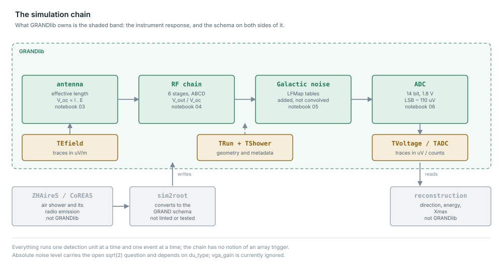

The simulation chain
====================

.. contents::
   :local:

From an electric field produced by an external air-shower simulation to the
digitized voltage a detection unit records.  This is what GRANDlib is for; the
physics upstream of it is not.

         digitised voltage, marking what GRANDlib owns and what it does not
   :width: 100%

*Click the figure to open it full size.*

The stages
----------

.. code-block:: text

    ZHAireS / CoREAS          external: shower and radio emission
        |
        v
    sim2root                  simulator output -> GRANDROOT trees
        |
        v
    E-field  --> V_oc         antenna effective length
             --> + noise      Galactic background
             --> RF chain     LNA, baluns, cable, VGA, filter
             --> ADC          digitisation
        |
        v
    TVoltage / TADC trees

Open-circuit voltage
--------------------

The response of the antenna to an incoming field is its **effective length**
:math:`\boldsymbol{\ell}`, a vector that depends on direction and frequency.
The open-circuit voltage at one arm is its projection onto the field:

.. math::

   V_{\mathrm{oc}}^{p} = \boldsymbol{\ell}^{\,p} \cdot \boldsymbol{E}
     = \ell^{p}_{x} E_{x} + \ell^{p}_{y} E_{y} + \ell^{p}_{z} E_{z},

with :math:`p` running over the three arms.  The computation is done in the
frequency domain over 30–250 MHz.  :mod:`grand.sim.detector.process_ant`
interpolates the tabulated response in frequency, azimuth and zenith.

The dot product is basis-independent, but the table is not: what
:class:`~grand.sim.detector.antenna_model.AntennaModel` stores is
:math:`\ell_\theta` and :math:`\ell_\phi` in the **spherical basis of the
arrival direction**,

.. math::

   V_{\mathrm{oc}}^{p} = \ell^{p}_{\theta}(\nu, \theta, \phi)\, E_{\theta}
                       + \ell^{p}_{\phi}(\nu, \theta, \phi)\, E_{\phi},

so :math:`\hat\theta` and :math:`\hat\phi` are set by where the shower came
from.  ``process_ant`` rotates the field into that basis before contracting.

.. warning::

   **The index** :math:`p` **is the antenna arm, not a component of the
   field.**  ``trace[:, 2]`` is the Z arm; it is not :math:`E_z`.  Because the
   basis follows the arrival direction, which arm sees a given field depends
   on the geometry, and the ratio between arms is not the ratio between field
   components.

   .. image:: _static/antenna_arms.svg
      :target: _static/antenna_arms.svg
      :alt: an antenna arm is not a field component: the effective length is
            projected in the spherical basis of the arrival direction, so at
            zenith 85 degrees the Z arm is the most sensitive of the three and
            still sees almost nothing
      :width: 100%

   *Click the figure to open it full size.*

   In notebook 06 a field with components in the ratio 1.0 : 0.6 : 0.2 produces
   arm amplitudes closer to 600 : 400 : 1, even though the Z arm has the
   largest :math:`|\ell_\theta|` of the three at that zenith angle.  An
   analysis that treats the channels as a Cartesian decomposition will be
   wrong in a direction-dependent way that does not look like a bug.

Galactic noise
--------------

Sky brightness temperatures from LFMap, folded through the antenna response
and tabulated over frequency and local sidereal time.  Each detection unit
receives an independent realisation; spatial coherence across the array is not
modelled.

.. jupyter-execute::

    import numpy as np
    from grand.sim.noise.galaxy import galactic_noise

    freqs = np.arange(30.0, 251.0)
    v = galactic_noise(18.0, 1024, freqs, nb_ant=4, seed=0)
    print("shape (units, arms, frequencies):", v.shape)

.. warning::

   The normalisation of this is an open question — the simulated RMS does not
   reproduce the tabulated model, and the change proposed to fix it does not
   fully reconcile them either.  See
   :ref:`issue-galactic-noise-normalisation` before relying on absolute noise
   levels.

The RF chain
------------

A cascade of two-port networks: low-noise amplifier, balun, cable and
connector, variable-gain amplifier with filter, a second balun, and the ADC
input.  Each is characterised by measured scattering parameters, converted to
the transmission (ABCD) representation so that the cascade is a matrix
product.

.. jupyter-execute::

    import numpy as np
    from grand.sim.detector.rf_chain import RFChain

    chain = RFChain(vga_gain=20)
    chain.compute_for_freqs(np.arange(30.0, 251.0))
    tf = np.abs(chain.get_tf())
    print("transfer function shape (arms, frequencies):", tf.shape)
    print("peak |V_out/V_oc| per arm:", np.round(tf.max(axis=1), 1))

The gain is a configuration choice: S-parameters are shipped for VGA gains of
20 dB (the GRANDProto300 default), 5 dB, 0 dB and −5 dB.

Digitisation
------------

:class:`~grand.sim.detector.adc.ADC` applies the sampling, quantisation and
saturation of the ADC chip, producing the counts a ``TADC`` tree holds.

Running it
----------

.. code-block:: python

    from grand import Efield2Voltage

    signal = Efield2Voltage("input_efield.root", "output_voltage.root")
    signal.params["add_noise"]    = True
    signal.params["add_rf_chain"] = True
    signal.compute_voltage()

or:

.. code-block:: bash

    python scripts/convert_efield2voltage.py in.root -o out.root --lst 18
    python scripts/convert_voltage2adc.py out.root -o adc.root

Run time is about 13 s per shower across a full GRANDProto300 array on one
core, measured over 300 ZHAireS showers for the GRANDlib paper.

What is not here
----------------

No trigger.  The library records trigger information in its trees but does not
decide whether a unit would have triggered, which is the step between "a
signal is present in this trace" and "this event was recorded" — and therefore
the step between a simulated trace and a sensitivity.

No reconstruction of shower parameters from recorded voltages; ``grand/recon``
is a stub.

No anthropogenic or radio-frequency-interference background; only the Galactic
component is modelled, and measured noise traces are used where a realistic
background is needed.
