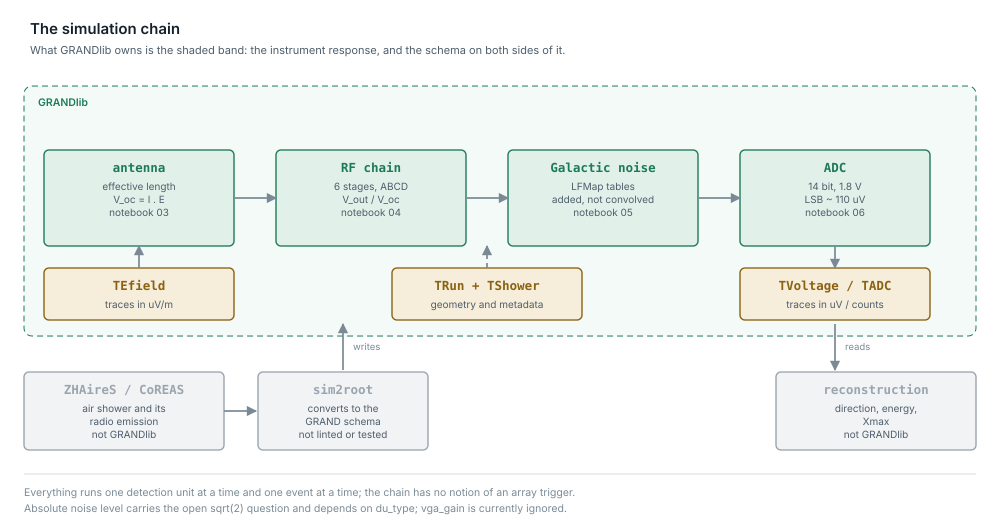
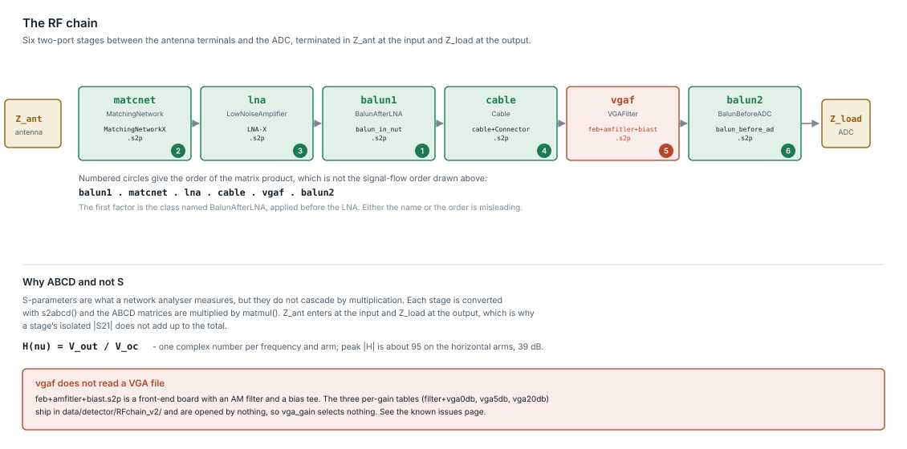

The simulation chain
====================

.. contents::
   :local:

This page describes how GRANDlib turns the electric field computed by an
air-shower code into the digitized voltage a :term:`detection unit <DU>` records: the
physics of each stage and how it is implemented.  To run the chain, see the
:doc:`quickstart` and :doc:`commands`.

         digitized voltage, marking what GRANDlib owns and what it does not
   :width: 100%

*Click the figure to open it full size.*

The stages
----------

.. code-block:: text

    ZHAireS / CoREAS          external: shower and radio emission
        |
        v
    sim2root                  simulator output -> GRANDROOT trees
        |
        v
    E-field  --> V_oc         antenna effective length
             --> + noise      Galactic background
             --> RF chain     LNA, baluns, cable, VGA, filter
             --> ADC          digitization
        |
        v
    TVoltage / TADC trees

Open-circuit voltage
--------------------

The response of the antenna to an incoming field is its **effective length**
:math:`\boldsymbol{\ell}`, a vector that depends on direction and frequency.
The :term:`open-circuit voltage` at one arm is its projection onto the field:

.. math::

   V_{\mathrm{oc}}^{p} = \boldsymbol{\ell}^{\,p} \cdot \boldsymbol{E}
     = \ell^{p}_{x} E_{x} + \ell^{p}_{y} E_{y} + \ell^{p}_{z} E_{z},

with :math:`p` running over the three arms.  The computation is done in the
frequency domain over 30–250 MHz.  :mod:`grand.sim.detector.process_ant`
interpolates the tabulated response in frequency, azimuth and zenith.

The traces are transformed with a length rounded up to the next size with
small prime factors (:func:`~grand.sim.efield2voltage.get_fastest_size_fft`),
which keeps the transforms fast.  The frequency axis is taken from the
sampling rate of the first detection unit, so all units of an event must be
sampled at the same rate.

The dot product is basis-independent, but the table is not: what
:class:`~grand.sim.detector.antenna_model.AntennaModel` stores is
:math:`\ell_\theta` and :math:`\ell_\phi` in the **spherical basis of the
arrival direction**,

.. math::

   V_{\mathrm{oc}}^{p} = \ell^{p}_{\theta}(\nu, \theta, \phi)\, E_{\theta}
                       + \ell^{p}_{\phi}(\nu, \theta, \phi)\, E_{\phi},

so :math:`\hat\theta` and :math:`\hat\phi` are set by where the shower came
from.  ``process_ant`` rotates the field into that basis before contracting.

.. warning::

   **The index** :math:`p` **is the antenna arm, not a component of the
   field.**  ``trace[:, 2]`` is the Z arm; it is not :math:`E_z`.  Because the
   basis follows the arrival direction, which arm sees a given field depends
   on the geometry.  The ratio between arms is not the ratio between field
   components.

   .. image:: _static/antenna_arms.svg
      :target: _static/antenna_arms.svg
      :alt: an antenna arm is not a field component: the effective length is
            projected in the spherical basis of the arrival direction, so at
            zenith 85 degrees the Z arm is the most sensitive of the three and
            still sees almost nothing
      :width: 100%

   *Click the figure to open it full size.*

   In notebook 06, a field with components in the ratio 1.0 : 0.6 : 0.2
   produces arm amplitudes of about 600 : 400 : 1, although the Z arm has the
   largest :math:`|\ell_\theta|` of the three at that zenith angle.  An
   analysis that treats the channels as Cartesian components is wrong by an
   amount that depends on the direction.

Galactic noise
--------------

The noise model starts from the sky brightness temperature of :term:`LFMap`, folded
through the antenna response and tabulated over frequency and local sidereal
time as an available power spectral density (:doc:`data_files`).  Each
detection unit receives an independent realization, with random amplitudes and phases.
Spatial coherence between units is not modeled; it is expected to be small,
given the spacing of the array.

.. jupyter-execute::

    import numpy as np
    from grand.sim.noise.galaxy import galactic_noise

    freqs = np.arange(30.0, 251.0)
    v = galactic_noise(18.0, 1024, freqs, nb_ant=4, seed=0)
    print("shape (units, arms, frequencies):", v.shape)

The simulated level agrees with the level rebuilt independently from the
tables and the antenna impedance, within the sampling spread of about 1%
(``tests/sim/test_galactic_noise_normalisation.py``).  Notebook 05 follows the
calculation step by step.

The RF chain
------------

The :term:`RF chain` is a cascade of two-port networks: matching network, low-noise
amplifier, :term:`balun`, cable and connector, filter board, a second balun and the
:term:`ADC` input.  Each is described by measured :term:`scattering parameters <S-parameters>`.  S-matrices
do not cascade (the S-matrix of two networks in series is not the product of
theirs), so :func:`~grand.sim.detector.rf_chain.s2abcd` converts each to the
transmission (ABCD) representation, in which the cascade is a matrix product.
A matched, lossless line gives the identity matrix.

         each reads, the order of the matrix product and the stage whose
         gain setting selects nothing
   :width: 100%

*Click the figure to open it full size.*

The numbered circles give the order of the **matrix product**, which differs
from the signal-flow order of the boxes: the first factor is the class named
``BalunAfterLNA``, applied before the LNA.  The ``vgaf`` stage loads
``feb+amfitler+biast.s2p``, a front-end board, not a :term:`variable-gain amplifier <VGA>`
(:ref:`issue-vga-gain-ignored`, :doc:`data_files`).

.. jupyter-execute::

    import numpy as np
    from grand.sim.detector.rf_chain import RFChain

    chain = RFChain(vga_gain=20)
    chain.compute_for_freqs(np.arange(30.0, 251.0))
    tf = np.abs(chain.get_tf())
    print("transfer function shape (arms, frequencies):", tf.shape)
    print("peak |V_out/V_oc| per arm:", np.round(tf.max(axis=1), 1))

S-parameters are shipped for VGA gains of 20 dB (the :term:`GRANDProto300 <GP300>`
default), 5 dB and 0 dB, but the ``vga_gain`` argument currently has no
effect: every chain uses the same filter board
(:ref:`issue-vga-gain-ignored`).

Digitization
------------

:meth:`ADC.downsample <grand.sim.detector.adc.ADC.downsample>` resamples
the voltage to the 500 MHz of the ADC and
:meth:`ADC.process <grand.sim.detector.adc.ADC.process>` quantizes it to 14
bits (one count is 109.9 µV) and saturates it at ±0.9 V, producing the counts
a ``TADC`` tree holds.  Measured noise, in ADC counts,
can be added before saturation.  An offline version of the T1 trigger,
:func:`grand.sim.detector.trigger.t1_du_triggers`, then flags the units that
would have triggered; its parameters are still to be confirmed by the trigger
group (:ref:`issue-t1-clean-simulations`).

Performance
-----------

A shower across the full GRANDProto300 array takes about 13 s on one core,
measured over 300 :term:`ZHAireS` showers for the GRANDlib paper.  The 44-antenna
shower of the :doc:`quickstart` takes about 10 s, including loading the
antenna and RF-chain models.

What is not modeled
-------------------

* Anthropogenic and other radio-frequency interference.  Only the Galactic
  background is simulated; measured noise traces can be added at the ADC
  step where a realistic background is needed.
* Spatial coherence of the Galactic noise between detection units.
* The air shower and its radio emission, which come from ZHAireS or CoREAS
  (:doc:`sim2root`).

Reconstruction, which goes from recorded times and amplitudes back to the
shower, is in :mod:`grand.analysis`; notebook 11 works through it.
