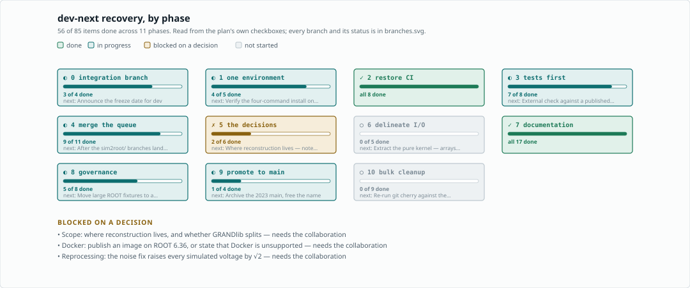
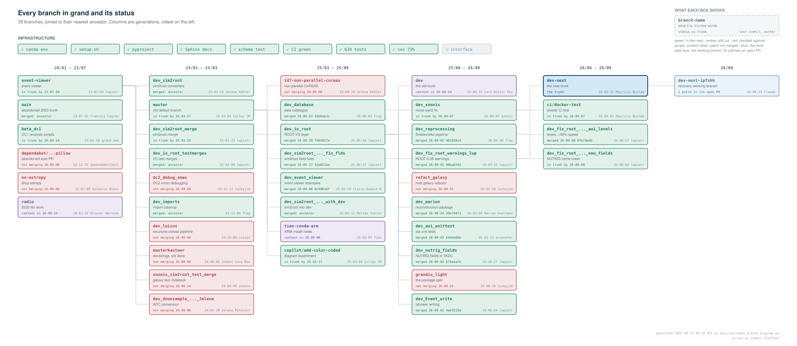

# GRANDlib recovery plan

Working document for the `dev-next` overhaul. The rendered version, with the
full audit and the reasoning behind each phase, is kept as a Claude artifact;
this file is the copy that lives with the code and is updated in the same
commits as the work.



That is the merge *queue* — the branches curated for merging — against the
infrastructure work. It is deliberately a summary; the branch-by-branch picture
is further down, under [Branches carrying unique work](#branches-carrying-unique-work).

Regenerate both diagrams after any change of state:

```bash
python docs/dev/make_recovery_diagram.py   # the queue and the phases
python docs/dev/make_branch_diagram.py     # every branch, read from git
```

## Why this exists

`master` is the GitHub default and sits 1163 commits behind `dev`, which is
the real trunk. A second abandoned trunk, `main`, was created in 2023 and left
355 behind. CI has not completed a run in a long time — the last 36 workflow
runs were all cancelled, and `tests.yml` has never produced a single run — so
no merge in recent memory has been validated by anything. Thirty-six branches
and ten open pull requests have accumulated behind that.

`dev-next` is cut from `dev@1ca1847d`. All work lands there, and it is promoted
to `main` in Phase 9. **Nothing is deleted before Phase 10**: keeping `dev`,
`master` and every branch intact through the transition is what makes rollback
trivial — if `dev-next` goes wrong, unfreeze `dev` and carry on.

## Status

The counts below are generated -- see `docs/dev/update_recovery_plan.py`. The
judgements under them are not, and are dated where they were made.

<!-- measured: begin -->

*Measured 2026-09-25 20:28 UTC by `docs/dev/update_recovery_plan.py`. Everything in this block is generated; edit the script, not the table.*

| | |
|---|---|
| Test suite | **640 passed, 10 skipped, 11 xfailed** — reported by CI run 36065849168 (ROOT 6.36.04) on 60959db1, not run here |
| Lint | clean over `grand/ tests/ quality/ notebooks/ docs/dev/ granddb/` |
| Branches | 24 contained in `dev-next`, **0 still out**, 10 decided against, 3 absorbed, plus the working branch |
| Known issues | 20 documented in `known_issues.rst`: 11 open, 8 settled, 1 not classifiable from its :Status: line |
| Notebooks | 12, generated by `notebooks/make_notebooks.py` |
| Tag | `v0.1.0-dev.27`, at `d91e21a1` |

<!-- measured: end -->

Judgements, as of 2026-09-08 unless noted:

| | |
|---|---|
| Merge queue | **done.** 8 merged, `dev_database` struck as an ancestor with nothing to merge. The one open Phase 4 item is the CoREAS site table, which waits on the `sim2root` branches |
| Coverage | 73 % over `grand/`; 20 % over `granddb/`, measured from 2026-09-08; 63 % together |
| Lint ratchet | granddb joined the gate on 2026-09-08, its 212 findings baselined; the ratchet may shrink, never grow |
| Regression against `dev` | none — identical failure set |
| Environment | builds; `env/setup.sh` completes; `pip install -e .` works |
| Documentation | 23 authored pages + API over 33 of 34 modules + the Handbook; **zero warnings**; **published at https://grand-mother.github.io/grand/** |
| CI | `Code Quality`, `Tests`, `Notebooks` and `Documentation Deployment` green on `dev-next` |
| Branch protection | `dev-next`: force-push and deletion blocked, enforced on admins |
| Promotion | exit criteria in Phase 9. **1, 2 and 4 met** — `dev-next` carries all of `dev`'s content, all four workflows green, `dev` tagged `archive/dev-2026-09`. Criterion 1 lapsed once: on 2026-09-15 `dev` gained `7cd02097`, Lech Wiktor Piotrowski's acknowledgement of the NCN OPUS grant in `README.rst`. On 2026-09-24 the text was copied into `README.md` verbatim, without merging `dev`, so git still counts that one commit as outstanding and `BRANCHES.md` marks it absorbed. It is the cost of the freeze never having been announced: anything else pushed to `dev` needs the same treatment until it is. **3 and 5 outstanding**: the clean-machine install, and the freeze announcement. 6 is checked on the day |

## Phases

Phases 0–2 build the place to work and the means to verify it. Phase 6 is the
one that makes the library usable. Phase 9 is the one that stops this becoming
a third abandoned trunk.

### Before you start
- [x] Name an owner per phase — Mauricio Bustamante, all phases
- [ ] Draft and send the freeze announcement for `dev` — **exit criterion 5**;
      promotion cannot happen while work still lands on `dev`
- [ ] Decide the reprocessing policy for the √2 noise change — **now live.**
      The fix is merged, so every simulated voltage produced from 2026-09-07
      is √2 higher than everything before it. New files now say which code
      wrote them (`TVoltage.grandlib_version`, and the version bumped to
      `0.1.0.dev1` to mark the change), so the question is narrowed to the
      files already on disk: they carry no stamp, and an absent stamp is the
      only thing distinguishing them.
- [x] Write the rollback sentence somewhere visible — the README, above the
      fold, and the documentation landing page. Both say the same thing: if
      `dev-next` goes wrong, unfreeze `dev` and carry on.
- [ ] Fix a first version number and target date

### Phase 0 — integration branch
- [x] Cut `dev-next` from `dev@1ca1847d`
- [x] Push `dev-next` to origin
- [ ] Announce the freeze date for `dev`
- [x] Tag `master` as `archive/master-2025-03` — pushed, pointing at `b8338a3`
      (2025-03-04). Tagging deletes nothing; `master` stays until Phase 10,
      which retires it *to* this tag rather than discarding it.

### Phase 1 — one environment
- [x] Write `env/conda/grand-dev.yml`, consolidating four dependency lists
- [x] Build it — 4.1 GB, ROOT 6.36.04, Python 3.12.14, `--solver=libmamba`
- [x] Run `env/setup.sh` — TURTLE and GULL compile, `_core.abi3.so` builds
- [x] Add `pyproject.toml` — `pip install -e .` works
- [ ] Verify the four-command install on a *clean* machine — **exit criterion 3**,
      and the only one that needs work rather than a decision

### Phase 2 — restore CI
- [x] Read the logs of a cancelled run and confirm the cause — see `FINDINGS_CI.md`
- [x] ~~Move the container into the repo~~ — no container at all; `setup-miniconda` against `grand-dev.yml`
- [x] Add `pull_request` to the triggers — fork PRs have had no CI at all
- [x] Move the `paths:` filter off the triggers into the workflow
- [x] Add the ROOT 6.36 / 6.38 matrix
- [x] CI runs and is green on GitHub (`Code Quality`, `Tests`)
- [x] Turn on branch protection for `dev-next` — **done 2026-09-07**, narrowly:
      force-push and deletion blocked, enforced on admins so the guard binds on
      the one person who could trip it. No required checks and no required
      reviews, because there is no second maintainer to approve and a required
      check that a path filter skips would produce an unmergeable PR. Widen it
      the first time someone else merges here, not on a date.
- [x] A `Tests gate` check that is green only when the suite ran and passed
      — **added 2026-09-24.** A skipped job reads as a pass, so a
      documentation-only commit looked exactly like a tested one; eight of
      twelve runs in September were skips. The gate always runs, fails if code
      changed and the suite did not run or did not pass, and on a docs-only
      commit passes while saying in the run summary that nothing ran.
      Because it always reports, it can be a required check without making
      docs-only PRs unmergeable, which was the reason given above for
      requiring none. Making it required is an admin setting; see *Needs
      repository admin*.

### Phase 3 — tests before features
- [x] Merge `dev_aoi_unittest`, stripped of its summary docs and stray artifacts
- [x] End-to-end numerical regression — `tests/sim/test_pipeline_golden.py`,
      with `tests/sim/pipeline_golden.npz` (21 kB) and notebook 08.
      **Not** against Fig. 6: nothing in the repository records what that
      figure shows, and reproducing it needs its inputs to still exist. This
      pins the chain's own answer instead — shower to voltage, fixed input,
      fixed seed, compared bin by bin at 1e-9. It locks behaviour in rather
      than validating it, and says so. Built now because Phase 6 rewrites
      this chain and claims not to change the answer; built afterwards it
      would only bless whatever the refactor produced.
- [ ] External check against a published result — Fig. 6 of the paper, or
      any figure whose inputs survive. Needs an author to confirm the shower,
      antenna model and configuration behind it still exist. Note that the
      √2 fix means today's code cannot reproduce a pre-2026-09-07 figure of
      any voltage-derived quantity, so such a test may have to assert
      disagreement with the paper, deliberately.
- [x] Parseval invariant for galactic noise — `tests/sim/test_galactic_noise_normalisation.py`
- [x] Tree schema snapshot — `tests/dataio/test_schema_snapshot.py`
- [x] Tree schema round-trip — `tests/dataio/test_tree_roundtrip.py`. All
      278 branch fields of the eleven tree classes are written, the file is
      closed, reopened and compared field by field. It is generic over the
      descriptors, so a field added tomorrow is covered the day it is added.
      Found one thing: fourteen `unsigned char` fields read back as
      one-character strings (values intact) — now in the known issues.
      Also generated the missing `schema_snapshot.json`, without which the
      schema-snapshot test had been skipping since it was written.
- [x] Backward-compatibility ROOT fixture — `tests/dataio/test_backward_compatibility.py`,
      against the 2024 fixtures already in the repo (April, CoREAS; October,
      ZHAireS). They still read, values and trace shapes included, and the 24
      fields `TADC` has gained since read back empty rather than raising.
      Compatibility rests on branch names: `event_version` exists in the files
      and no code in `grand/` reads it, which is pinned too.
- [x] Upgrade `test_rf_chain.py` to passivity, reciprocity, cascade identity —
      in `tests/sim/test_rf_chain_physics.py`. The tests discriminate: passive
      stages must satisfy |S11|²+|S21|² ≤ 1 and S12 = S21, and the two
      amplifiers must violate both, so a check that passed on any input would
      be caught.

### Phase 4 — merge the queue
- [x] `dev_fix_root_warnings_lwp` — ROOT 6.38 warnings
- [x] `dev_nutrig_fields` — NUTRIG fields in TADC
- [x] `dev_reprocessing` — Snakemake pipeline
- [x] `dev_Event_write` — tshower writing
- [x] `dev_fix_root_warnings_lwp_new_fields` — **merged in two halves.** The two
      commits that were not about NUTRIG went in on 2026-09-08; the two that
      were followed the same day, once lwpiotr chose `nutrig_rhox`/`nutrig_rhoy`
      and confirmed the `TRawVoltage` change travels with the merge. `TADC`
      keeps the pair it already had; `TRawVoltage` gains its own as `float`.
      The branch's `correlation_x`/`_y` were dropped: the same quantity under
      the name that lost.
- [x] `dev_fix_root_warnings_aoi_levels_lwp` — **merged 2026-09-08. It was
        never blocked**: none of its eight commits touches `event_trees.py` and
        neither disputed name appears in it. It carried four defects, fixed on
        the way in: an unconditional `from line_profiler import profile` that
        broke `import grand.aoi` for anyone without that dev tool; an
        initialiser indented into the loop above it; an efield-level selector
        that looked for a tree name no file uses — the level is metadata, not
        part of the name — and debris. Auditing that work found two more: the
        level selector substituted a different level silently, and the GP-site
        workaround's flag never gated two of its three sites.
- [x] `dev_snonis` — **merged into `dev-next` 2026-09-07**. The physics
      decision was answered by its author: the tabulated quantity is an RMS by
      construction, so `size_out/sqrt(2)` is right. Both conflicts resolved
      deliberately — `.gitignore` ours, `galaxy.py` their code in our docstring
      style. See `issue-galactic-noise-normalisation`.
- [x] `dev_database` — **struck 2026-09-08: there is nothing to merge.** Its tip
      `dc565b3` *is* the merge-base with `dev-next`, so the branch is a strict
      ancestor: 0 commits ahead, 286 behind. Its work arrived through
      `dev_Event_write` and `dev_aoi_unittest`, which were cut from a `dev`
      lineage that already carried fleg's merge of it (`93b8ab3`, June 2025) --
      a merge that is in `dev-next` but not in `origin/dev`. `dev-next` has
      since moved well past it: `granddb/monitoring*.py` did not exist on the
      branch, and `datamanager.py` differs by 166 lines. Worth telling fleg the
      branch can be deleted; nothing waits on it.
- [x] Fix the CoREAS site table (`issue-coreas-site-table`) — **done
      2026-09-24.** Unknown sites, Xiaodushan among them, crashed on an empty
      unpacking; they now raise an error naming the site and the sites the
      table knows. The altitudes were in centimetres, one line away from
      reaching the output; they are now in metres. It had been left for
      after `dev_io_root_testmerges` landed, a reason that turned out to be
      stale; see *Corrections*.
- [x] Fix the CoREAS converter's crash on its own fixture
      (`issue-coreas-xmax-unbound`, #159) — **done 2026-09-24.** The
      branch without `DistanceOfShowerMaximum` now writes NaN for Xmax
      instead of leaving `Xmax_NWU` undefined, and the zenith test checks
      presence rather than truth. The CoREAS chain runs end to end for the
      first time. NaN was a choice the known-issues entry had left to the
      owners of `sim2root/`; the fixture's long `.reas` would give a real
      position, and that stays open for them.
- [x] Decide the Xmax convention across samples and readers
      (`issue-xmax-sample-vintage`, #160). **Decided 2026-09-24: keep the
      samples, detect the convention.** `grand/dataio/xmax_frame.py` reads it
      from the file's geometry, since Xmax must lie along the stored direction.
      `root_files.py`, `gen_shower.py`, `aoi/event.py` and the event viewer all
      use it. `tests/sim2root/test_xmax_frame.py` runs the real reader on the
      committed sample and on fresh converter output, and fails if the old
      unconditional subtraction is put back.

### Phase 5 — the decisions
- [x] Galactic noise: fix or rewrite — **answered**, and the fix merged. Still
      open behind it: whether anything simulated with the old constant gets
      reprocessed. (`refact_galaxy`, which rewrote the same model in new
      modules, was decided against on 2026-09-25 with its author's
      agreement; see `BRANCHES.md`.)
- [x] Where reconstruction lives — **decided 2026-09-24: in GRANDlib, as
      `grand/analysis/`; `dev_marion` merged with its prerequisites, and the
      `grand/recon/` placeholder removed.** Note that an implementation already
      exists**: `dev_marion` adds `grand/analysis/`, 38 files, alongside the
      `grand/recon/` already on `dev-next`. It merges clean. The decision is
      which of the two is the reconstruction, not whether to write one.
      Measured 2026-09-24 in [`DECISIONS.md`](https://github.com/grand-mother/grand/blob/dev-next/resources/dev/dev-next/DECISIONS.md): it also adds a
      27-field `TRecons` tree and needs an undeclared `iminuit`.
- [x] Whether GRANDlib splits (`grandio_light`) — **decided 2026-09-24:
      no split; lazy imports instead, branch not merged.** Measured in
      [`DECISIONS.md`](https://github.com/grand-mother/grand/blob/dev-next/resources/dev/dev-next/DECISIONS.md): the branch deletes the physics, but
      the I/O code barely depends on it, so lazy imports in
      `grand/__init__.py` would give an I/O-only GRANDlib without the branch.
- [x] GRAND's angle convention (`snonis_sim2root_test_merge`) — **decided
      2026-09-24: "comes from" stays, branch not merged.** Measured in
      [`DECISIONS.md`](https://github.com/grand-mother/grand/blob/dev-next/resources/dev/dev-next/DECISIONS.md): the stored angles are "comes from",
      which `dev-next` reproduces exactly; the branch flips them and raises
      on arrays.
- [ ] Docker: publish an image, or state that it is unsupported — see *Blocked
      on a decision*. The engineering is done either way; what is missing is
      the answer, and the 2023 images stay pullable until there is one.
- [x] NUTRIG field names — **answered 2026-09-08.** lwpiotr chose
      `nutrig_rhox`/`nutrig_rhoy`, and both branches are in. Nothing in the
      queue is blocked on a decision now.

### Phase 6 — delineate input, processing, output
- [ ] Extract the pure kernel — arrays in, arrays out, no filesystem
- [ ] Introduce configuration objects
- [ ] Move ROOT to I/O adapters at the edges
- [ ] Reimplement `Efield2Voltage` over the three, with a deprecation shim
- [ ] Remove the import-time `ROOT.gROOT.GetVersionInt()` check

### Phase 7 — documentation
- [x] Single Sphinx tree at `docs/source/`
- [x] `conf.py` with autodoc, numpydoc, jupyter-sphinx
- [x] Narrative pages; Appendix A ported into `coordinates.rst`
- [x] Clean local build with executed examples
- [x] Five exemplar docstrings to the numpydoc + jupyter-execute standard
- [x] Reduce build warnings to zero
- [x] Apply the standard to the remaining functions — 554/554 described
- [x] Ruff `D`-rule ratchet
- [x] Delete `docs/apidoc-only/`, retire Doxygen
- [x] Notebook: coordinate systems (`notebooks/01_coordinates.ipynb`)
- [x] Notebooks 02–09, generated by `notebooks/make_notebooks.py`. 09 covers
      `grand.aoi`, the layer an analyst opens: one event with its antennas on
      a common clock, and the three traps that come with it.
- [x] Notebooks 11 (reconstruction with `grand.analysis`) and 12 (the event
      viewer), 2026-09-24. Both follow the rule the others do: every number in
      the text was read from the executed output, and three drafted claims
      that the output contradicted were rewritten before commit (the
      plane-wave curvature bias, the candidates' zenith range, and a ring the
      viewer's shower plane does not show for this event).
- [x] API reference over 33 of the 34 modules (the 34th,
      `sim/noise/Compute_Plot_Galactic_Noise.py`, is a script that plots on
      import and would run during the build)
- [x] Reference pages: glossary, data files, sim2root, troubleshooting,
      contributing
- [x] Diagrams: frames, pipeline, data model, antenna arms, RF chain, module
      dependencies
- [x] The GRANDlib Handbook included as its own section, with errata
- [x] Generator vs hand edit on `handbook/directory_structure.rst`, decided
      2026-09-24: the hand edit wins. `build_handbook.py` now leaves pages in
      `HAND_MAINTAINED` alone. Verified by running it: every other page came
      out byte-identical, that one unchanged; an unknown entry is refused
      before any page is deleted.
- [x] ~~Make `-W` the gate~~ — **won't do.** `jupyter-sphinx` reports
      anything a cell writes to stderr as a warning, and ROOT's JIT writes a
      CPU-feature diagnostic there on some processors. Under `-W` that fails
      the build for a hardware reason nobody can act on. The job greps the
      log instead, filtering that one line; every other warning still fails.
- [x] Publish to GitHub Pages from CI — **live at
      https://mbustama.github.io/grand/**, built by `pages.yml` from `dev-next`.
      Published from a personal fork, because the collaboration repository has
      Pages switched off *and* a default branch GitHub will not dispatch from.
      Both routes, and the two non-obvious failure modes met on the way, are in
      `ci.rst`. Still open on the proper repository — see *Needs repository
      admin* — and the fork comes down the day that is switched on.

### Phase 8 — governance and weight
- [x] Bump the deprecated GitHub Action versions (checkout, setup-python,
      setup-miniconda). `root_version.yml` is deliberately left behind: two
      branches add it from a base where it did not exist, so editing it turns
      every such merge into an add/add conflict. Bump it after they land.
- [x] CONTRIBUTING.md, CODEOWNERS, issue/PR templates, CITATION.cff
- [x] pre-commit: ruff, whitespace/YAML/TOML checks, a large-file guard, and
      a notebooks-match-the-generator hook. **No formatter**: reformatting the
      package wholesale would rewrite files across every open branch and turn
      the merge queue into conflicts. **No nbstripout**: the stored outputs are
      what a reader sees on GitHub, so stripping them is the opposite of what
      is wanted here.
- [x] **granddb brought inside the gates, 2026-09-08.** It ships in every wheel
      -- the `grand*` package glob in `pyproject.toml` matches `granddb` -- and
      a comment above that glob claimed for months that it did not. Meanwhile it
      was in no lint scope, had no tests, and its dependencies were an optional
      overlay that no workflow installed. Seven stages:

      1. Its dependencies join `env/conda/grand-dev.yml`, the file CI builds
         from. Until then four of its five modules could not even be imported.
      2. `ruff` covers `granddb/`; its 212 findings baselined on the existing
         ratchet, whose rule was amended to say what it always meant -- code
         entering scope for the first time is debt becoming visible, not new
         debt.
      3. 56 mechanical findings fixed; eight of thirteen baseline entries shrink.
      4. `from grand.aoi import *` replaced by explicit imports in the two
         monitoring modules; the baseline becomes docstrings-only.
      5. The five command-line scripts get a `main()`, so importing one stops
         parsing `sys.argv` and opening a database; and two *library* modules
         stop installing handlers on the `grand` logger, which had left two
         attached and every record printed twice.
      6. First tests -- 19 of them, none needing PostgreSQL.
      7. `granddb/` joins the coverage measurement. The tests already ran, since
         they live under `tests/`; coverage did not, so a package that ships in
         every wheel was reporting none while the figure was presented as the
         project's. 73 % over `grand/`, 20 % over `granddb/`, 63 % together --
         stated separately rather than blended.

      Since: the local file search is covered (593 tests), and the two
      monitoring modules import for the first time. `monitoring_dbconf.py` has
      never been in this repository -- checked against all 2589 files ever
      added on any branch -- and exists only on the production machine. Their
      import is now guarded, narrowed to that one module so that a *broken*
      conf file on that machine still raises as it does today; an example says
      what the file must contain; and `granddb/.gitignore` stops the real one
      being staged, which nothing did before, on a checkout where it sits
      untracked beside the database password.

      What it found: `register_dataset_in_db`'s `--repository` flag was read
      and never passed on; `trunnoiseToDB` named two fields `TRunNoise` has
      never had, so registering such a tree would raise; `DataManager` shared
      one credentials dictionary across every instance, so two managers built
      from different config files saw each other's logins; `reqmt_db.txt` asked
      for `pynac`, a symbolic-algebra library, where `pynacl` was meant; and
      `ReadRootForDb.py` is a personal scratch file that cannot run for anyone.

      Still outside: `monitoring.py` and `monitoring_site.py` import
      `granddb.monitoring_dbconf`, which has never existed in this repository
      and is not gitignored. They ship and cannot be imported by anyone.
      Supplying it is a decision for their author.

- [ ] Move large ROOT fixtures to a fetched bundle
- [x] Delete the stray `GP300` file — done in 3a2ec1a
- [ ] ~~Delete `createAIP.jar`~~ — **it is in use**: `scripts/archiving/
      archive_grandraw.bash` invokes it. 36 MB, and it can only go when the
      archiving workflow is retired or the jar is fetched instead.
- [ ] The real weight is elsewhere: ~142 MB of ROOT fixtures tracked under
      `sim2root/Common/sim_*/`, the largest a single 86 MB voltage file

### Phase 9 — promote to `main`

**Exit criteria.** These were referred to for weeks and written down nowhere,
so here they are. They are deliberately about *safety*, not *completeness*.
Phase 9 exists to stop this becoming a third abandoned trunk, and every week
`dev-next` spends unpromoted is a week it looks more like the two it replaces.
The refactor and the open decisions continue afterwards, on a trunk people are
actually using — that is the point of having one.

Measured 2026-09-08.

1. **The trunk is the real trunk.** `git cherry dev-next dev` reports nothing,
   or each commit it does report is listed here with a reason for leaving it.
   *Met: 0 commits on `dev` that `dev-next` lacks.*

2. **CI completes, and is green.** The failure that started all this was 36
   consecutive cancelled runs and a `tests.yml` that had never produced one, so
   "configured" is not the bar; a completed successful run on `dev-next` is.
   *Met: Code Quality, Tests, Notebooks and Documentation Deployment have all
   completed successfully.*

3. **The install works for someone who is not us.** The four-command install,
   run on a machine that is not the author's, from a clean checkout.
   ***Not met** — the last open item in Phase 1, and the only criterion here
   that needs work rather than a decision.*

4. **Rollback is a tag, not a promise.** The README says recovery is "unfreeze
   `dev` and carry on". That holds while `dev` is a branch someone could move
   or delete. `master` has `archive/master-2025-03`; `dev` has nothing.
   ***Not met** — `dev` needs an archive tag before promotion, not during
   Phase 10.*

5. **The freeze is announced and observed.** Promoting while work still lands
   on `dev` forks the collaboration rather than moving it.
   ***Not met** — the announcement is still to be sent.*

6. **The front page is true on the day.** Test count, published documentation,
   and the install commands, checked at the moment of promotion rather than
   remembered from the week before.

**Explicitly not gates**, so that nobody waits for them:

- The Phase 5 decisions — reconstruction, the `grandio_light` split, Docker
  publishing. They are about the library's future, not about which branch is
  the default.
- Phase 6, the refactor. It is the reason to want a trunk, not a precondition
  for having one, and the golden-file regression exists to make it safe to do
  afterwards.
- The NUTRIG field names. Two commits.
- The external check against a published figure. A validation goal that may
  never be reachable, since the √2 fix means today's code cannot reproduce a
  pre-2026-09-07 figure of any voltage-derived quantity.
- Phases 8 and 10 cleanup. The plan already says nothing is deleted before
  Phase 10, and promotion is not a deletion.

- [x] Tag `dev` as `archive/dev-2026-09` — pushed, pointing at `1ca1847`, which
      is the commit `dev-next` was cut from. **Criterion 4 met.**
> **Note.** Promoting also unblocks `workflow_dispatch`. GitHub only offers it
> for workflows present on the *default* branch, so every manual workflow added
> on `dev-next` — `docker.yml` today — is untriggerable from the Actions tab
> until this lands.
- [ ] Archive the 2023 `main`, free the name
- [ ] Rename `dev-next`, set default, move protection
- [ ] Announce with the install commands

### Phase 10 — bulk cleanup
- [ ] Re-run `git cherry` against the finished trunk
- [ ] Salvage the seven branches carrying unique work
- [ ] Delete `src_outlib/` — abandoned, unpackaged, imported by nothing, and
      `ZHAireSRawToGRANDROOT.py` has not parsed since a conflict was committed
      unresolved on 2023-06-30. Held to Phase 10 because four branches still
      touch it. See `issue-src-outlib-conflict`.
- [ ] Delete `lib/` (contains only a readme saying "directory for C library")
      and untrack `.vscode/settings.json`
- [ ] Reorganise the tree, if wanted, only *after* the queue drains: 14 of 36
      branches touch `grand/`, 8 `examples/`, 8 `scripts/`, 7 `sim2root/`.
      Before that, a rename is a manual replay of every one of them.
- [ ] Archive-tag everything before deleting
- [ ] Close PRs 9, 49, 52
- [ ] Delete `tests_with_docker.yml` from the 34 branches that still carry it.
      It pins the retired `ubuntu-20.04` runner, so every push to those
      branches queues 24 h and is cancelled — 41 such runs since 2025-08-07.
- [ ] Retire `master` and `dev` to their tags

## Needs repository admin

None of these can be done from a branch; all are one-time settings.

**Make `Tests gate` a required check on `dev-next`.** Settings → Branches →
the `dev-next` rule → *Require status checks to pass* → add `Tests gate`.
It is the one check designed for this: it reports on every commit, including
docs-only ones, and is green only when the suite ran and passed or when
nothing it covers changed. Until it is required, it informs but does not
block.

**`CODECOV_TOKEN` is missing.** The coverage upload has never worked — Codecov
answers `Token required because branch is protected`, and the repository has
only `PERSONAL_TOKEN` and `PYPI_TOKEN`. The step is non-fatal so it fails
invisibly, and the README's codecov badge does not reflect reality. Adding the
secret is the whole fix; the workflow already passes it.

**~~GitHub Pages is switched off.~~ Done 2026-09-07.** The manual publishes
from this repository at https://grand-mother.github.io/grand/, built by
`pages.yml` on every push to `dev-next`. Three things had to change: Pages
enabled with GitHub Actions as the source, `dev-next` added to the
`github-pages` environment's deployment branch policy, and `dev-next` added to
the workflow's trigger alongside `main`. The personal fork that served as a
stopgap can come down.

**24 Dependabot alerts on the default branch** — 1 critical, 15 high, 7
moderate, 1 low. Looked at 2026-09-08: **all 24 are one file**,
`binder/requirements.txt`, and 19 of them are Pillow. That file exists only on
`master` — not on `dev`, not on `dev-next` — and is a 2022 scratch experiment
with mybinder.org whose readme is pasted links and an error message, with no
badge anywhere and pointing at a branch that no longer exists. Nothing installs
it, nothing under `grand/` imports PIL, and the critical one (CVE-2023-50447)
needs `ImageMath.eval` on attacker input. **They should clear when `dev-next`
becomes the default branch**; do not dismiss them, or a recurrence would be
hidden.

Two things that look like this problem and are not. `env/docker_amd64/requirements_vers.txt`
carries the same 2022 pins — 42 of 43 packages at identical versions, `Pillow`
one patch older — and has sat on the default branch throughout without ever
raising an alert: Dependabot's pip scanner does not match that file name, so it
never will. It was removed on 2026-09-08 along with the handbook instruction
that told people to install it, which was the only thing referencing it. And
`Pillow` *is* installed in the working environment, at 12.3.0, pulled in by
matplotlib rather than declared by us — patched, not vulnerable.

Litter for Phase 10: `origin` still carries a
`dependabot/pip/binder/pillow-9.3.0` branch from an abandoned auto-PR.

## Blocked on a decision

**~~NUTRIG field names.~~ Answered 2026-09-08.** `dev_nutrig_fields` added
`nutrig_rhox`/`nutrig_rhoy` to `TADC`; `dev_fix_root_warnings_lwp_new_fields`
added `correlation_x`/`correlation_y` for the same quantity. lwpiotr chose the
first and confirmed the `TRawVoltage` pair travels with the merge. Both are in.
Nothing in the queue is blocked on a decision now. `_aoi_levels_lwp` was listed
here as blocked behind this and never was.

*(The galactic-noise entry that stood here is gone: answered, merged, and its
provenance recorded in `data_files.rst` on 2026-09-07. What remains of it is
the reprocessing question, listed under* Before you start.*)*

**Docker: publish an image, or say we do not.** The engineering is finished —
`env/docker/grandlib.dockerfile` builds an image on ROOT 6.36 matching the
conda environment, CI builds it on every trigger and 459 tests pass inside it.
Nothing is published, deliberately: pushing to a registry is a statement about
what the collaboration distributes.

What makes this urgent rather than optional is that the *current* state is the
bad one. `grandlib/dev:1.2` is still pullable, so people pull it, and get ROOT
6.26 from January 2023 — a different branch of `grand/dataio/descriptors.py`
from everyone else, silently. A stale published image is worse than no
published image, and that is what we have.

- **Supported** → push what that Dockerfile builds, keep the CI job, retire
  `env/docker_*` in Phase 10, and accept that the image is now owned: rebuilt
  when ROOT moves, when dependencies move, when a CVE lands in the base.
- **Not supported** → say so on the installation page, retire all eleven
  Dockerfiles including the new one, and point people at conda.

Either answer is respectable. Continuing without one is not, because the 2023
images stay pullable while nobody maintains them. Detail, measurements and the
two loose ends (arm64 untested; a 2025 image nothing can pull) are in *Open
scope question: is Docker supported?* below. **Needs the collaboration.**

**Galactic noise — answered 2026-09-07, and merged.** The question was whether
the tabulated `Vocmax` quantity was an RMS or a maximum: the first made
PR 153's `size_out/sqrt(2)` right, the second made the existing `size_out/2`
right. Measured here, the simulated RMS sat at exactly 1/√2 of the tabulated
value for every `du_type`, which was consistent with either reading and settled
neither.

Stavros Nonis settled it by re-deriving the chain rather than by measuring its
output. The calculation starts from the available power spectral density `P_L`
and reconstructs the open-circuit voltage as `V_oc,RMS² = 4 P_L Re(Z_ant)`, so
the quantity is an RMS **by construction**. `size_out/sqrt(2)` is correct, and
every voltage simulated before this merge is low by √2.

`0205c15` also supplies matching `P_L` tables for `GP300_nec` and `GP300_mat`,
retiring the separate defect that those two tables were byte-identical and that
the `hfss` tables were reachable from no `du_type` at all.

Three things remain open behind it, and none of them is the constant:

- **Reprocessing.** Anything simulated with the old constant is low by √2. What
  gets redone, if anything, is still undecided — it is listed under *Before you
  start* and has been since the plan was written.
- **`refact_galaxy` (PR 146)** rewrote the same model in new modules alongside
  the old one. **Decided 2026-09-25: not merged**, with luckyjim's agreement;
  its fixes were already on the trunk (`BRANCHES.md` has the comparison).
- **The paper.** Section 8.2 describes phase-only randomisation while the code
  also randomises the modulus, so the published description matches neither
  implementation exactly. That is a paper question, not a code one.

## Open scope question: is Docker supported?

**Technically answered, 2026-09-02.** Both halves now pass:

| Image | Environment | Full suite |
|---|---|---|
| `grandlib/dev:1.2` (2023) | ROOT 6.26, Py 3.8, NumPy 1.23 | **459 passed** on `dev-next` |
| built from this repo | ROOT 6.36, Py 3.13, NumPy 2.2 | **459 passed** |

So the images are stale, not incompatible. What remains is a *decision*, not
engineering:

- **Supported** → publish the image `env/docker/grandlib.dockerfile` builds,
  and keep the CI job that builds it. Roughly a day, mostly registry
  paperwork.
- **Not supported** → say so on the installation page and retire
  `env/docker_*` in Phase 10.

Two loose ends either way: arm64 is untested (x86_64 runners; needs
`ubuntu-24.04-arm` or QEMU), and a **2025** image exists that nothing can pull
— the Handbook distributes `grand_docker_handson_2025.tar.gz` via Google Drive.
If that one works, publishing it is smaller than anything above.

See `docs/source/docker.rst`.

The Dockerfiles and the published images are three years stale — newest image
2023-01-14, pinning ROOT 6.26.02 against 6.36/6.38 everywhere else — and
nothing builds them. The Handbook still presents Docker as the first
installation route.

This is a decision for the collaboration, not a patch:

- **Supported** → repin the base to `rootproject/root:6.36.00-ubuntu25.04`, pin
  the requirements from the conda environment, rebuild and publish, and add a
  CI job that builds the image. Without that last part it drifts again; the
  drift happened precisely because nothing checked.
- **Not supported** → say so on the installation page and retire
  `env/docker_*` in Phase 10.

Documented meanwhile in `issue-docker-unmaintained`, with an erratum in the
Handbook and a note on the installation page. Merge exposure is low either way:
`env/docker_arm64` is touched by no branch, `env/docker_amd64` by two.

## Corrections to earlier findings in this plan

Everything in this document was re-verified on 2026-09-02. Four claims that had
been recorded as defects were not defects, and are listed here rather than
quietly edited out, because the pattern in them is worth more than any of them
individually. A fifth is listed below them: it was caught before it was ever
written down, and is kept because it is the same mistake stopping one step
earlier.

| Claimed | Actually |
|---|---|
| Galactic-noise normalisation is off by an unexplained factor of ~2 (ratio 0.33) | Ratio is **1/√2** exactly. The 0.33 came from comparing `GP300` against a table it never reads. |
| ROOT 6.38 changes the result of a NumPy-only test | **No.** The test had unseeded noise and gave the "anomalous" answer 6.5 % of the time on any ROOT. |
| The Docker route cannot work | **It works.** 459 tests pass in the 2023 image. |
| `vga_gain` loads the 20 dB table regardless | It loads `feb+amfitler+biast.s2p`, which is not a VGA table at all. |
| *(not filed)* `MatchingNetwork` treats dB magnitudes as linear | **Correct as written.** Its files declare `# hz S ma R 50`; the dB-declaring files are the ones whose classes do call `db2reim`. A comment now says so at the line. |
| *(2026-09-08)* Four duplicated docstring parameter blocks were fixed in `rf_chain.py` | The same commit had left four more in `grand/sim/detector/adc.py`. A package-wide sweep now confirms none remain. |
| *(2026-09-09)* `test_pipeline_golden.py` compares at `rtol=1e-9`, "far above" floating-point reassociation | **Too tight for hardware.** Through 8–9 September the test failed on one leg of the CI matrix and passed on the other, with the failing leg alternating between ROOT 6.36 and 6.38 across five runs — the same commit passing both legs sometimes and one leg other times. The ROOT version was incidental: what varied was which GitHub runner each leg landed on, and numpy takes different vectorised paths on different CPUs. Locally it is deterministic — eight consecutive runs agreed, and one, two and eight BLAS threads changed nothing. Now `1e-6`, which still catches a 0.001% change and the √2 noise fix, and the failure message reports the relative disagreement instead of printing both values to six figures as "1276.82 against 1276.82". |
| *(2026-09-08)* `read_list_of_params` returned the builtin `list` for a missing keyword, so the absence reached the ROOT trees silently as `list[0]` | **It raised.** Assigning `list` anywhere in the function body makes the name local throughout, so `return list` on the not-found path is an `UnboundLocalError`, not the builtin. I had demonstrated the generic-alias behaviour in a *different* function that really did return the builtin, and carried the conclusion across. The repair on the trunk is still the right one — absence is now a value, and the caller says which keyword was missing — but it fixes a loud error with a bad message, not a silent wrong number. The verdict on `147-add-option-…` changes with it: superseded, not broken. |
| *(2026-09-09)* Loosening `test_pipeline_golden.py` to `rtol=1e-6` fixed its flakiness | **It made it rarer.** On 2026-09-24 a README-only PR failed it on one leg at 2.59e-5. The measure was the fault, not the number: each difference was divided by that sample's own value, so a sample of -1.178 in a trace peaking at 3258 turned a 3.05e-5 rounding difference (9.4e-9 of the peak) into a large relative error. No per-sample tolerance survives a sample close enough to zero. Now measured against each trace's peak, at `1e-6`; checked against the stored reference, CI's output passes at 9.4e-9 while the √2 fix, a one-sample shift, a 1e-5 change and a 1% single-sample glitch all fail. |
| *(2026-09-08, #160)* Xmax sits 1264 m too high in every ZHAireS sample, and the open half of the question was whether `sim2root` writes it | **The samples are stale, not the converter.** Run on the committed `.sry` files, `ZHAireSRawToRawROOT.py` writes the ground-relative height exactly — 4499.41 m for event 1618, 12663.77 m for 13790 — against the `.sry` itself. The samples predate that subtraction. `root_files.py`'s "DC2 FIX" compensates for exactly this, so `FIX_xmax_pos` is right on the committed samples and would be 1264 m low on regenerated ones, while `gen_shower.py` and `aoi/event.py`, which read the raw field, are wrong on the committed samples. The observation stands; the cause had been assumed to be code. See `issue-xmax-sample-vintage`. |
| *(2026-09-24)* `test_the_dc2_xmax_fix_would_over_correct_regenerated_data` "fails if root_files.py learns to tell the two vintages apart" | **It could not have.** It recomputed the fix's formula in the test instead of calling `get_simu_parameters`, so changing the reader would have left it green — the scratch-function mistake from the `read_list_of_params` row above, one day later. Pushed in `45e9b36`. Rewritten to call the real reader on both the committed sample and fresh `sim2root` output, and confirmed to fail when the reader's subtraction is removed. |
| *(2026-09-08)* `sim2root/` fixes must wait for `dev_io_root_testmerges`, which is in flight over the directory | **Nothing is in flight.** Its one commit not in `dev-next` is `bea1952e` (2025-01-08), a merge of `dev` into it, carrying no patch of its own, and `BRANCHES.md` lists it as contained. Merging it into `dev-next` today conflicts in one file, `data/download_data_grand.py`, and in nothing under `sim2root/`. Every open branch was trial-merged on full history with and without the CoREAS fix, and the conflicting files are identical either way. *(A first pass of these checks ran on a shallow clone and gave wrong counts — six conflicts, four commits. Ancestry questions need full history: `git fetch --unshallow` first.)* The site-table fix below is no longer blocked on this ground, though whoever owns `sim2root/` should still make it. |
| *(2026-09-24)* The measured block: "5 still out" | **3 were.** `branch_facts` measured branches against the local `dev-next`, which in this clone lagged the remote by three merges, so `dev_marion` (merged that day) still read as out; and the branch the recovery's PRs come from was counted as undecided work, because it always carries the PR being prepared. Now measured against `origin/dev-next`, and that branch is shown as the working branch. Same lesson as the shallow-clone row: a count read from git is only as current as the refs it reads. |

The pattern: each was a *real observation* wrapped in a *guessed cause*, and in
each case the guess was more dramatic than the truth. The observation that two
CI legs disagreed was real; "ROOT changes NumPy's floating point" was invented
to explain it. The observation that `du_type` levels differ by 2× was real; "the
transform is wrong" was invented to explain it.

The discipline that would have caught all four: **before attributing a
difference to a cause, check that the measurement repeats.** Three of the four
collapse immediately under that test, and the fourth (`vga_gain`) needed only
reading one more line of the function.

The fifth is the same shape and shows what the discipline costs when it works:
an asymmetry between sibling classes is a real observation, and "one of them
forgot the unit conversion" is the dramatic explanation. Reading the four file
headers took a minute and produced the undramatic one. Asymmetric code that is
correct is worth a comment, because the next reader will make the same guess.

## Branches carrying unique work



The branch-by-branch record is **[`BRANCHES.md`](https://github.com/grand-mother/grand/blob/dev-next/resources/dev/dev-next/BRANCHES.md)**: every branch
the repository has ever had — 69 of them, including the 31 that were merged and
then deleted — with who made it, what it came off, what came out of it, and
whether it should be merged. It is generated from git by
`docs/dev/make_branch_inventory.py`; this section carries only the decisions.
It lists the branches that exist today: a branch that was merged and deleted
cannot be acted on, and belongs in the history rather than in a work list.

For context rather than for action, `history.svg` in the same folder draws all
69 branches the repository has ever had on a time axis, back to the first
commit in June 2019, with the merges between them.

Re-measured 2026-09-08 with `git cherry` against `dev-next`. Of 38 remote
branches, 19 are fully contained, 5 are ahead only by commits whose patches are
already in under other ids, and **15 carry genuinely unmerged patches** — not
the seven this table listed before. Salvage before Phase 10 deletes anything.

The diagram above is generated from git rather than maintained by hand —
parentage, dates, authors, merge commits and state are all read at build time,
which is why it cannot drift the way this table did. Columns are generations,
and they turn out to be eras: the leftmost stopped being touched in 2023.
`dev_io_root` is the parent of eight, including everything merged during this
recovery *and* both branches still carrying live work, so `refact_galaxy` and
`dev_marion` are siblings of the queue rather than strangers to it.

### What to do with the fifteen

Three review passes, 2026-09-08. Only **three of the fifteen merge cleanly**;
every other candidate conflicts, most of them only on context.

| | Branches | |
|---|---|---|
| **Merge** | `dev_event_viewer`, `dev_marion`, `beta_dc1` | Test-merge clean. `dev_marion` is also Phase 5's "where reconstruction lives"; `beta_dc1` is from 2023, so confirm DC1 analysis is still wanted. |
| **Merge by hand** | `tian-conda-arm` | Ten lines of ARM notes; conflicts only because the trunk added 52 lines to the same readme. |
| **Cherry-pick** | `dev_leisos`, `masterkastner` | A real `get_antenna_position` fix under 35,000 lines of committed CORSIKA data; and 34 lines of docstrings under 192 files of rebuilt docs. |
| **Do not merge** | `no-astropy`, `dependabot/…pillow`, `dev_downsample_…_Jelena`, `dc2_debug_xmax`, `147-add-option-…` | Obsolete paths, deleted targets, superseded implementations, and live debug hacks. `147-add-option-…` works but was fixed more thoroughly at the root on the trunk. |
| **Decision, not a merge** | `grandio_light`, `snonis_sim2root_test_merge`, `radio` | The package split; an angular-convention change; and the only spatial trace interpolation in the repository, on a branch that is otherwise dead. |
| **Ask the author** | `refact_galaxy` | luckyjim's parallel galactic-noise implementation, overlapping work already verified here. |

Decisions actually taken, with dates, are logged in the *Decisions taken*
table at the top of [`BRANCHES.md`](https://github.com/grand-mother/grand/blob/dev-next/resources/dev/dev-next/BRANCHES.md).
A branch is amber until a decision is recorded there and red once it is: the
difference between a question nobody has answered and one that is closed.

**Three settled so far**, all 2026-09-08 and all "do not merge":
`dependabot/…pillow`, `no-astropy` and `147-add-option-…`. One was
deliberately *not* settled: `radio` is held amber because it carries the only
spatial trace interpolation in the repository. Going through them one at a time
has been worth it — two of the first four changed shape once the code was run
rather than read, and `147-add-option-…` was being rejected for a reason that
turned out to be false.

Reasons for each are in [`BRANCHES.md`](https://github.com/grand-mother/grand/blob/dev-next/resources/dev/dev-next/BRANCHES.md#why-one-by-one).

**Merge order.** Take the three clean ones first, then `tian-conda-arm`. Four of
the remaining candidates touch `grand/sim/efield2voltage.py`, so merge nothing
else into that file in parallel — each merge moves the conflict surface for the
rest.

### What the third pass changed

The first two passes read diff *summaries*. The third read the code, and four
verdicts moved. Recorded here rather than edited away, because they are all one
mistake: **a diffstat is not a diff.**

| Read as | Actually |
|---|---|
| `dc2_debug_xmax` is cosmetic churn — reformatting and log-level changes | It contains two live debug hacks: `for du_idx in range(2)` under a `'Reduce DU to 2'` warning, and an `if True:` block placing every antenna at the shower core. Merging would silently corrupt every simulation. Do-not-merge for a far stronger reason than "churn". |
| `snonis_sim2root_test_merge` carries a cherry-pickable 14-line `coordinates.py` fix | It redefines the **angular convention** across all four core transforms — θ→180−θ, φ→φ+180, azimuth and elevation redefined. Every angle in the codebase moves. It also raises on array input (`if phi==360`), and its other half is already on the trunk. Not a cherry-pick: a collaboration decision. |
| `147-add-option-…` is a small live fix worth merging | Half right, and see the correction below. The problem is real and the branch's fix does work; it is superseded rather than broken. The reader was [repaired at the root on the trunk](https://github.com/grand-mother/grand/blob/dev-next/sim2root/CoREASRawRoot/CorsikaInfoFuncs.py) instead. |
| Branch size measured by `git diff merge-base..branch` | For an old branch that replays everything already merged by another route. `snonis_sim2root_test_merge` shows 279 commits and has **two** patches of its own. `BRANCHES.md` reports both numbers side by side for exactly this reason. |
| *(found by the post-implementation audit)* `beta_dc1` has 333 commits | **Three.** The 333 was produced by the inventory collector itself, which read an unmerged branch's commits from six 2022 merges naming it rather than from the trunk's merge-base — describing a state the branch left in 2023. Fixed, and the figure it had been quoted as an example in three documents was corrected with it. |

## Tools

- `quality/premerge_check.py` — reports what a branch adds; flags tree fields
  whose docstrings duplicate an existing field's meaning, and new modules that
  shadow existing ones.
- `docs/dev/make_recovery_diagram.py` — regenerates the status diagram.
- `tests/dataio/test_schema_snapshot.py` — pins the ROOT tree schema.
